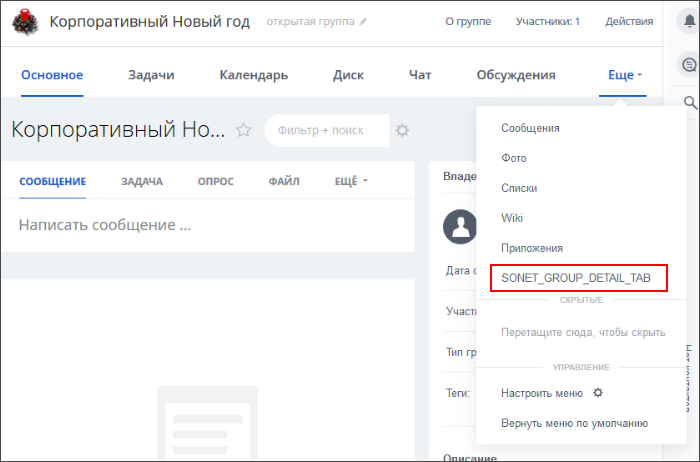

# Пункт основного выпадающего меню проекта SONET_GROUP_DETAIL_TAB

> Scope: [`workgroups`](../../scopes/permissions.md)

Вы можете добавлять свой пункт основного выпадающего меню проекта.



Код конкретного места встройки виджета указывается в параметре `PLACEMENT` метода [placement.bind](../placement-bind.md).



Встройка не будет отображаться в интерфейсе, пока установка приложения не завершена. [Проверьте установку приложения](../../../settings/app-installation/installation-finish.md)



## Куда встраивается виджет

#|
|| **Код встройки** | **Место** ||
|| `SONET_GROUP_DETAIL_TAB` | Пункт основного выпадающего меню проекта ||
|#

## Что получает обработчик

Данные передаются в виде POST-запроса {.b24-info}

```php

Array
(
    [DOMAIN] => xxx.bitrix24.com
    [PROTOCOL] => 1
    [LANG] => en
    [APP_SID] => 3c900e588b941b81eef07608e4253159
    [AUTH_ID] => 1a55ba6600705a0700005a4b00000001f0f107db29f044c6ff24e984d378967134de83
    [AUTH_EXPIRES] => 3600
    [REFRESH_ID] => 0ad4e16600705a0700005a4b00000001f0f10731fce9fa3219163d545a088b217cc2d4
    [member_id] => da45a03b265edd8787f8a258d793cc5d
    [status] => L
    [PLACEMENT] => SONET_GROUP_DETAIL_TAB
    [PLACEMENT_OPTIONS] => {"GROUP_ID":"10"}
)

```





### PLACEMENT_OPTIONS

Значением `PLACEMENT_OPTIONS` является JSON-строка, содержащая массив из одного и более ключей.



#|
|| **Параметр** | **Описание** ||
|| **GROUP_ID***
[`string`](../../data-types.md) | Идентификатор рабочей группы/проекта, в котором был открыт виджет.

Может быть использован для получения дополнительной информации с помощью метода [sonet.group.get](../../sonet-group/sonet-group-get.md).

||
|#

## Продолжите изучение

- [{#T}](../placement-bind.md)
- [{#T}](../ui-interaction/index.md)
- [{#T}](../ui-interaction/crm-card.md)
- [{#T}](../../../settings/interactivity/index.md)
- [{#T}](../open-application.md)
- [{#T}](../open-path.md)
