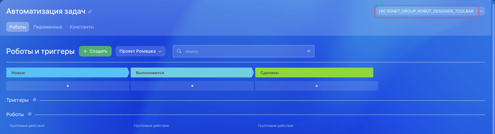

# Кнопка в дизайнере роботов группы SONET_GROUP_ROBOT_DESIGNER_TOOLBAR



Выберите инструмент для разработки с AI-агентом:

- используйте [Битрикс24 Вайбкод](../../../ai-tools/vibecode.md), чтобы создать приложение для Битрикс24 по описанию задачи без знания языков программирования. Агент напишет код и разместит приложение на сервере без ручной настройки хостинга
- используйте [MCP-сервер](../../../ai-tools/mcp.md), чтобы разрабатывать интеграцию через REST API в своем проекте. Агент будет обращаться к официальной REST-документации



> Scope: [`placement, sonet_group`](../../scopes/permissions.md)

Виджет добавляет свою кнопку в дизайнер роботов, где настраивают автоматизацию задач рабочей группы или проекта.

Код точки встраивания указывается в параметре `PLACEMENT` метода [placement.bind](../placement-bind.md).



Виджет не отображается в интерфейсе, пока установка приложения не завершена. [Проверьте установку приложения](../../../settings/app-installation/installation-finish.md)



## Куда встраивается виджет

#|
|| **Код точки встраивания** | **Место** ||
|| `SONET_GROUP_ROBOT_DESIGNER_TOOLBAR` | Кнопка в панели дизайнера роботов группы ||
|#

### Где находится в интерфейсе

Откройте задачи рабочей группы или проекта и нажмите *Роботы*. Кнопка приложения выводится справа в заголовке окна *Автоматизация задач*.

Не путайте эту точку с [`TASK_ROBOT_DESIGNER_TOOLBAR`](../task/robot-designer-toolbar.md): та относится к разделу задач и требует scope `task`.



## Что получает обработчик

Данные передаются POST-запросом: часть параметров — в query-строке адреса обработчика, остальные — в теле запроса {.b24-info}

```php
Array
(
    [DOMAIN] => xxx.bitrix24.com
    [PROTOCOL] => 1
    [LANG] => ru
    [APP_SID] => 25e596577c2a1ddf98c7863421330527
    [AUTH_ID] => 5d56ba6600705a0700005a4b00000001f0f107d21c0babb82529a32836e165141a2010
    [AUTH_EXPIRES] => 3600
    [REFRESH_ID] => 4dd5e16600705a0700005a4b00000001f0f107a934a327935855b75f8c3686204e3bd5
    [SERVER_ENDPOINT] => https://oauth.bitrix24.tech/rest/
    [APPLICATION_TOKEN] => 5b2f8c1d7e3a9046b8c5d2f1a7e3b904
    [APPLICATION_SCOPE] => sonet_group,task,placement
    [member_id] => da45a03b265edd8787f8a258d793cc5d
    [status] => L
    [PLACEMENT] => SONET_GROUP_ROBOT_DESIGNER_TOOLBAR
    [PLACEMENT_OPTIONS] => {"GROUP_ID":"10","URI":"\/workgroups\/group\/10\/tasks\/"}
)
```





### PLACEMENT_OPTIONS

Значение `PLACEMENT_OPTIONS` передается как JSON-строка с контекстом вызова.

Для `SONET_GROUP_ROBOT_DESIGNER_TOOLBAR` в контекст передается ключ:

- `GROUP_ID` — идентификатор рабочей группы или проекта, чью автоматизацию настраивает пользователь. По нему можно получить данные группы методом [sonet_group.get](../../sonet-group/sonet-group-get.md)

## Примеры кода





- cURL (OAuth)

    ```bash
    curl -X POST \
      -H "Content-Type: application/json" \
      -H "Accept: application/json" \
      -d '{
        "PLACEMENT": "SONET_GROUP_ROBOT_DESIGNER_TOOLBAR",
        "HANDLER": "https://your-domain.com/widgets/sonet-group-robot-designer-handler.php",
        "TITLE": "Моя автоматизация группы",
        "LANG_ALL": {
          "ru": {
            "TITLE": "Моя автоматизация группы"
          },
          "en": {
            "TITLE": "My group automation"
          }
        },
        "auth": "**put_access_token_here**"
      }' \
      https://**put_your_bitrix24_address**/rest/placement.bind
    ```

- JS (TS)

    ```ts
    // This snippet is an ES module: top-level await requires type="module" or a bundler.
    // $b24 is an already-initialized SDK instance (see the SDK "Get started" guide).
    import { Text } from '@bitrix24/b24jssdk'
    import type { B24Frame } from '@bitrix24/b24jssdk'

    declare const $b24: B24Frame

    try {
      const response = await $b24.actions.v2.call.make<boolean>({
        method: 'placement.bind',
        params: {
          PLACEMENT: 'SONET_GROUP_ROBOT_DESIGNER_TOOLBAR',
          HANDLER: 'https://your-domain.com/widgets/sonet-group-robot-designer-handler.php',
          TITLE: 'My group automation',
          LANG_ALL: {
            ru: {
              TITLE: 'Моя автоматизация группы',
            },
            en: {
              TITLE: 'My group automation',
            },
          },
        },
        requestId: Text.getUuidRfc4122()
      })

      // The payload is available only on a successful response
      if (!response.isSuccess) {
        console.error(response.getErrorMessages().join('; '))
      } else {
        const result = response.getData()!.result
        console.info('Placement bound successfully:', result)
      }
    } catch (error) {
      // Thrown on transport or SDK failures (AjaxError, SdkError, etc.)
      console.error(error)
    }
    ```

- JS (UMD)

    ```html
    <!-- Load the SDK (UMD build); it is exposed as the global B24Js -->
    <script src="https://unpkg.com/@bitrix24/b24jssdk@1/dist/umd/index.min.js"></script>
    <script>
      async function bindSonetGroupRobotDesignerToolbar() {
        try {
          // Initialize the SDK inside a Bitrix24 frame
          const $b24 = await B24Js.initializeB24Frame()

          const response = await $b24.actions.v2.call.make({
            method: 'placement.bind',
            params: {
              PLACEMENT: 'SONET_GROUP_ROBOT_DESIGNER_TOOLBAR',
              HANDLER: 'https://your-domain.com/widgets/sonet-group-robot-designer-handler.php',
              TITLE: 'My group automation',
              LANG_ALL: {
                ru: {
                  TITLE: 'Моя автоматизация группы',
                },
                en: {
                  TITLE: 'My group automation',
                },
              },
            },
            requestId: B24Js.Text.getUuidRfc4122()
          })

          // The payload is available only on a successful response
          if (!response.isSuccess) {
            console.error(response.getErrorMessages().join('; '))
            return
          }

          const result = response.getData().result
          console.info('Placement bound successfully:', result)
        } catch (error) {
          // Thrown on transport or SDK failures (AjaxError, SdkError, etc.)
          console.error(error)
        }
      }

      document.addEventListener('DOMContentLoaded', bindSonetGroupRobotDesignerToolbar)
    </script>
    ```

- PHP

    ```php
    try {
        $response = $b24Service
            ->core
            ->call(
                'placement.bind',
                [
                    'PLACEMENT' => 'SONET_GROUP_ROBOT_DESIGNER_TOOLBAR',
                    'HANDLER' => 'https://your-domain.com/widgets/sonet-group-robot-designer-handler.php',
                    'TITLE' => 'Моя автоматизация группы',
                    'LANG_ALL' => [
                        'ru' => [
                            'TITLE' => 'Моя автоматизация группы',
                        ],
                        'en' => [
                            'TITLE' => 'My group automation',
                        ],
                    ],
                ]
            );

        $result = $response->getResponseData()->getResult();
        if ($result->error()) {
            error_log($result->error());
        } else {
            echo 'Success: ' . print_r($result->data(), true);
        }
    } catch (Throwable $e) {
        error_log($e->getMessage());
        echo 'Error binding placement: ' . $e->getMessage();
    }
    ```

- BX24.js

    ```js
    BX24.callMethod(
        'placement.bind',
        {
            PLACEMENT: 'SONET_GROUP_ROBOT_DESIGNER_TOOLBAR',
            HANDLER: 'https://your-domain.com/widgets/sonet-group-robot-designer-handler.php',
            TITLE: 'Моя автоматизация группы',
            LANG_ALL: {
                ru: { TITLE: 'Моя автоматизация группы' },
                en: { TITLE: 'My group automation' }
            }
        },
        function(result) {
            if (result.error()) {
                console.error(result.error());
            } else {
                console.log(result.data());
            }
        }
    );
    ```

- PHP CRest

    ```php
    require_once('crest.php');

    $result = CRest::call(
        'placement.bind',
        [
            'PLACEMENT' => 'SONET_GROUP_ROBOT_DESIGNER_TOOLBAR',
            'HANDLER' => 'https://your-domain.com/widgets/sonet-group-robot-designer-handler.php',
            'TITLE' => 'Моя автоматизация группы',
            'LANG_ALL' => [
                'ru' => [
                    'TITLE' => 'Моя автоматизация группы',
                ],
                'en' => [
                    'TITLE' => 'My group automation',
                ],
            ],
        ]
    );

    echo '<PRE>';
    print_r($result);
    echo '</PRE>';
    ```



## Продолжите изучение

- [{#T}](./index.md)
- [{#T}](./detail-tab.md)
- [{#T}](./toolbar.md)
- [{#T}](../task/robot-designer-toolbar.md)
- [{#T}](../placement-bind.md)
- [{#T}](../ui-interaction/index.md)
- [{#T}](../bx24-widget-methods.md)
