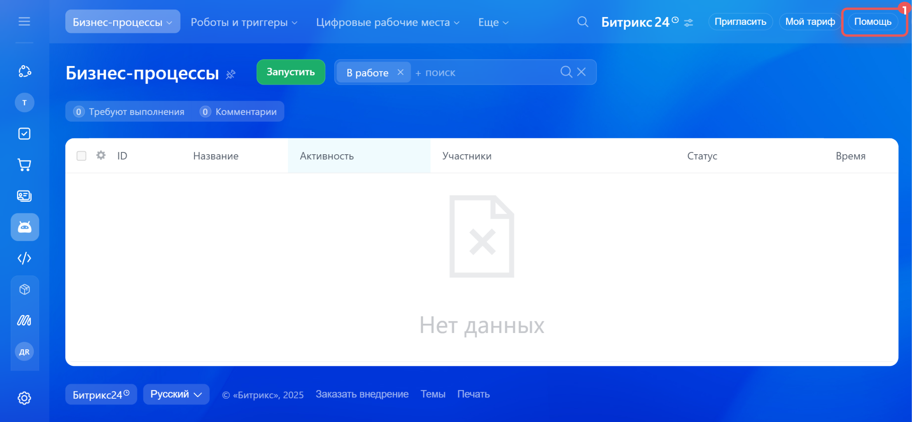
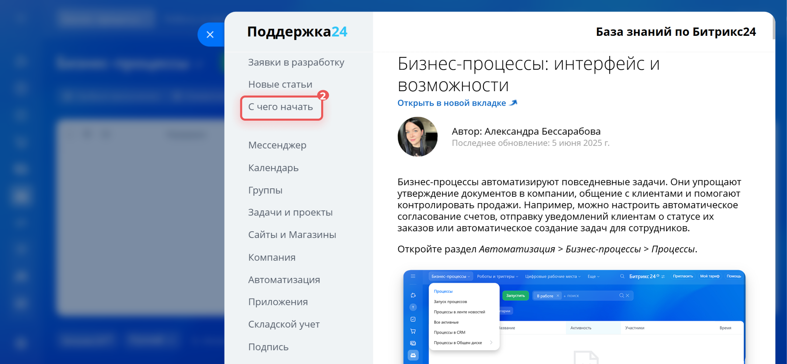
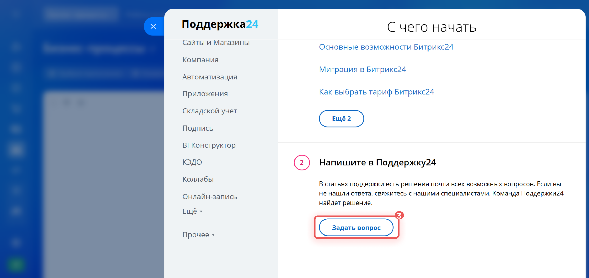

# Как написать в поддержку

С вопросами по работе REST API Битрикс24 можно обратиться в техническую поддержку.



Техническая поддержка доступна только на коммерческих тарифах. Написать в поддержку может администратор или интегратор.
На бесплатном тарифе и деморежиме доступна поддержка только через чат-бот [Марта AI](https://helpdesk.bitrix24.ru/open/24351052/).



## С чем поможет поддержка

- Разобраться в документации, например найти метод по описанию.
- Принять запрос на новый функционал.
- Объяснить работу метода или события.
- Принять заявку о неработающем методе или событии.

## Где найти чат с поддержкой

В правом верхнем углу нажмите _Помощь (1) > С чего начать (2) > Задать вопрос (3)_. Откроется чат с поддержкой.







В одном чате сотрудник поддержки решает только один вопрос. Если вопросов несколько, создайте [параллельные диалоги](https://helpdesk.bitrix24.ru/open/17585752/).

## Что прислать в поддержку

### Вопрос по работе метода

1. Напишите, с каким методом сложности. Можно приложить ссылку на страницу документации.

2. Пришлите код запроса.

3. Ответ на запрос: JSON ответ, сообщение об ошибке.

4. Опишите, что ожидаете от метода.



   ```javascript
   BX24.callMethod(
       'crm.item.productrow.add', {
           fields: {
               ownerId: 13142,
               ownerType: 'D',
               productId: 9621,
               price: 80000.000000,
               quantity: 2,
               discountTypeId: 2,
               discountRate: 20,
               taxRate: 20,
               taxIncluded: 'Y',
               measureCode: 796,
               sort: 10,
           },
       },
       function(result) {
           if (result.error()) {
               console.error(result.error());
           } else {
               console.log(result.data());
           }
       }
   );
   ```





```json
{
    "result":{
    "productRow":{
        "id":17647,
        "ownerId":13142,
        "ownerType":"D",
        "productId":9621,
        "price":80000,
        "quantity":2,
        "discountTypeId":2,
        "discountRate":20,
        "taxRate":20,
        "taxIncluded":"Y",
        "measureCode":796,
        "sort":10,
        "type":4,
        "productName":"iphone 14",
        "priceAccount":80000,
        "priceExclusive":66666.67,
        "priceNetto":83333.34,
        "priceBrutto":100000.01,
        "discountSum":16666.67,
        "customized":"Y",
        "measureName":"шт",
        "xmlId":""
    }
    },
    "time":{
    "start":1716887721.77879,
    "finish":1716887723.259695,
    "duration":1.4809050559997559,
    "processing":1.2986550331115723,
    "date_start":"2024-05-28T12:15:21+03:00",
    "date_finish":"2024-05-28T12:15:23+03:00"
    }
}
```





```json
{\"error\":422,\"error_description\":\"Parameter resourceIds must be array\"}" 
```

    

### Вопрос по работе события

1. Напишите, с каким событием сложности. Можно приложить ссылку на страницу документации.

2. Укажите URL обработчика, который подписан на событие:
	- URL из поля `handler` метода [event.bind](//api-reference/events/event-bind.md),
	- URL из поля `URL вашего обработчика*` [исходящего вебхука](./local-integrations/local-webhooks.md).

3. Напишите дату и время, когда последний раз событие не сработало.
