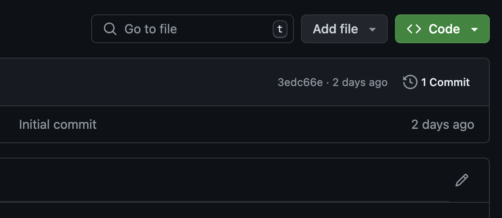

# Как исправить и дополнить документацию

Мы благодарны всем, кто вносит изменения и дополняет документацию. Ваш опыт  работы с REST API Битрикс24 помогает начинающим разработчикам познакомиться с API, а опытным — находить ответы на вопросы.

## Как организована документация

Документация по REST API Битрикс24 — это проект из файлов в формате Markdown и файлов Yaml, необходимых для управления структурой и навигацией.

Markdown удобен для технической документации и привычен многим разработчикам. Даже если вы ни разу его не использовали, то, ориентируясь на содержимое текущей документации, вы сможете быстро разобраться.

Итоговая документация генерируется из md/yaml-файлов в статичные html-файлы и автоматически публикуется.

Мы полагаем, что вы уже знакомы с принципами работы в системах контроля версий.

В репозитории есть основная ветка main для автоматической сборки документации. Права на работу с этой веткой есть только у редакторов документации.

Остальные контрибьюторы могут создавать свои ветки и вносить изменения в них. Затем отправлять их на проверку с помощью заявок pull request.

## Как внести изменения в готовую статью

В правой верхней части каждой статьи документации есть кнопка редактирования.

Переход по ссылке откроет в репозитории статью, которую вы планируете изменить.

1.	В навигационном меню репозитория выберите вкладку Code.
2.	В правом верхнем углу окна файла нажмите кнопку Edit this file (иконка карандаша).
3.	Внесите необходимые изменения в текстовом редакторе прямо в браузере.
4.	GitHub предложит автоматически создать форк репозитория. Выберите эту опцию, чтобы создать форк.
5.	После внесения изменений прокрутите страницу вниз до раздела Propose changes.
    - Введите заголовок и описание изменений: что вы изменили и почему.
    - Нажмите кнопку Propose changes.
6.	Вас перенаправят на страницу создания pull request.
7.	На странице создания pull request нажмите Create pull request.
8.	Ваша заявка на изменение придет редакторам документации. Мы стараемся оперативно рассматривать предложенные заявки.

## Как создать новую статью

Вы можете добавить свою статью в документацию.

1.	Перейдите в репозиторий документации.
2.	Перейдите в раздел, в котором вы хотите предложить добавить статью.
3.	В правом верхнем углу списка файлов нажмите кнопку Add file.
4.	Выберите Create new file.
5.	Введите имя файла в поле Name your file. Файл со статьей должен иметь расширение md.
6.	В текстовом редакторе ниже добавьте содержимое нового файла.
7.	GitHub предложит автоматически создать форк репозитория. Выберите эту опцию, чтобы создать форк.
8.	После внесения изменений прокрутите страницу вниз до раздела Propose new file.
    - Введите заголовок и описание: какой файл вы добавляете и почему.
    - Нажмите Propose new file.
9.	Вас перенаправят на страницу создания pull request.
10.	На странице создания pull request нажмите Create pull request.
11.	Ваша заявка на изменение придет редакторам документации. Мы стараемся оперативно рассматривать предложенные заявки.
