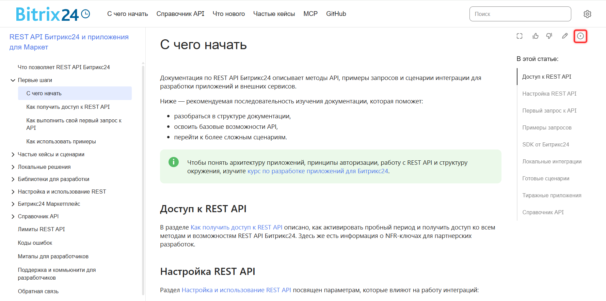
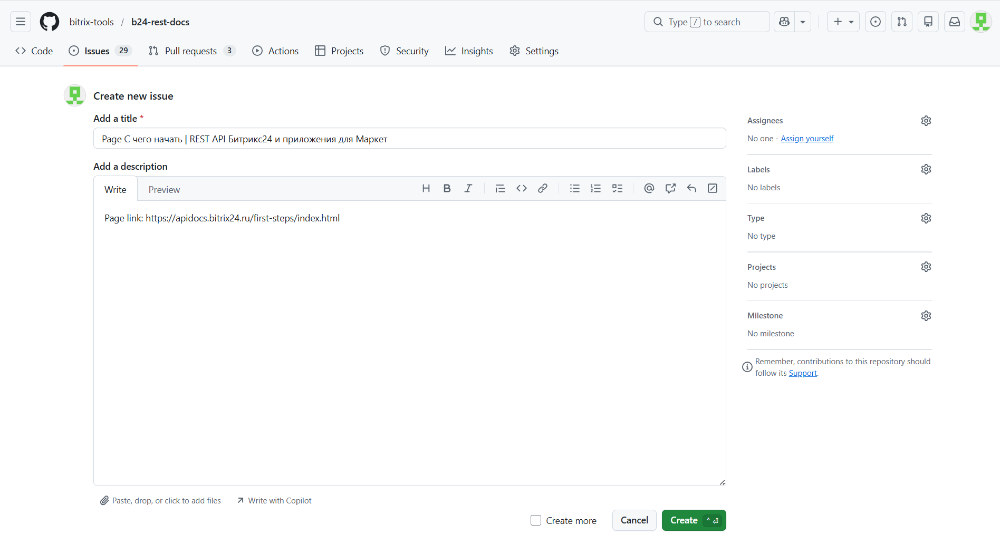
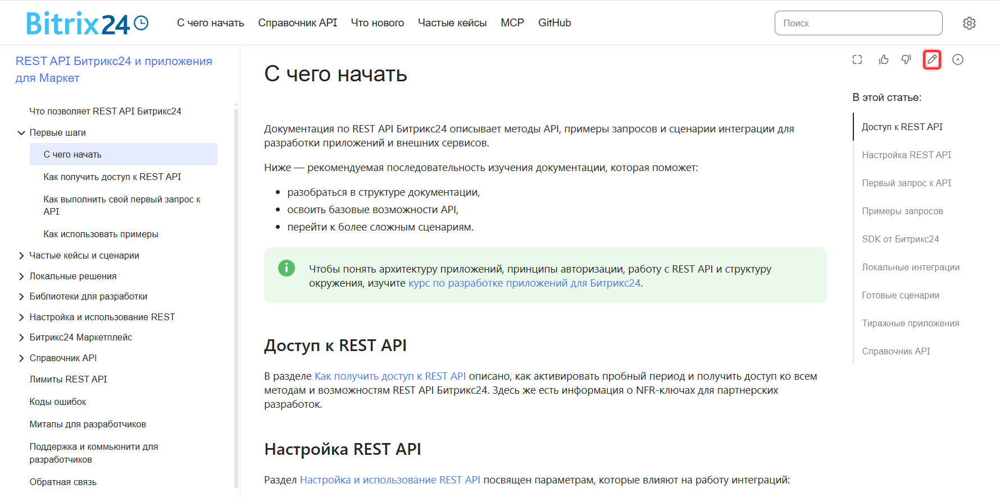
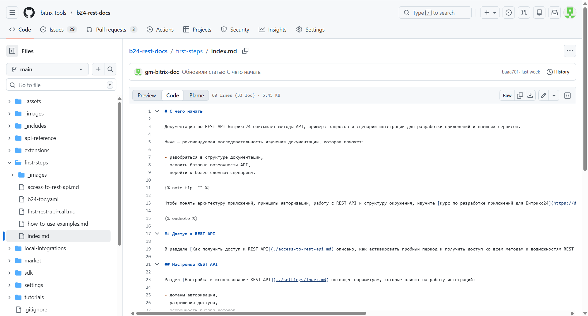

# Обратная связь

Документация REST API Битрикс24 находится в открытом репозитории на [GitHub](https://github.com/bitrix-tools/b24-rest-docs). Если вы нашли ошибку, хотите исправить материал или добавить новый — напишите нам. Мы внимательно относимся к любым предложениям и стараемся отвечать быстро.

Чтобы помочь проекту, вы можете:

- сообщить об ошибке через Issue,
- внести изменения через Pull Request,
- предложить новую статью.

## Как устроена документация

Документация хранится в GitHub в виде файлов в формате Markdown и YAML. Итоговые HTML-страницы генерируются автоматически.

Основная ветка репозитория — `main`. В нее могут вносить изменения только редакторы. Все остальные контрибьюторы работают через свои ветки и Pull Request.

## Как оставить Issue

Issue подходит, если вы заметили ошибку в статье или хотите задать вопрос.

### Как оставить Issue со страницы документации

1. Откройте нужную статью и нажмите на иконку круга с точкой в верхней части страницы.

   

2. Вы перейдете в репозиторий GitHub. Форма Issue откроется автоматически.

   

3. Заполните форму:

   - В поле Add a title появится название статьи. Можете оставить как есть.
   - В поле Add a description автоматически подставится ссылка на статью. Здесь же подробно опишите проблему или вопрос.

4. Нажмите Create.

### Как оставить Issue из репозитория GitHub

1. В верхнем меню выберите вкладку Issues и нажмите New issue.
2. Откроется форма создания Issue.
3. Заполните форму:

   - В поле Add a title коротко обозначьте проблему.
   - В поле Add a description подробно опишите проблему или вопрос.

4. Нажмите Create.

## Как отправить Pull Request

Pull Request подходит, если вы хотите исправить или улучшить существующую статью.

### Как отправить Pull Request со страницы документации

1. Откройте нужную статью и нажмите на иконку карандаша в верхней части страницы.

   

2. Вы перейдете в репозиторий GitHub. Откроется файл статьи, которую вы планируете изменить.

   

3. В правом верхнем углу нажмите на иконку карандаша. GitHub предложит создать Fork — подтвердите.
4. Внесите изменения прямо в интерфейсе и нажмите Commit changes.
5. GitHub предложит создать Pull Request — подтвердите.
6. Откроется форма создания Pull Request.
7. Заполните форму:

   - В поле Add a title коротко обозначьте изменения.
   - В поле Add a description подробнее опишите, что вы изменили и почему.

8. Нажмите Create pull request.

### Как отправить Pull Request из репозитория GitHub

1. В правом верхнем углу нажмите Fork и создайте копию репозитория.
2. Найдите нужный файл и внесите изменения.
3. Нажмите Commit changes.
4. В верхнем меню репозитория выберите вкладку Pull request и нажмите New pull request.
5. Откроется форма создания Pull Request.
6. Заполните форму:

   - В поле Add a title коротко обозначьте изменения.
   - В поле Add a description подробнее опишите, что вы изменили и почему.

7. Нажмите Create pull request.

## Как предложить новую статью

1. Откройте репозиторий документации на GitHub.
2. Перейдите в раздел, куда хотите добавить файл.
3. В правом верхнем углу нажмите *Add file > Create new file*.
4. Укажите имя файла с расширением `.md`.
5. Напишите текст статьи в формате Markdown и нажмите Commit changes.
6. В разделе, где добавили новый файл, найдите файл `b24-toc.yaml`.
7. В нем добавьте новый пункт по примеру:

   ```
   - name: Как получить доступ к REST API 
     href: access-to-rest-api.md
   ```

   - `name: Название пункта меню` — название статьи. Для статей о методах и событиях в пункте меню указывайте только описание. Например, статья «Создать новую сделку crm.deal.add» — пункт меню «Создать новую сделку».
   - `href: название-файла.md` — название файла.

8. Нажмите Commit changes.
9. GitHub предложит создать Pull Request — подтвердите.
10. Откроется форма создания Pull Request.
11. Заполните форму:
    - В поле Add a title укажите, какой файл вы добавили.
    - В поле Add a description опишите тему статьи и почему вы ее предлагаете.
12. Нажмите Create pull request.