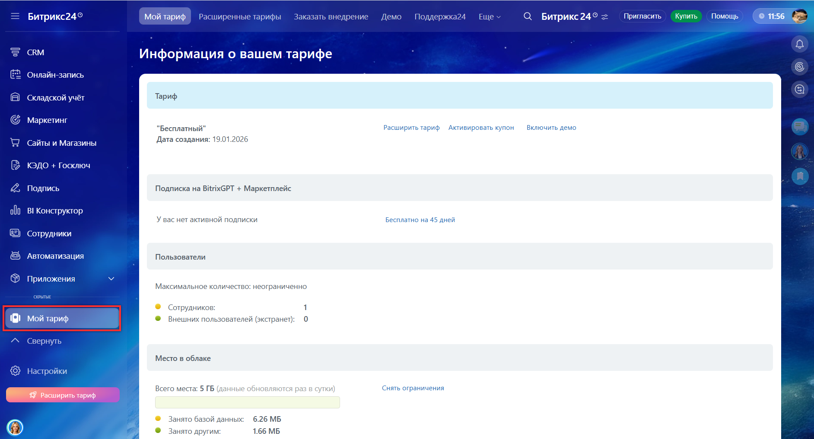

# Как получить доступ к REST API

REST API в Битрикс24 работает только с подпиской Битрикс24 Маркетплейс. Приобрести подписку можно на платных тарифах Битрикс24. Стоимость подписки [зависит от тарифа](https://www.bitrix24.ru/prices/).

Чтобы получить доступ к REST API:

1. Проверьте текущий тариф в разделе Мой тариф в главном меню Битрикс24. Если портал на бесплатном тарифе — выберите и активируйте подходящий тариф.
   
   
   
2. Оформите подписку Маркетплейс. Перейдите в *Мой тариф > Подписка на BitrixGPT + Маркетплейс* и нажмите Купить подписку.



- [Возможности раздела Мой тариф](https://helpdesk.bitrix24.ru/open/24515854/)
- [Как оформить подписку Маркетплейс](https://helpdesk.bitrix24.ru/open/20703042/)



## Как протестировать API перед покупкой

Перед оформлением платной подписки вы можете активировать пробную версию Маркетплейса. В этот период REST API будет доступен для тестирования и разработки.

Чтобы включить пробный режим:

1. Перейдите в виджет Мой тариф в верхнем меню Битрикс24.
2. В разделе BitrixGPT + Маркетплейс нажмите Включить демо.


   
В коробочной версии Битрикс24 активировать пробный период Маркетплейса можно только при наличии активной лицензии. Если вы используете пробный ключ для коробки, демо-режим для Маркетплейса будет недоступен.




   
- [Пробная подписка Маркетплейс](https://helpdesk.bitrix24.ru/open/19411366/)



## Доступ для технологических партнеров

Если вы разрабатываете тиражные приложения для размещения в Битрикс24 Маркетплейс, запросите специальный NFR-ключ. Этот ключ активирует партнерский тариф с подпиской на Маркетплейс для работы REST API на тестовом портале.

Чтобы получить NFR-ключ:

1. Зарегистрируйтесь как технологический партнер. Заполните анкету на [сайте кабинета разработчика](https://vendors.bitrix24.ru/technology-partnership/) и нажмите кнопку Стать партнером.
2. После получения доступа в кабинет разработчика отправьте заявку на NFR-ключ через внутренний чат поддержки.


   
- [Обзор тиражных приложений](../market/index.md)
- [Технологическое партнерство](../market/technology-partnership.md)



## Права пользователя при работе с API

REST API выполняет запросы от имени пользователя, который их отправляет. API не расширяет права доступа. Через API можно делать только то, что пользователь может сделать в интерфейсе. Например, если пользователь не видит задачу в списке задач, он не сможет получить ее через метод REST API.

Чтобы получить максимальный доступ, используйте учетную запись администратора.

### Ограничения через scope

Права на выполнение методов REST API дополнительно регулируются через `scope`. Скоупы Битрикс24 определяют, к каким методам может обращаться приложение или вебхук.


   
- [Доступные скоупы Битрикс24](../api-reference/scopes/permissions.md)



## Что дальше

Когда подписка Битрикс24 Маркетплейс или пробный период активны, вы можете перейти к выполнению первого запроса к REST API.


   
Чтобы REST API работал в коробке, должны быть открыты необходимые сетевые подключения. Если доступ извне ограничен, API будет не доступен.




   
- [Как выполнить свой первый запрос к API](./first-rest-api-call.md)
- [Необходимые сетевые доступы](../settings/cloud-and-on-premise/network-access.md)

