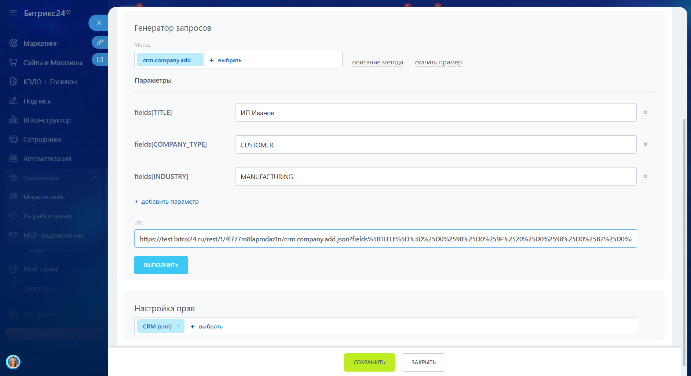
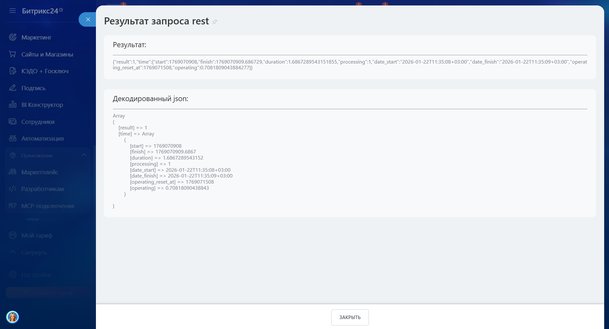

# Как выполнить свой первый запрос к API

Чтобы сделать первый запрос к REST API, используйте входящий вебхук. Это готовый инструмент для вызова методов API с правами пользователя, который создал вебхук.

## Как создать входящий вебхук

1. В левом меню Битрикс24 откройте раздел *Приложения > Разработчикам*.
2. Перейдите на вкладку *Готовые сценарии > Другое > Входящий вебхук*. Появится слайдер с уже сгенерированным кодом вебхука.



Никому не передавайте секретный код вебхука и не встраивайте его в публичный код веб-страниц или скриптов.



## Генератор запросов

Под кодом вебхука находится блок Генератор запросов. С его помощью можно подобрать нужные значения методов и параметров.

1. Выберите метод из списка. Если нужного метода в списке нет:
   -  Установите необходимые скоупы в блоке Настройка прав и сохраните вебхук.
   -  Пропишите название метода в URL.

   

2. При необходимости укажите параметры метода.
3. Нажмите кнопку Выполнить. Запрос отправится к API Битрикс24, и вы увидите ответ в формате JSON.

   

## Структура URL вебхука

Для выполнения запроса из внешней системы используется URL, который формируется автоматически. Его можно посмотреть в генераторе.

URL состоит из нескольких частей:

- test.bitrix24.ru — адрес вашего Битрикс24
- /rest — указание на работу через REST API
- /1 — идентификатор пользователя, создавшего вебхук
- /4l777m8lapmdaz1n — уникальный код вебхука
- /crm.company.add — вызываемый метод REST API
- .json — формат данных
- ?fields — параметры, необходимые для конкретного метода

## Настройка прав

В блоке Настройка прав указывается, к каким модулям Битрикс24 может обращаться вебхук. Узнать, какие скоупы нужны для выполнения конкретного метода, можно на странице с описанием этого метода.


   
- [Доступные скоупы Битрикс24](../api-reference/scopes/permissions.md)



## Другие способы работы с API

Входящие вебхуки подходят для личного пользования. Для разработки локальных приложений, которые будут работать у разных пользователей, или тиражных решений для Битрикс24 Маркетплейс требуется авторизация через OAuth 2.0.

- Для регистрации локальных приложений перейдите на вкладку *Готовые сценарии > Другое > Локальное приложение*.
- Для размещения решений в Маркетплейс необходимо стать участником партнерской программы. Для этого заполните анкету на [сайте кабинета разработчика](https://vendors.bitrix24.ru/technology-partnership/).



- [Локальные приложения](../local-integrations/local-apps.md)
- [Обзор тиражных приложений](../market/index.md)
- [Протокол авторизации OAuth 2.0](../settings/oauth/index.md)

