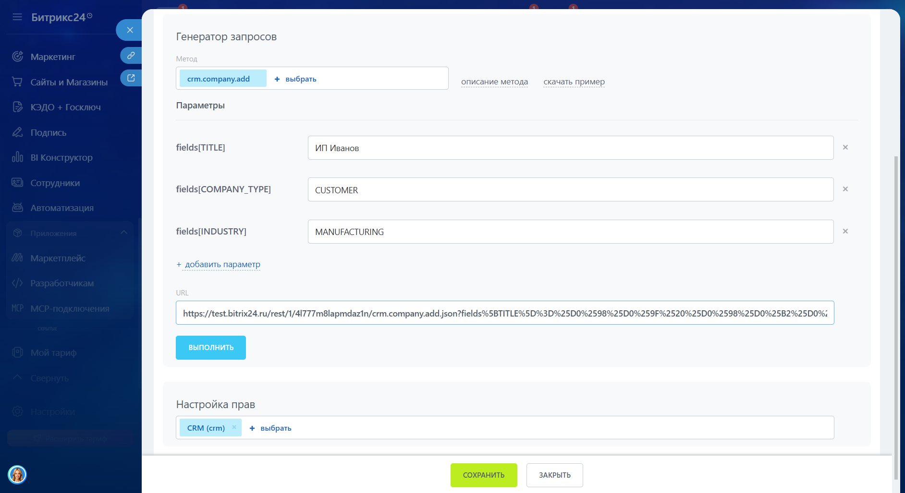
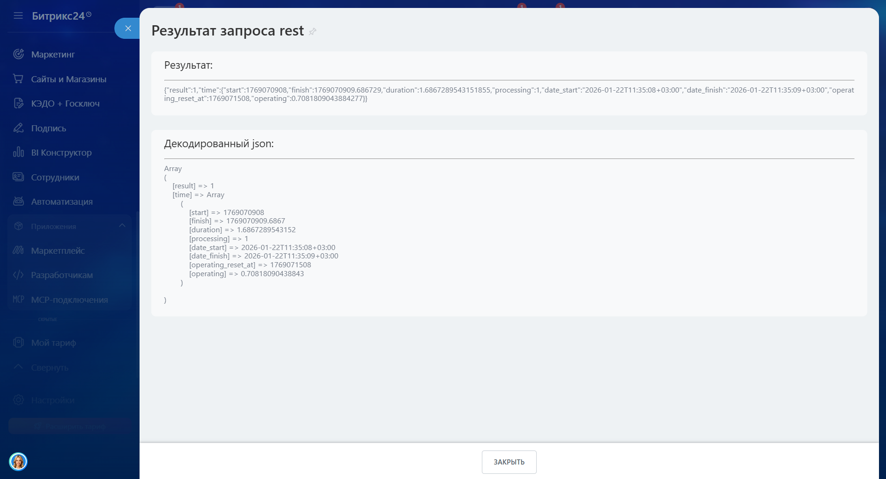

# Как выполнить свой первый запрос к API



Выберите инструмент для разработки с AI-агентом:

- используйте [Битрикс24 Вайбкод](../ai-tools/vibecode.md), чтобы создать приложение для Битрикс24 по описанию задачи без знания языков программирования. Агент напишет код и разместит приложение на сервере без ручной настройки хостинга
- используйте [MCP-сервер](../ai-tools/mcp.md), чтобы разрабатывать интеграцию через REST API в своем проекте. Агент будет обращаться к официальной REST-документации



Чтобы выполнить первый запрос к REST API, создайте входящий вебхук. Это готовый инструмент для вызова методов API с правами пользователя, который создал вебхук.

На этой странице вы узнаете, как настроить вебхук, выполнить тестовый запрос и выбрать подходящий способ авторизации для интеграции.

## Как создать входящий вебхук

1. В левом меню Битрикс24 откройте раздел *Приложения > Разработчикам*.
2. Перейдите на вкладку *Готовые сценарии > Другое > Входящий вебхук*. Появится слайдер с уже сгенерированным кодом вебхука.

Если пункта *Входящий вебхук* нет, значит право на создание вебхуков закрыто. Попросите администратора [дать доступ к созданию вебхуков](#webhook-app-access).

## Генератор запросов

Под кодом вебхука находится блок *Генератор запросов*. С его помощью можно подобрать нужные значения методов и параметров.

1. Выберите метод из списка. Если нужного метода в списке нет:
   - установите необходимые скоупы в блоке Настройка прав и сохраните вебхук
   - пропишите название метода в URL

   

2. При необходимости укажите параметры метода.
3. Нажмите кнопку Выполнить. Запрос отправится к API Битрикс24, и вы увидите ответ в формате JSON.

   

## Структура URL вебхука

Для выполнения запроса из внешней системы используется URL, который формируется автоматически. Его можно посмотреть в генераторе.

Пример URL:

```http
https://test.bitrix24.ru/rest/1/4l777m8lapmdaz1n/crm.company.add.json?fields[TITLE]=Company
```

URL состоит из нескольких частей:

- `test.bitrix24.ru` — адрес вашего Битрикс24
- `/rest` — указание на работу через REST API
- `/1` — идентификатор пользователя, создавшего вебхук
- `/4l777m8lapmdaz1n` — уникальный код вебхука
- `/crm.company.add` — вызываемый метод REST API
- `.json` — формат данных
- `?fields` — параметры, необходимые для конкретного метода



Никому не передавайте секретный код вебхука и не встраивайте его в публичный код веб-страниц или скриптов.



## Настройка прав вебхука

В блоке *Настройка прав* указывается, к каким модулям Битрикс24 может обращаться вебхук. Запросы выполняются с правами пользователя, который создал вебхук, и только в рамках выбранных скоупов. Узнать, какие скоупы нужны для выполнения конкретного метода, можно на странице с описанием этого метода.



- [Доступные скоупы Битрикс24](../api-reference/scopes/permissions.md)



## Как настроить доступ к созданию вебхуков для сотрудников {#webhook-app-access}

В Битрикс24 доступ к созданию вебхуков может быть закрыт по умолчанию.

Сотрудник без прав администратора не может сам выдать себе доступ. Администратор может разрешить создание вебхуков всем сотрудникам или отдельным пользователям.

1. Откройте *Настройки > Настройки Битрикс24*. Раздел доступен только сотрудникам с правами администратора.
2. В новом окне перейдите в *Безопасность > Интеграции Битрикс24*.
3. В поле *Кому разрешить создавать входящие вебхуки* нажмите *Добавить* и выберите всех сотрудников или отдельных пользователей


## Другие способы работы с API

Входящие вебхуки подходят для личного пользования и внутренних сценариев, где запросы выполняются от имени одного пользователя. Для локальных приложений, которые будут работать у разных пользователей, используйте OAuth 2.0. Для тиражных решений, которые будут размещены в Битрикс24 Маркетплейс, также требуется OAuth 2.0 и регистрация решения.

- Для регистрации локальных приложений перейдите на вкладку *Готовые сценарии > Другое > Локальное приложение*. Если пункта *Локальное приложение* нет, попросите администратора настроить доступ к созданию приложений так же, как доступ к созданию вебхуков.
- Для размещения решений в Маркетплейс необходимо стать участником партнерской программы. Для этого заполните анкету на [сайте кабинета разработчика](https://vendors.bitrix24.ru/technology-partnership/).



- [Локальные приложения](../local-integrations/local-apps.md)
- [Обзор тиражных приложений](../market/index.md)
- [Протокол авторизации OAuth 2.0](../settings/oauth/index.md)


