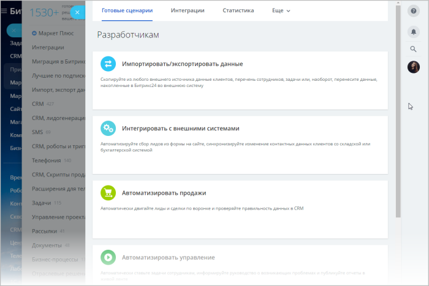
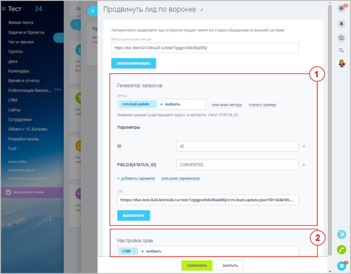
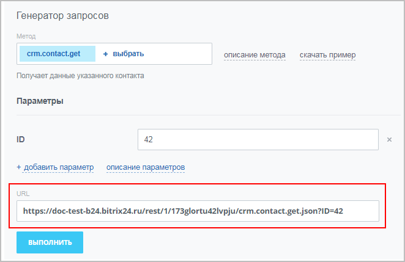
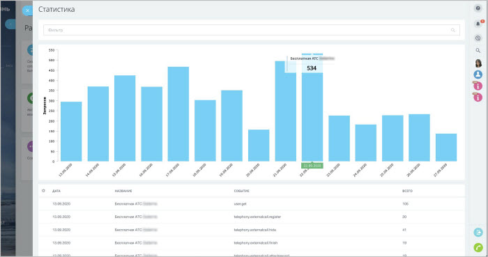

# Раздел Разработчикам в Битрикс24

В разделе **Разработчикам** (*Приложения > Разработчикам*) собраны удобные инструменты для облегчения работы по интеграции и доработке вашего Битрикс24:

Доступны следующие инструменты:

- Готовые сценарии
- Интеграции
- Статистика

Рассмотрим подробнее каждый из этих инструментов.

## Готовые сценарии

На этой вкладке представлены готовые сценарии для интеграции и доработки с примерами кода и предустановленными параметрами на базе вебхуков и локальных приложений.

В настройках каждого из сценариев есть генератор REST-запросов (1), с помощью которого можно подобрать нужные значения параметров для дальнейшего использования во внешних системах:

В генераторе запросов можно выбрать метод REST API, прочитать описание метода, скачать готовый пример кода (в примере уже есть необходимые параметры для выполнения запросов), добавить свои параметры. Здесь же можно выполнить сам запрос и получить результат, проверив работу вебхука.

Настройка прав доступа (2) позволяет разрешить выполнение запросов только определенным инструментам Битрикс24.

После сохранения созданные приложения и вебхуки будут отображаться во вкладке **Интеграции**.

### Список готовых сценариев

Готовые сценарии разбиты по категориям:

- **Импортировать/экспортировать данные** (скопируйте из любого внешнего источника данные клиентов, перечень сотрудников, задачи или, наоборот, перенесите данные, накопленные в Битрикс24 во внешнюю систему):
    - Импортировать контрагентов
    - Экспортировать контрагентов
    - Другое (реализуйте свои сценарии добавления виджетов в Битрикс24)

- **Интегрировать с внешними системами** (автоматизируйте сбор лидов из формы на сайте, синхронизируйте изменение контактных данных клиентов со складской или бухгалтерской системой):
    - Синхронизировать контрагентов
    - Добавить лиды

- **Автоматизировать продажи** (автоматически двигайте лиды и сделки по воронке и проверяйте правильность данных в CRM):
    - Продвинуть лид по воронке
    - Продвинуть сделку по воронке

- **Автоматизировать управление** (автоматически ставьте задачи сотрудникам, информируйте руководство о возникающих проблемах и публикуйте отчеты в живой ленте):
    - Поставить задачу
    - Послать нотификацию
    - Опубликовать отчет в живой ленте
    - Следить за задачами

- **Встроить виджет** (кастомизируйте интерфейс Битрикс24: выводите свою информацию прямо в карточке клиента, скрипты продаж - в карточке звонка):
    - Вывести свои данные в карточку CRM
    - Добавить свое действие в карточку CRM
    - Добавить скрипт продаж в карточку звонка
    - Формировать счет по трудозатратам задачи

- **Добавить чат-бот** (создайте чатботов, которые будут отправлять нотификации и отчеты сотрудникам прямо в мессенджер):
    - Информировать сотрудников в чате
    - Передавать боту сообщения из чата

- **Другое** (создайте входящий вебхук, исходящий вебхук или локальное приложение):
    - Локальное приложение
    - Исходящий вебхук
    - Входящий вебхук

## Интеграции

Все созданные интеграции (вебхуки и приложения) портала Битрикс24 выводятся единым списком на странице:

В этом списке выводится следующая информация об интеграциях:

- Кто создал
- Название
- Права доступа
- События
- Виджеты

Показ нужных полей можно настроить, кликнув по значку шестеренки в левом верхнем углу списка.

Также из этого списка можно перейти к редактированию настроек интеграции (или удалить ее).

> **Важно!** Секретные коды **чужих** вебхуков недоступны даже администратору. Если администратор отредактирует чужой вебхук, то секретный код будет сброшен, и владельцем этого вебхука станет администратор.

### Подробнее о секретном коде в URL

URL состоит из:

- **doc-test-b24.bitrix24.ru** — адрес вашего Битрикс24
- **/rest** — указание на то, что работа ведется через rest с вебхуками
- **/1** — идентификатор пользователя, создавшего вебхук
- **/173glortu42lvpju** — секретный код
- **/crm.contact.get** — вызываемый метод REST API. В данном случае — метод, возвращающий контакт по идентификатору
- **.json** — необязательный параметр («транспорт»). При создании новых вебхуков можно не указывать (по умолчанию будет использоваться `.json`). В конструкторе готовых решений `.json` подставляется явно
- **?ID=42** — параметры, необходимые для конкретного метода. В данном случае — идентификатор. Параметры указываются после вопросительного знака и разделяются символом `&`

## Статистика

В этом разделе выводится общее число ежедневных REST-запросов вашего Битрикс24, а детальная статистика по каждому вебхуку, внешней интеграции или приложению:

## Продолжите изучение

- [Разработчикам: как проверить нагрузку REST в Битрикс24](https://helpdesk.bitrix24.ru/open/20986032/)