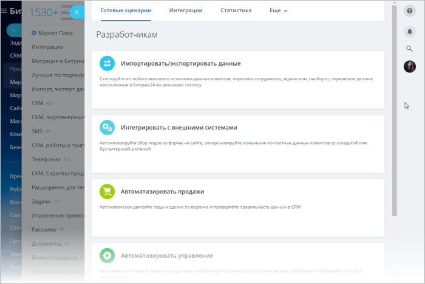
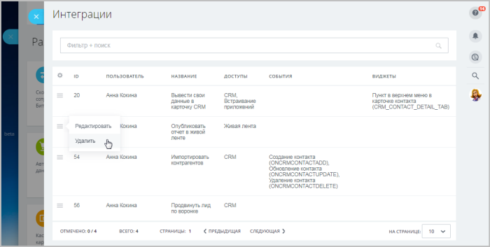
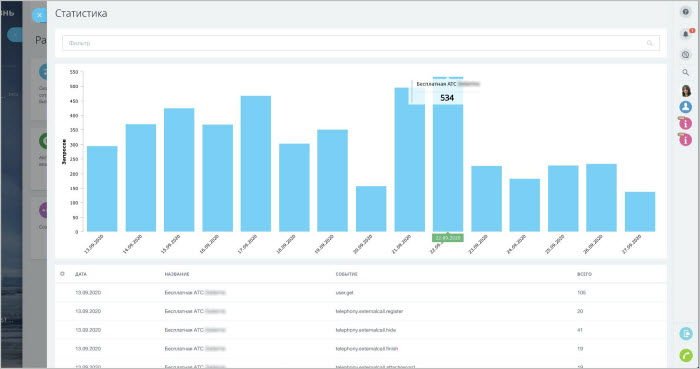

# Раздел Разработчикам в Битрикс24



Выберите инструмент для разработки с AI-агентом:

- используйте [Битрикс24 Вайбкод](../ai-tools/vibecode.md), чтобы создать приложение для Битрикс24 по описанию задачи без знания языков программирования. Агент напишет код и разместит приложение на сервере без ручной настройки хостинга
- используйте [MCP-сервер](../ai-tools/mcp.md), чтобы разрабатывать интеграцию через REST API в своем проекте. Агент будет обращаться к официальной REST-документации



На странице *Приложения > Разработчикам* собраны инструменты для создания локальных интеграций: [вебхуков](./local-webhooks.md), [локальных приложений](./local-apps.md), готовых сценариев и проверки нагрузки REST.

Для быстрого вызова методов REST API в одном Битрикс24 выберите входящий вебхук. Чтобы передавать события Битрикс24 внешнему обработчику, создайте исходящий вебхук. Если интеграции нужен собственный интерфейс или обработка событий в приложении, создайте локальное приложение.

Создавать вебхуки и приложения можно, если в Битрикс24 активирован [доступ к REST API](../first-steps/access-to-rest-api.md). Для постоянной работы нужна подписка BitrixGPT + Маркетплейс, для тестирования можно включить пробный режим.

По умолчанию приложения для всех пользователей может создавать только администратор Битрикс24, а входящие вебхуки и свои приложения — все пользователи. Администратор может изменить эти настройки.



Права на создание интеграций дополнительно регулирует Вайбкод-коннектор. Если включена опция *Источник прав — Вайбкод-сервер*, действуют права, заданные в Битрикс24 Вайбкод. Чтобы применить настройки Битрикс24, выключите эту опцию.



## Готовые сценарии

На вкладке *Готовые сценарии* можно выбрать пример интеграции или создать вебхук либо локальное приложение.

### Импортировать/экспортировать данные

Скопируйте из любого внешнего источника данные клиентов, перечень сотрудников, задачи или перенесите данные, накопленные в Битрикс24, во внешнюю систему.

- Импортировать контрагентов
- Экспортировать контрагентов
- Другое — реализовать свои сценарии добавления виджетов в Битрикс24

### Интегрировать с внешними системами

Автоматизируйте сбор лидов из формы на сайте или синхронизацию контактных данных клиентов со складской или бухгалтерской системой.

- Синхронизировать контрагентов
- Добавить лиды

### Автоматизировать продажи

Автоматически перемещайте лиды и сделки по воронке и проверяйте правильность данных в CRM.

- Продвинуть лид по воронке
- Продвинуть сделку по воронке

### Автоматизировать управление

Информируйте сотрудников и руководство о важных событиях и публикуйте отчеты в живой ленте.

- Послать нотификацию
- Опубликовать отчет в живой ленте

### Встроить виджет

Добавьте свои данные и действия в карточки CRM и задач или скрипт продаж в карточку звонка.

- Вывести свои данные в карточку CRM
- Добавить свое действие в карточку CRM
- Добавить скрипт продаж в карточку звонка
- Формировать счет по трудозатратам задачи

### Добавить чат-бот

Создайте чат-бота, который будет отправлять уведомления и отчеты сотрудникам в мессенджер.

- Информировать сотрудников в чате
- Передавать боту сообщения из чата

### Другое

Создайте входящий или исходящий вебхук либо локальное приложение.

- Локальное приложение
- Исходящий вебхук
- Входящий вебхук

### Как настроить сценарий

Выберите сценарий и откройте его настройки. Состав полей зависит от типа интеграции.

Для сценариев с входящим вебхуком доступен генератор REST-запросов. В нем можно выбрать метод, добавить параметры, выполнить запрос и скачать пример кода.

В блоке *Настройка прав* выберите инструменты Битрикс24, с которыми будет работать интеграция. Коды прав и принцип выбора `scope` описаны в статье [{#T}](../api-reference/scopes/index.md).

После сохранения интеграция появится на вкладке *Интеграции*.

## Интеграции

Все созданные интеграции выводятся единым списком: входящие и исходящие вебхуки и локальные приложения, а также связанные с ними обработчики событий, виджеты и чат-боты.

Администратор Битрикс24 видит все созданные вебхуки и приложения, а обычный пользователь — только те, которые создал сам.

В этом списке выводится следующая информация об интеграциях:

- ID
- Пользователь
- Название
- Доступы
- События
- Виджеты

Чтобы выбрать отображаемые поля, нажмите значок шестеренки в левом верхнем углу списка.

В списке можно изменить настройки интеграции или удалить ее.

Удалить интеграцию может администратор Битрикс24 или сотрудник, который ее создал. Вместе с интеграцией удаляются связанные с ней вебхук, обработчики событий, локальное приложение, виджеты и чат-бот.



Секретные коды чужих вебхуков недоступны даже администратору. Если администратор отредактирует чужой вебхук, секретный код обновится, а владельцем вебхука станет администратор.



## Статистика

На вкладке *Статистика* администратор Битрикс24 может посмотреть количество REST-запросов по каждому вебхуку и приложению. Данные можно отфильтровать за период не более 14 дней. Подробнее об оценке нагрузки REST читайте в статье [Разработчикам: как проверить нагрузку REST в Битрикс24](https://helpdesk.bitrix24.ru/open/20986032/).

## Продолжите изучение

- [{#T}](./local-webhooks.md)
- [{#T}](./local-apps.md)
- [{#T}](./use-cases.md)
- [{#T}](../api-reference/scopes/index.md)
