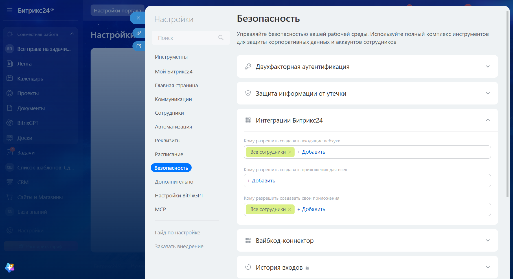

# Входящие и исходящие вебхуки



Выберите инструмент для разработки с AI-агентом:

- используйте [Битрикс24 Вайбкод](../ai-tools/vibecode.md), чтобы создать приложение для Битрикс24 по описанию задачи без знания языков программирования. Агент напишет код и разместит приложение на сервере без ручной настройки хостинга
- используйте [MCP-сервер](../ai-tools/mcp.md), чтобы разрабатывать интеграцию через REST API в своем проекте. Агент будет обращаться к официальной REST-документации



Вебхуки подходят для локальных интеграций в одном Битрикс24. Входящий вебхук вызывает методы REST API от имени сотрудника, который его создал. Исходящий вебхук отправляет событие Битрикс24 на URL вашего обработчика.

## Что выбрать

#|
|| **Инструмент** | **Что делает** | **Когда подходит** | **Что важно учесть** ||
|| Входящий вебхук | Вызывает методы REST API по секретному URL | Быстрые интеграции, тесты, скрипты, обмен данными с внешней системой | Работает в рамках `scope` и прав сотрудника. Часть методов требует контекста приложения и через вебхук недоступна ||
|| Исходящий вебхук | Отправляет событие Битрикс24 на URL вашего обработчика | Реакция на изменение данных, запуск синхронизации, уведомление внешней системы | Обработчик должен быть доступен из внешней сети. Для получения полных данных об объекте обычно нужен дополнительный вызов метода ||
|#

## Входящий вебхук {#incoming-webhook}

Входящий вебхук выбирают для внутренних интеграций и быстрых проверок, когда:

- нужно быстро проверить вызов метода в браузере, генераторе запросов или через `curl`
- интеграция работает только с одним Битрикс24
- запросы должны выполняться от имени конкретного сотрудника
- не нужен интерфейс приложения, обработчик событий или установка решения на другие Битрикс24

### Как работает входящий вебхук

Права входящего вебхука определяются сотрудником, который его создал, и списком выбранных `scope`:

- создать входящий вебхук может администратор или сотрудник, которому администратор разрешил создание вебхуков
- на Битрикс24 должен быть [доступ к REST API](../first-steps/access-to-rest-api.md)
- запросы выполняются в рамках [scope](../api-reference/scopes/permissions.md), который выбран в настройках вебхука
- запросы выполняются с правами сотрудника, который создал вебхук
- секретный код вебхука доступен только сотруднику, который его создал. Если администратор отредактирует чужой вебхук, секретный код обновится, а владельцем вебхука станет администратор
- часть методов через вебхук недоступна, потому что требует контекста приложения. Например, методы встраивания виджетов, такие как [placement.bind](../api-reference/widgets/placement-bind.md), часть методов [телефонии](../api-reference/telephony/index.md) и некоторые сценарии [чат-ботов](../api-reference/chat-bots/index.md)
- механизм входящих вебхуков поддерживает дату окончания. Если срок действия истек, запрос перестанет проходить и вернет ошибку авторизации

### Как создать входящий вебхук

Вебхуки создают в разделе *Приложения > Разработчикам*. Если подходит готовый сценарий, выберите его на вкладке *Готовые сценарии* и откройте настройки. Если нужного сценария нет, создайте входящий вебхук на вкладке *Готовые сценарии > Другое*.

1. Откройте раздел *Приложения > Разработчикам*
2. Перейдите на вкладку *Готовые сценарии > Другое > Входящий вебхук*
3. В генераторе запросов выберите метод и при необходимости заполните параметры
4. Нажмите *Выполнить*, чтобы проверить тестовый вызов
5. Укажите права доступа и нажмите *Создать*

В генераторе запросов можно выбрать метод, посмотреть описание метода и параметров, заполнить параметры, выполнить запрос и скачать готовый пример кода на PHP.

Если пункта *Входящий вебхук* нет, значит право на создание вебхуков закрыто. Попросите администратора [дать доступ к созданию вебхуков](#webhook-access).

### Как устроен URL вебхука

Пример URL:

```text
https://example.bitrix24.ru/rest/1/xxxxxxxx/department.get.json?ID=42
```

URL состоит из нескольких частей:

- `example.bitrix24.ru` — адрес вашего Битрикс24
- `/rest` — путь к REST API
- `/1` — идентификатор сотрудника, который создал вебхук
- `/xxxxxxxx` — секретный код вебхука
- `/department.get` — имя вызываемого метода
- `.json` — формат ответа. Этот суффикс можно не указывать, по умолчанию используется `json`
- `?ID=42` — параметры метода



Секретный код вебхука дает доступ к методам в рамках прав вебхука. Не передавайте URL вебхука посторонним и не публикуйте его в клиентском коде.



### Как настроить доступ к созданию вебхуков для сотрудников {#webhook-access}

Сотрудник без прав администратора не может сам выдать себе доступ. Администратор может разрешить создание вебхуков всем сотрудникам или отдельным пользователям.

1. Откройте *Настройки > Настройки Битрикс24*. Раздел доступен только сотрудникам с правами администратора.
2. В новом окне перейдите в *Безопасность > Интеграции Битрикс24*.
3. В поле *Кому разрешить создавать входящие вебхуки* нажмите *Добавить* и выберите всех сотрудников или отдельных пользователей



### Как быстро проверить метод через GET-запрос

На страницах методов REST API вызовы через вебхук показаны как POST-запросы. GET-запрос можно выполнить в адресной строке браузера или генераторе запросов при создании входящего вебхука.

Такой формат подходит, когда нужно быстро проверить простой вызов и посмотреть, как параметры выглядят в URL.

Общий формат URL:

```text
https://{your-bitrix24}.bitrix24.ru/rest/{user_id}/{webhook_code}/{method}.json
```

Пример метода без параметров:

```text
https://example.bitrix24.ru/rest/1/xxxxxxxx/profile.json
```

Пример метода с одним параметром:

```text
https://example.bitrix24.ru/rest/1/xxxxxxxx/department.get.json?ID=1
```

Пример метода с массивом параметров:

```text
https://example.bitrix24.ru/rest/1/xxxxxxxx/user.get.json?FILTER[ACTIVE]=true&select[]=ID&select[]=NAME
```



У GET-запросов есть ограничения:

- GET подходит для быстрых тестов простых запросов
- URL вебхука может сохраниться в истории браузера, логах и сервисах мониторинга
- для рабочих интеграций, вложенных параметров, файлов и изменения данных используйте POST-запрос
- если URL становится длинным, используйте POST-запрос, `curl` или SDK



### Что проверить перед рабочим использованием

Перед рабочим запуском проверьте, что:

- нужный метод доступен по выбранному `scope`
- у сотрудника, который создал вебхук, есть права на нужный объект
- у вашего Битрикс24 есть [доступ к REST API](../first-steps/access-to-rest-api.md)
- запросы идут по HTTPS

## Исходящий вебхук {#outgoing-webhook}

Исходящий вебхук выбирают, когда:

- внешняя система должна автоматически узнавать об изменениях в Битрикс24
- нужно запустить синхронизацию после создания или изменения объекта
- достаточно получить событие и идентификатор объекта, а подробные данные можно запросить отдельным методом

### Как работает исходящий вебхук

Исходящий вебхук не вызывает метод сам. Он передает событие на ваш обработчик, а обработчик уже решает, нужен ли дополнительный запрос к REST API:

- вы выбираете событие и URL обработчика
- при наступлении события Битрикс24 отправляет POST-запрос на этот URL
- обработчик получает название события, основные данные об объекте и служебные поля авторизации
- если нужны полные данные об объекте, обработчик обычно вызывает соответствующий метод через входящий вебхук или приложение

### Как создать исходящий вебхук

1. Откройте раздел *Приложения > Разработчикам*
2. Перейдите на вкладку *Готовые сценарии > Другое > Исходящий вебхук*
3. Укажите URL вашего обработчика
4. Выберите событие, на которое должен реагировать вебхук
5. Нажмите *Создать* и проверьте вызов после тестового изменения данных

URL обработчика должен быть публичным и доступным из внешней сети. Не указывайте `localhost`, адреса из локальной сети и обработчики с самоподписанным SSL-сертификатом.

При создании исходящего вебхука Битрикс24 показывает токен. Он нужен, чтобы обработчик мог проверить, что запрос действительно пришел от вашего Битрикс24.

### Что получает обработчик

Данные приходят как параметры HTTP-запроса с типом `application/x-www-form-urlencoded`. В PHP их удобно читать через `$_REQUEST`.

Пример структуры для события [ONCRMDEALUPDATE](../api-reference/crm/deals/events/on-crm-deal-update.md):

```php
Array
(
    [event] => ONCRMDEALUPDATE
    [data] => Array
        (
            [FIELDS] => Array
                (
                    [ID] => 662
                )
        )
    [ts] => 1724140800
    [auth] => Array
        (
            [domain] => example.bitrix24.ru
            [member_id] => xxxxxxxxxxxxxxxxxxxxxxxxxxxxxxxx
            [application_token] => xxxxxxxxxxxxxxxxxxxxxxxxxxxxxxxx
        )
)
```

Параметры запроса:

#|
|| **Параметр** | **Тип** | **Описание** ||
|| `event` | [`string`](../api-reference/data-types.md) | Название события, которое вызвало исходящий вебхук ||
|| `data` | [`object`](../api-reference/data-types.md) | Данные события. Для событий CRM идентификатор объекта обычно приходит в `data[FIELDS][ID]` ||
|| `ts` | [`integer`](../api-reference/data-types.md) | Время отправки события в формате Unix timestamp ||
|| `auth` | [`object`](../api-reference/data-types.md) | Служебные данные авторизации, включая `domain`, `member_id` и `application_token` ||
|#

В типовом сценарии обработчик берет идентификатор сделки из `data[FIELDS][ID]`, а затем вызывает метод [crm.item.get](../api-reference/crm/universal/crm-item-get.md) с `entityTypeId = 2`, чтобы получить полные данные.

### Как проверить подлинность запроса

Сравните значение `auth[application_token]` в запросе со значением токена, которое показано в настройках исходящего вебхука. Если значения не совпадают, такой запрос нельзя считать доверенным.

### Ограничения исходящего вебхука

Перед настройкой исходящего вебхука учитывайте, что:

- в коробочной версии Битрикс24 для исходящего вебхука нужна активная лицензия
- на деморежимах исходящий вебхук недоступен
- URL обработчика должен быть доступен из внешней сети и принимать POST-запросы
- для коробочной версии нужно открыть необходимые [сетевые доступы](../settings/cloud-and-on-premise/network-access.md)

## Когда вебхука недостаточно

Выбирайте [локальное приложение](./local-apps.md) или [OAuth 2.0](../settings/oauth/index.md), если:

- интеграцию нужно устанавливать на разные Битрикс24
- нужен интерфейс внутри Битрикс24
- нужны методы, которые работают только в контексте приложения
- нужно централизованно управлять авторизацией без передачи URL вебхука

## Продолжите изучение

- [{#T}](./developers-area.md)
- [{#T}](./local-apps.md)
- [{#T}](./use-cases.md)
- [{#T}](../first-steps/first-rest-api-call.md)
- [{#T}](../api-reference/scopes/permissions.md)
- [{#T}](../settings/oauth/index.md)
