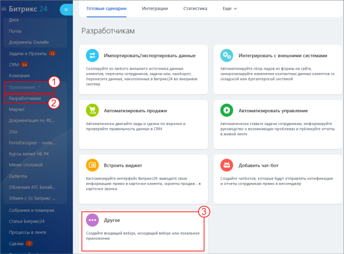
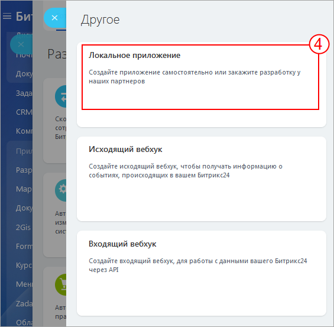
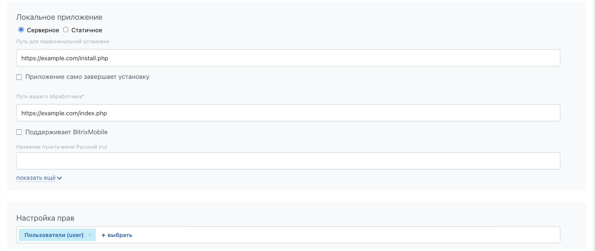
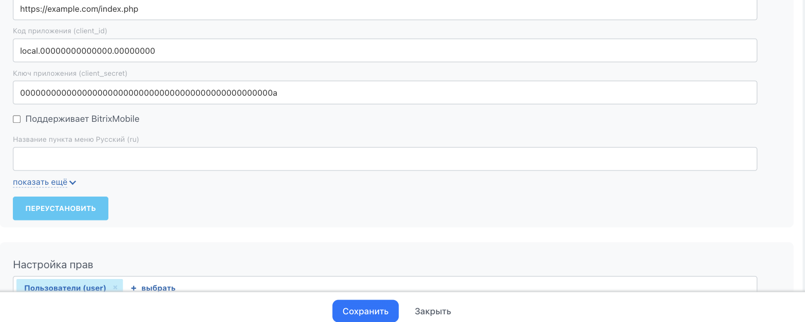

# Серверное локальное приложение без пользовательского интерфейса



Выберите инструмент для разработки с AI-агентом:

- используйте [Битрикс24 Вайбкод](../ai-tools/vibecode.md), чтобы создать приложение для Битрикс24 по описанию задачи без знания языков программирования. Агент напишет код и разместит приложение на сервере без ручной настройки хостинга
- используйте [MCP-сервер](../ai-tools/mcp.md), чтобы разрабатывать интеграцию через REST API в своем проекте. Агент будет обращаться к официальной REST-документации



Серверное локальное приложение без пользовательского интерфейса выполняет код на вашем сервере, а своей страницы внутри Битрикс24 не показывает. В левом меню такого приложения нет — его запускает не сотрудник, а ваш код: планировщик, внешний сервис или обработчик событий.

Приложение работает от имени сотрудника, который его установил. Токены оно получает один раз при установке, хранит у себя и продлевает само.

Приложение работает только в том Битрикс24, где его создали. Если решение нужно устанавливать на разные Битрикс24, разрабатывайте [тиражное приложение](../market/index.md).

Другие виды локальных приложений и критерии выбора между ними описаны в статье [{#T}](./local-apps.md).

## Как работает авторизация {#how-auth-works}

Битрикс24 не открывает страницу такого приложения, поэтому передавать токены при каждом запуске некуда. Приложение проходит полный вариант OAuth 2.0.

1. Вы сохраняете форму локального приложения.
2. Битрикс24 обращается POST-запросом к адресу из поля *Путь для первоначальной установки* и передает событие [ONAPPINSTALL](../api-reference/common/events/on-app-install.md) с объектом `auth`.
3. Скрипт первоначальной установки сохраняет данные из `auth` на вашей стороне.
4. Приложение подставляет `access_token` в запросы к REST API и вызывает методы.
5. Приложение обменивает `refresh_token` на новую пару токенов и перезаписывает сохраненные значения, когда `access_token` истекает.

Основные данные объекта `auth`:

#|
|| **Параметр** | **Что это** ||
|| **access_token** | Авторизационный токен для вызова методов ||
|| **expires_in** | Время жизни `access_token` в секундах. По умолчанию — один час ||
|| **refresh_token** | Токен продления авторизации. Действует 180 дней. По нему приложение получает новую пару токенов ||
|| **domain** | Адрес Битрикс24, в котором установлено приложение ||
|| **client_endpoint** | Адрес, с которого начинаются вызовы методов этого Битрикс24 ||
|| **server_endpoint** | Адрес сервера авторизации, к которому приложение обращается за новой парой токенов ||
|| **scope** | Скоупы, выданные приложению. За их пределами метод вернет ошибку ||
|| **application_token** | Токен приложения. По нему приложение проверяет, что запрос пришел от Битрикс24 ||
|| **member_id** | Идентификатор Битрикс24. По нему приложение отличает один Битрикс24 от другого ||
|| **status** | Статус приложения. У локального — `L` ||
|#

Описанный порядок работает при выключенном флажке *Приложение само завершает установку*.

Запрос установки Битрикс24 отправляет со своего сервера, браузер в этом запросе не участвует. Поэтому приложение без интерфейса не вызывает [BX24.installFinish](../sdk/bx24-js-sdk/system-functions/bx24-install-finish.md) — вызывать его неоткуда, и Битрикс24 считает установку завершенной сам.

Полный состав данных разобран в статье [{#T}](../api-reference/common/events/on-app-install.md), порядок продления токенов — в статье [{#T}](../settings/oauth/auto-renewal.md), сценарий установки — в статье [{#T}](../settings/app-installation/local-apps/installation-callback.md).

## Как получать события {#events}

На адрес первоначальной установки обработчики вешает сам Битрикс24. Событие [ONAPPINSTALL](../api-reference/common/events/on-app-install.md) приходит туда при выключенном флажке *Приложение само завершает установку*, событие [ONAPPUSERREADY](../api-reference/common/events/on-app-user-ready.md) — независимо от флажка.

`ONAPPUSERREADY` приходит после того, как Битрикс24 создал приложению [системного пользователя](../settings/system-user.md). Авторизация этой технической учетной записи передается в объекте `data`, а в `auth` того же запроса лежит авторизация сотрудника, который установил приложение. Что именно приходит в событии, описано в статье [{#T}](../api-reference/common/events/on-app-user-ready.md).

Остальные события приложение подписывает само, и на адрес из поля *Путь вашего обработчика* они не приходят.

Подписку оформляют методом [event.bind](../api-reference/events/event-bind.md). Адрес обработчика события передается в параметре `handler`, а список доступных событий собран в разделе [{#T}](../api-reference/events/index.md). Подписаться удобно в скрипте первоначальной установки, сразу после сохранения токенов.

Проверяйте источник каждого запроса к обработчику события — порядок описан в разделе [Как проверить источник запроса](#check-source).

Публичного адреса у приложения может не быть: оно работает за файрволом или включается по расписанию. Тогда выбирайте [{#T}](../api-reference/events/offline-events.md) — Битрикс24 не вызывает обработчик, а копит изменения в очереди, и приложение забирает их методом [event.offline.get](../api-reference/events/event-offline-get.md).

## Когда выбрать этот вид приложения {#when-to-choose}

Серверное локальное приложение без пользовательского интерфейса подходит, если нужно:

- синхронизировать данные Битрикс24 с внешней системой по расписанию или по изменению данных
- получать [события](../api-reference/events/index.md) Битрикс24 на свой обработчик и обрабатывать их без участия сотрудника
- показывать интерфейс на своей стороне — на своем сайте или в своем сервисе — и обращаться к Битрикс24 со своего сервера

Выберите другой вид приложения, если:

- нужна своя страница внутри Битрикс24 — подойдет [{#T}](./serverside-local-app-with-ui.md). Такое приложение получает токены при каждом открытии и работает от имени того, кто его открыл
- своего сервера нет — подойдет [{#T}](./static-local-app.md). Такое приложение работает в браузере и события не получает
- внешней системе достаточно вызывать методы и принимать события, а хранить токены и проходить OAuth 2.0 не нужно — подойдут [входящие и исходящие вебхуки](./local-webhooks.md)

## Что нужно подготовить {#requirements}

- **Доступ к REST API.** Локальное приложение работает, только если у Битрикс24 есть [доступ к REST API](../first-steps/access-to-rest-api.md) — по подписке Маркетплейс или в пробном режиме.
- **Право на создание приложений.** Создать приложение может администратор Битрикс24 или сотрудник, которому выдано такое право. Если пункта *Локальное приложение* нет в интерфейсе, попросите администратора [настроить доступ к созданию приложений](./local-apps.md#local-app-access).
- **Веб-сервер.** Пример написан на PHP, поэтому нужен сервер с PHP, модулем cURL и действующим SSL-сертификатом. Адрес скрипта первоначальной установки должен отвечать по HTTPS уже в момент сохранения формы. Требования к серверу описаны в статье [{#T}](../sdk/crest-php-sdk/index.md).

## Что содержит пример {#example}

Готовый пример печатает данные сотрудника, от имени которого работает приложение. Их возвращает метод [profile](../api-reference/common/users/profile.md).

Архив — поставка [SDK CRest](https://github.com/bitrix-tools/crest/):

- `crest.php` — код библиотеки
- `settings.php` — настройки приложения: код приложения и секретный ключ
- `install.php` — скрипт первоначальной установки
- `checkserver.php` — проверка настроек сервера
- `index.php` — страница примера

[Скачать архив](https://helpdesk.bitrix24.ru/examples/server-no-ui-crest.zip)

Скрипт `install.php` разбирает запрос установки. Если пришло событие `ONAPPINSTALL` с объектом `auth`, скрипт сохраняет токены в файл `settings.json` рядом с библиотекой и ничего не выводит в ответ.

Страница `index.php` подключает библиотеку и вызывает метод:

```php
<?php

require_once __DIR__ . '/crest.php';

$result = CRest::call('profile');

echo '<pre>';
    print_r($result);
echo '</pre>';
```

Продление токенов берет на себя `CRest::call`: получив ошибку `expired_token`, библиотека сама обновляет пару токенов и повторяет вызов.

Пример собран на CRest, но вид приложения к этой библиотеке и к PHP не привязан. Для PHP есть и [B24PhpSDK](../sdk/b24phpsdk/index.md). Он оформляет вызовы как PHP-классы и методы, но требует Composer и PHP 8.2 или новее. CRest подключают файлами из архива. Остальные библиотеки перечислены в [обзоре SDK](../sdk/index.md).

## Как создать приложение {#create-app}

1. Разместите файлы из архива на своем сервере. Запомните адреса `install.php` и `index.php`: их указывают в форме.

2. Откройте в браузере `checkserver.php` по адресу сервера. Скрипт проверит, что модуль cURL доступен и CRest может сохранять свои файлы. Если проверка не прошла, устраните замечания скрипта, прежде чем переходить к форме: без cURL и без права на запись CRest не сохранит токены.

3. Откройте форму локального приложения: *Приложения > Разработчикам*, вкладка *Готовые сценарии*, далее *Другое > Локальное приложение*.

    

    

4. Выберите вариант *Серверное*. Вариант *Статичное* рассчитан на архив со страницей — смотрите статью [{#T}](./static-local-app.md).

5. Укажите в поле *Путь для первоначальной установки* адрес `install.php`. По этому адресу Битрикс24 передаст данные авторизации.

6. Оставьте выключенным флажок *Приложение само завершает установку*. С выключенным флажком Битрикс24 завершает установку сам и отправляет данные авторизации на адрес первоначальной установки. Если флажок включить, обработчик события `ONAPPINSTALL` не зарегистрируется — токены не придут, а завершить установку приложению без интерфейса нечем.

7. Укажите в поле *Путь вашего обработчика* адрес `index.php`. Поле обязательное, хотя страницу приложения Битрикс24 не открывает.

8. Оставьте пустым поле *Название пункта меню* и скрытые под ним поля названий на других языках. Именно пустое название делает приложение доступным только через API: пункт в левом меню Битрикс24 не появится.

9. Выберите скоупы приложения в блоке *Настройка прав*. Без них форма не сохранится. Примеру подойдет любой: метод `profile` работает с базовым набором прав. На скриншоте выбран `user`. Коды перечислены в статье [{#T}](../api-reference/scopes/permissions.md).

    

10. Сохраните форму. Приложение появится в списке *Приложения > Разработчикам > Интеграции*.

11. Скопируйте значения полей *Код приложения (client_id)* и *Ключ приложения (client_secret)* из карточки приложения в константы `C_REST_CLIENT_ID` и `C_REST_CLIENT_SECRET` файла `settings.php` и загрузите измененный файл на сервер.

    

Битрикс24 обращается к `install.php` сразу после сохранения формы, поэтому токены сохраняются еще до того, как вы заполните `settings.php`. Код приложения и секретный ключ нужны позже: по ним CRest продлевает токены.

Чем отличаются сценарии установки, описано в статье [{#T}](../settings/app-installation/local-apps/index.md).

## Как проверить результат {#check-result}

Откройте `index.php` в браузере по адресу своего сервера. Страница напечатает ответ метода `profile`:

```text
Array
(
    [result] => Array
        (
            [ID] => 1
            [ADMIN] => 1
            [NAME] => Иван
            [LAST_NAME] => Петров
            [PERSONAL_GENDER] => M
            [TIME_ZONE] => Europe/Moscow
        )

    [time] => Array
        (
            [start] => 1788867501.63142
            [finish] => 1788867501.67418
            [duration] => 0.042757034301758
            [processing] => 0.0012109279632568
            [date_start] => 2026-09-10T14:38:21+03:00
            [date_finish] => 2026-09-10T14:38:21+03:00
            [operating] => 0
        )

)
```

Данные сотрудника возвращаются в ключе `result`, а `time` добавляет к ответу сам REST API. Состав данных не зависит от того, кто открыл страницу `index.php`: приложение вызывает метод с токенами, полученными при установке. Список полей описан в статье [{#T}](../api-reference/common/users/profile.md).

## Что делать при ошибках {#errors}

- **`no_install_app`.** В настройках CRest пусто хотя бы одно из значений `access_token`, `domain`, `refresh_token`, `application_token`, `client_endpoint`. Скрипт `install.php` не отработал: чаще всего в момент сохранения формы сервер был недоступен или на нем не хватило прав на запись. Проверьте сервер скриптом `checkserver.php` и нажмите *Переустановить* в карточке приложения — кнопка доступна только администратору Битрикс24.
- **`expired_token`.** Токен `access_token` истек, а продлить его не удалось. Проверьте, что в `settings.php` заполнены `C_REST_CLIENT_ID` и `C_REST_CLIENT_SECRET`: без них запрос к серверу авторизации не пройдет.
- **`insufficient_scope`.** Приложению не выдан скоуп метода. Добавьте нужный скоуп в карточке приложения.
- **Токены перестали продлеваться через несколько месяцев.** Срок действия `refresh_token` — 180 дней. Если приложение не обращалось к Битрикс24 дольше, авторизацию нужно получить заново. Как этого избежать, описано в статье [{#T}](../settings/oauth/auto-renewal.md).

## Права и безопасность {#security}

- **Права сотрудника.** Токены выданы сотруднику, который установил приложение, поэтому вызов ограничен его правами в Битрикс24. Приложение работает от его имени постоянно, а не только в момент установки. Если приложение получило событие `ONAPPUSERREADY`, у него есть и авторизация системного пользователя — она от установившего сотрудника не зависит.
- **Скоупы приложения.** Набор скоупов выбирают при создании и меняют в карточке приложения.
- **Секреты и токены.** Код приложения, секретный ключ и оба токена храните на своем сервере. Секретный ключ участвует только в запросах к серверу авторизации. Не размещайте эти значения в клиентском коде, не сохраняйте в репозитории и не передавайте третьим лицам.
- **Файл настроек.** Закройте доступ из внешней сети к `settings.json`: по умолчанию он лежит в папке, доступной по адресу приложения, а в нем хранятся токены.
- **Логи библиотеки.** CRest по умолчанию пишет логи в папку `logs` рядом с библиотекой, и в записи об установке оказывается весь запрос вместе с токенами. Закройте папку от внешнего доступа или отключите логи константой `C_REST_BLOCK_LOG` в файле `settings.php`.

### Как проверить источник запроса {#check-source}

Адреса приложения доступны из внешней сети — обратиться к ним может кто угодно, а не только Битрикс24. Поэтому обработчик события должен сравнивать два значения `application_token`:

- Приложение сохраняет эталонное значение при установке. В поставке CRest скрипт `install.php` записывает `application_token` из объекта `auth` в свои настройки. У локального приложения это значение остается прежним, пока не меняется секретный ключ.
- Битрикс24 передает текущее значение в параметре `auth.application_token` каждого события.

Перед обработкой события сравните эти значения и отклоните запрос, если они не совпали. Правила хранения токена описаны в статье [{#T}](../api-reference/events/safe-event-handlers.md).

Для адреса первоначальной установки эта сверка не работает: эталонное значение приходит в том же запросе, который нужно проверить. Поэтому скрипт установки не должен ничего выводить в ответ и не должен перезаписывать уже сохраненные настройки при повторных обращениях.

## Продолжите изучение

- [{#T}](./local-apps.md)
- [{#T}](./serverside-local-app-with-ui.md)
- [{#T}](./static-local-app.md)
- [{#T}](../settings/app-installation/local-apps/installation-callback.md)
- [{#T}](../settings/oauth/auto-renewal.md)
- [{#T}](../api-reference/common/events/on-app-install.md)
- [{#T}](../api-reference/events/event-bind.md)
- [{#T}](../api-reference/events/safe-event-handlers.md)
