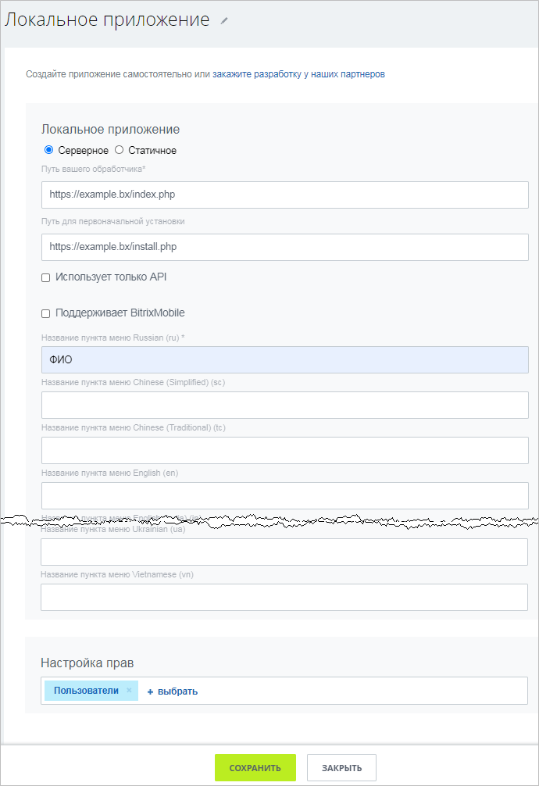
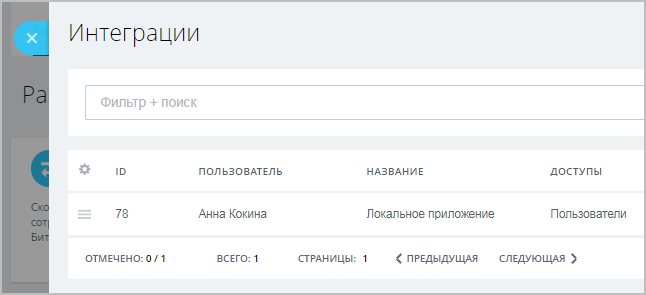
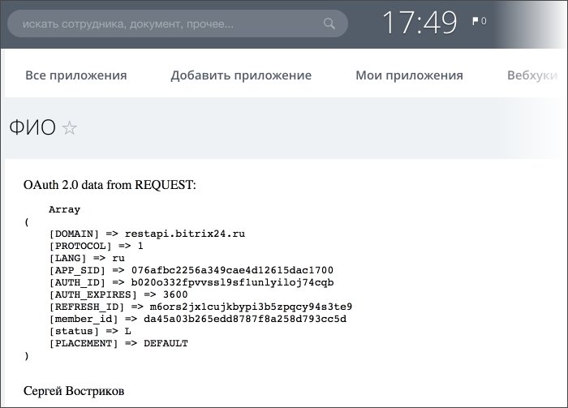

# Серверное локальное приложение с пользовательским интерфейсом

Приложение использует упрощенный вариант использования OAuth 2.0, выводится в виде дополнительной страницы, на которой показывает ФИО текущего пользователя. Архив примера состоит из [SDK CRest](https://github.com/bitrix-tools/crest/), [модификации SDK CRest](../sdk/crest-php-sdk/using-in-users-context.md) для упрощенного варианта использования OAuth 2.0 и PHP-файла index.php с кодом примера. Файлы из архива с примером вы должны разместить на своем веб-сервере до установки в Битрикс24.

> **Внимание!** Данный пример работает на основе *SDK CRest*. Перед использованием примера необходимо открыть через браузер файл **checkserver.php** и проверить корректность настроек вашего сервера. [Подробнее](../first-steps/how-to-use-examples.md).

[Скачать архив](https://helpdesk.bitrix24.ru/examples/local-server-ui-index.zip)

Установить локальное приложение можно либо из раздела **Разработчикам** (*Приложения > Разработчикам, вкладка «Готовые сценарии» > Другое > Локальное приложение*), либо перейдя по цепочке: Приложения (1) — Разработчикам (2) — Другое (3) — Локальное приложение (4):

В открывшейся форме заполните базовые поля и укажите необходимые для приложения права (для нашего примера нужны права на управление пользователями), указав **Путь вашего обработчика** (это означает, что ваше приложение уже должно быть физически доступно по URL по протоколу HTTPS до того, как вы станете добавлять его в ваш Битрикс24).

После сохранения новое приложение будет показано в списке интеграций (*Приложения > Разработчикам > Интеграции*) в вашем Битрикс24.

Найдите приложение **ФИО** в левом меню или в меню **Ещё** в разделе Приложения и запустите.

Запущенное приложение выведет  отладочную информацию о передаваемых авторизационных данных текущего пользователя, а также ФИО текущего пользователя, получая его по REST API с использованием этих авторизационных данных.

Поскольку это приложение работает в интерфейсе Битрикс24 и использует авторизацию текущего пользователя, который открыл приложение, то оно действует исключительно только в рамках прав этого пользователя.

## Продолжите изучение

- [{#T}](static-local-app.md)
- [{#T}](serverside-local-app-with-no-ui.md)