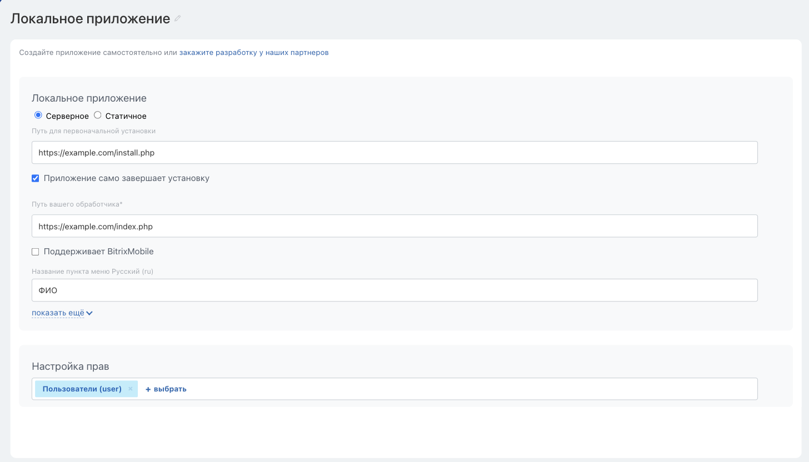
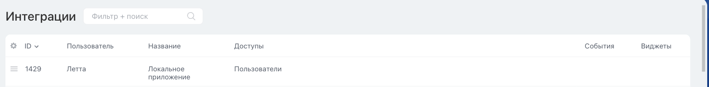
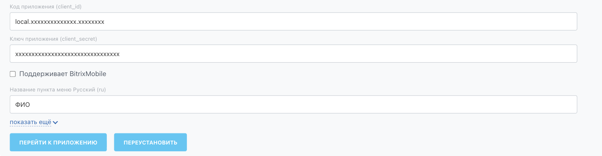

# Серверное локальное приложение с пользовательским интерфейсом



Выберите инструмент для разработки с AI-агентом:

- используйте [Битрикс24 Вайбкод](../ai-tools/vibecode.md), чтобы создать приложение для Битрикс24 по описанию задачи без знания языков программирования. Агент напишет код и разместит приложение на сервере без ручной настройки хостинга
- используйте [MCP-сервер](../ai-tools/mcp.md), чтобы разрабатывать интеграцию через REST API в своем проекте. Агент будет обращаться к официальной REST-документации



Серверное локальное приложение с пользовательским интерфейсом выполняет код на вашем сервере, а свою страницу показывает во фрейме внутри Битрикс24. Вместе с этой страницей приложение получает токены сотрудника, который открыл приложение.

Приложение работает только в том Битрикс24, где его создали. Если решение нужно устанавливать на разные Битрикс24, разрабатывайте [тиражное приложение](../market/index.md).

Другие виды локальных приложений и критерии выбора между ними описаны в статье [{#T}](./local-apps.md).

## Как работает авторизация {#how-auth-works}

Приложение во фрейме использует упрощенный вариант OAuth 2.0: запрашивать токены отдельно не нужно, Битрикс24 передает их при каждом открытии приложения.

1. Сотрудник запускает приложение в интерфейсе Битрикс24.
2. Битрикс24 обращается POST-запросом к адресу обработчика и передает данные авторизации. Обработчик — это страница приложения, которую вы указали в поле *Путь вашего обработчика*.
3. Обработчик сравнивает пришедший `APPLICATION_TOKEN` с сохраненным значением.
4. Приложение подставляет `AUTH_ID` в запросы к REST API и вызывает методы от имени сотрудника, который открыл приложение.

Сравнение на третьем шаге — требование к вашему коду. Порядок описан в разделе [Как проверить источник запроса](#check-source).

Основные параметры запроса:

#|
|| **Параметр** | **Где приходит** | **Что это** ||
|| **DOMAIN** | query-строка адреса | Адрес Битрикс24, в котором открыто приложение ||
|| **APP_SID** | query-строка адреса | Идентификатор сессии приложения. Битрикс24 создает его заново при каждой отрисовке ||
|| **AUTH_ID** | тело запроса | Авторизационный токен для вызова методов. Действует один час ||
|| **REFRESH_ID** | тело запроса | Токен продления авторизации. По нему приложение получает новую пару токенов ||
|| **APPLICATION_TOKEN** | тело запроса | Токен приложения. По нему обработчик проверяет, что запрос пришел от Битрикс24 ||
|| **APPLICATION_SCOPE** | тело запроса | Права приложения на разделы Битрикс24 — скоупы (`scope`) ||
|| **member_id** | тело запроса | Идентификатор Битрикс24. По нему приложение отличает один Битрикс24 от другого ||
|#

Полный состав данных разобран в статье [{#T}](../settings/oauth/simple-way.md), порядок продления токенов — в статье [{#T}](../settings/oauth/auto-renewal.md).

Токены приходят только в том запросе, которым Битрикс24 открывает страницу. Последующие запросы со страницы, в том числе AJAX, идут уже без них, поэтому сохраняйте токены на своей стороне — например, в сессии. Обновить токены на самой странице можно вызовом [BX24.refreshAuth](../sdk/bx24-js-sdk/system-functions/bx24-refresh-auth.md) из BX24 JS SDK, но передать их на сервер все равно должен ваш код.

Тот же набор параметров Битрикс24 передает и на адрес первоначальной установки.



По умолчанию базовый CRest работает от имени сотрудника, который установил приложение. Чтобы запросы выполнялись от имени того, кто открыл приложение, класс `CRest` переопределяют — готовый код и разбор в статье [{#T}](../sdk/crest-php-sdk/using-in-users-context.md). Базовый CRest пишет продленные токены в общий `settings.json`. Если приложением пользуется несколько сотрудников, храните токены отдельно по каждому из них.



## Когда выбрать этот вид приложения

Серверное локальное приложение с пользовательским интерфейсом подходит, если нужно:

- показать свою страницу или [виджет](../api-reference/widgets/index.md) внутри Битрикс24 и обработать данные на своем сервере
- держать секретный ключ приложения и токены на сервере, а не в коде, который загружается в браузер
- получать [события](../api-reference/events/index.md) Битрикс24 на свой обработчик событий

Выберите другой вид приложения, если:

- своего сервера нет, а интерфейс нужен — подойдет [{#T}](./static-local-app.md). Такое приложение работает в браузере и события не получает
- приложение работает в фоне без интерфейса и от имени одного сотрудника — подойдет [{#T}](./serverside-local-app-with-no-ui.md)
- внешняя система только вызывает методы или принимает события, а интерфейс в Битрикс24 не нужен — подойдут [входящие и исходящие вебхуки](./local-webhooks.md)

## Что нужно подготовить

- **Доступ к REST API.** Локальное приложение работает, только если у Битрикс24 есть [доступ к REST API](../first-steps/access-to-rest-api.md) — по подписке Маркетплейс или в пробном режиме.
- **Право на создание приложений.** Создать приложение может администратор Битрикс24 или сотрудник, которому выдано такое право. Если пункта *Локальное приложение* нет в интерфейсе, попросите администратора [настроить доступ к созданию приложений](./local-apps.md#local-app-access).
- **Веб-сервер.** Пример написан на PHP, поэтому нужен сервер с PHP, модулем cURL и действующим SSL-сертификатом. Страницы приложения должны быть доступны по HTTPS до того, как вы добавите приложение в Битрикс24: их адреса указывают уже в форме создания. Требования к серверу описаны в статье [{#T}](../sdk/crest-php-sdk/index.md).
- **Разрешение на встраивание.** Битрикс24 открывает страницу приложения во фрейме, поэтому сервер не должен запрещать встраивание заголовками `X-Frame-Options` и `Content-Security-Policy`. Как разрешить встраивание для адреса своего Битрикс24, описано в статье [{#T}](./site-does-not-allow-connection.md).

## Что содержит пример {#example}

Готовый пример — приложение «ФИО». Оно печатает два блока: данные запроса, которым Битрикс24 открыл страницу, включая авторизационные, и сведения о сотруднике, который открыл приложение. Эти сведения возвращает метод [user.current](../api-reference/user/user-current.md) — приложение вызывает его с токенами, которые пришли вместе со страницей.

Архив состоит из трех частей:

- [SDK CRest](https://github.com/bitrix-tools/crest/) — PHP-библиотека для вызова методов REST API. В ее поставку входят `settings.php` с настройками приложения, `install.php` для первоначальной установки и `checkserver.php` для проверки сервера
- [модификация SDK CRest](../sdk/crest-php-sdk/using-in-users-context.md) — файл `crestcurrent.php` с классом-наследником, который подставляет в запросы токены текущего сотрудника
- `index.php` — страница приложения с кодом примера, в архиве этот файл уже стоит вместо стандартного `index.php` из поставки CRest

[Скачать архив](https://helpdesk.bitrix24.ru/examples/local-server-ui-index.zip)

Класс-наследник берет токены прямо из запроса, которым Битрикс24 открыл страницу. Поэтому `user.current` возвращает данные текущего сотрудника. Код `index.php`:

```php
<?php

require_once __DIR__ . '/crestcurrent.php';

echo '<pre>';
    print_r($_REQUEST);
echo '</pre>';

$result = CRestCurrent::call('user.current');

echo '<pre>';
    print_r($result);
echo '</pre>';
```

Пример собран на CRest, но сам вид приложения к этой библиотеке и к PHP не привязан. Для PHP есть и [B24PhpSDK](../sdk/b24phpsdk/index.md). Он оформляет вызовы как PHP-классы и методы, но требует Composer и PHP 8.2 или новее. CRest подключают файлами из архива. Остальные библиотеки перечислены в [обзоре SDK](../sdk/index.md).

## Как создать приложение {#create-app}

Пример идет по сценарию с мастером установки: у приложения есть отдельная страница первоначальной установки, на которой CRest сохраняет настройки. Сам сценарий описан в статье [{#T}](../settings/app-installation/local-apps/installation-master.md).

Битрикс24 выдает код приложения и секретный ключ только после сохранения формы, а `install.php` без них настройки не сохранит. Поэтому порядок такой: сначала создать приложение, затем заполнить `settings.php` и переустановить приложение.

1. Разместите файлы из архива на своем сервере. Запомните адреса страниц `index.php` и `install.php`: их указывают в форме.

2. Откройте в браузере `checkserver.php` по адресу сервера. Скрипт проверит, что модуль cURL доступен и CRest может сохранять свои файлы. Если проверка не прошла, устраните замечания скрипта до перехода к форме: CRest не сохранит настройки без cURL и без права на запись.

3. Откройте форму локального приложения: *Приложения > Разработчикам*, вкладка *Готовые сценарии*, далее *Другое > Локальное приложение*.

    

    

4. Выберите вариант *Серверное* — он открывает поля для адресов страниц на вашем сервере. Вариант *Статичное* рассчитан на архив со страницей — смотрите статью [{#T}](./static-local-app.md).

5. Укажите адреса страниц на своем сервере: в поле *Путь для первоначальной установки* — адрес `install.php`, в поле *Путь вашего обработчика* — адрес `index.php`. По первому адресу Битрикс24 обращается при установке приложения, по второму открывает приложение во фрейме.

6. Заполните *Название пункта меню* — по нему приложение находят в интерфейсе Битрикс24. В примере это «ФИО». Названия на других языках заполняют, если приложением пользуются не только на русском.

7. Выберите скоупы приложения в блоке *Настройка прав*. Примеру подойдет любой из скоупов пользователей: *Пользователи* — `user`, *Пользователи (базовый)* — `user_basic`, *Пользователи (минимальный)* — `user_brief`. От выбранного скоупа зависит, какие поля вернет `user.current`. Остальные скоупы перечислены в статье [{#T}](../api-reference/scopes/permissions.md).

    

8. Сохраните форму. Приложение появится в списке *Приложения > Разработчикам > Интеграции*.

    

9. Откройте приложение. Битрикс24 покажет страницу первоначальной установки — так вы проверите, что адрес `install.php` доступен. Настройки на этом шаге не сохранятся. Эту страницу открывает администратор Битрикс24 или сотрудник с правом на установку приложений — остальные вместо нее увидят сообщение об ошибке.

10. Откройте карточку приложения. После сохранения в ней есть поля *Код приложения (client_id)* и *Ключ приложения (client_secret)*. Скопируйте эти значения в константы `C_REST_CLIENT_ID` и `C_REST_CLIENT_SECRET` файла `settings.php` и загрузите измененный файл на сервер.

    

11. Нажмите *Переустановить* в карточке приложения и откройте приложение еще раз. Кнопка доступна только администратору Битрикс24. Теперь `install.php` отработает с заполненными константами и создаст `settings.json`. Без этого файла CRest не сможет вызвать метод.



Скрипт первоначальной установки должен сообщить Битрикс24, что установка завершилась, — вызвать [BX24.installFinish](../sdk/bx24-js-sdk/system-functions/bx24-install-finish.md). Пока вызова не было, приложение считается неустановленным. Это приводит к трем последствиям:

- страница установки открывается при каждом входе вместо приложения
- события приложению не доставляются
- виджеты приложения не показываются

При этом ошибки регистрации нет: обработчики событий и виджеты регистрируются успешно, но не срабатывают. Проверить состояние можно по полю `INSTALLED` в ответе метода [app.info](../api-reference/common/system/app-info.md).

Вызов срабатывает только у администратора Битрикс24 или сотрудника с правом на установку приложений. Сама функция приходит из [BX24 JS SDK](../sdk/bx24-js-sdk/index.md), поэтому страница установки должна подключать эту библиотеку. Если вы заменяете `install.php` своим кодом, добавьте вызов последним шагом установочного сценария.



Сценарии установки локального приложения и их отличия описаны в статье [{#T}](../settings/app-installation/local-apps/index.md).

## Как проверить результат

Найдите приложение «ФИО» в левом меню или в меню *Еще* раздела *Приложения* и запустите его. Приложение откроется во фрейме и напечатает два блока.

Первый блок — все данные запроса, которым Битрикс24 открыл страницу. `$_REQUEST` сводит вместе параметры из query-строки и из тела запроса, поэтому в блоке есть и авторизационные данные, и служебные:

```text
Array
(
    [DOMAIN] => example.bitrix24.ru
    [PROTOCOL] => 1
    [LANG] => ru
    [APP_SID] => 0f5a2e9b6c1d4a8e7f30b21c5d9e4a6b
    [AUTH_ID] => a1b2c3d4e5f60718293a4b5c6d7e8f90
    [AUTH_EXPIRES] => 3600
    [REFRESH_ID] => 90f8e7d6c5b4a3928170f6e5d4c3b2a1
    [SERVER_ENDPOINT] => https://oauth.bitrix24.tech/rest/
    [APPLICATION_TOKEN] => 7d1e4c02fa93b586ce4710d2f8b3a9c5
    [APPLICATION_SCOPE] => user
    [member_id] => 4c8f2b91d7e3a56f0b1c9d8e7a6f5b43
    [status] => L
    [PLACEMENT] => DEFAULT
)
```

Основные параметры описаны в разделе [Как работает авторизация](#how-auth-works), полный состав данных — в статье [{#T}](../settings/oauth/simple-way.md).

Второй блок — результат вызова `user.current`:

```text
Array
(
    [result] => Array
        (
            [ID] => 1
            [ACTIVE] => 1
            [NAME] => Иван
            [LAST_NAME] => Петров
            [EMAIL] => ivan@example.com
            [LAST_LOGIN] => 2026-09-08T13:51:07+03:00
            [DATE_REGISTER] => 2020-04-20T03:00:00+03:00
            [TIME_ZONE] => Europe/Moscow
            [IS_ONLINE] => Y
            [WORK_POSITION] => Менеджер
            [UF_DEPARTMENT] => Array
                (
                    [0] => 1
                )

        )

    [time] => Array
        (
            [start] => 1788867501
            [finish] => 1788867502.0294
            [duration] => 1.0293660163879
            [processing] => 0
            [date_start] => 2026-09-08T14:38:21+03:00
            [date_finish] => 2026-09-08T14:38:22+03:00
        )

)
```

Данные сотрудника возвращаются в ключе `result`, а `time` добавляет к ответу сам REST API. Набор полей зависит от выбранного скоупа и от пользовательских полей Битрикс24. Пользовательские поля приходят в ключах с префиксом `UF_`. Полный список полей описан в статье [{#T}](../api-reference/user/user-current.md).

## Что делать при ошибках {#errors}

- **«Сайт не позволяет установить соединение».** Сервер приложения запрещает встраивание своей страницы во фрейм. Разберите заголовки ответа по статье [{#T}](./site-does-not-allow-connection.md).
- **`no_install_app`.** В настройках CRest пусто хотя бы одно из значений `access_token`, `domain`, `refresh_token`, `application_token`, `client_endpoint`. Первая причина — страницу открыли напрямую по адресу сервера, без POST-запроса от Битрикс24, и подставлять в настройки оказалось нечего. Вторая — приложение не переустановили после заполнения `settings.php`, поэтому файл `settings.json` не создан.
- **`insufficient_scope`.** Приложению не выдан скоуп метода. Добавьте нужный скоуп в карточке приложения.
- **`expired_token`.** С момента открытия страницы прошло больше часа, и `AUTH_ID` истек. Получите новую пару токенов по `REFRESH_ID` — порядок описан в статье [{#T}](../settings/oauth/auto-renewal.md).
- **Вместо приложения каждый раз открывается страница установки.** Скрипт первоначальной установки не вызвал `BX24.installFinish` — что при этом происходит, разобрано в разделе [Как создать приложение](#create-app).

## Права и безопасность

- **Права сотрудника.** Токены выданы конкретному сотруднику, поэтому вызов ограничен его правами в Битрикс24: один и тот же вызов у разных сотрудников вернет разный результат. Отличие от поведения базового CRest разобрано в разделе [Как работает авторизация](#how-auth-works).
- **Скоупы приложения.** Набор скоупов выбирают при создании и меняют в карточке приложения.
- **Секреты и токены.** Код приложения, секретный ключ, `AUTH_ID` и `REFRESH_ID` храните на своем сервере. Не размещайте их в клиентском коде, который загружается в браузер, не сохраняйте в репозитории, не записывайте в логи и не передавайте третьим лицам.

### Как проверить источник запроса {#check-source}

Адрес обработчика доступен из внешней сети: открыть страницу приложения может кто угодно, а не только Битрикс24. Проверка работает с двумя значениями `APPLICATION_TOKEN`:

- эталон приложение должно сохранить при установке — в скрипте `install.php` или в обработчике события [ONAPPINSTALL](../api-reference/common/events/on-app-install.md). У локального приложения это значение остается прежним, пока не меняется секретный ключ
- Битрикс24 передает текущее значение в теле каждого запроса, которым открывает страницу

Перед работой с токенами сравните эти значения и отклоните запрос, если они не совпали.

В поставке CRest `install.php` не сохраняет эталон, а библиотека записывает в настройку `application_token` значение `APP_SID`. Сравнение с этой настройкой не сработает, потому что `APP_SID` каждый раз новый. Чтобы проверка заработала, заведите свое хранилище:

1. Сохраняйте `APPLICATION_TOKEN` из запроса в `install.php` — например, в свою таблицу или файл рядом с приложением.
2. Сравнивайте на странице приложения сохраненное значение с `APPLICATION_TOKEN` из входящего запроса и отвечайте кодом `403`, если они не совпали.

Адрес `install.php` тоже доступен из внешней сети. Храните эталон в недоступном извне месте и не перезаписывайте сохраненное значение при каждом обращении к странице установки.

Обработчики событий приложения проверяют источник так же, но берут значение из параметра `auth.application_token`, а сохраненный эталон ищут по `auth.member_id` — идентификатору Битрикс24. Правила хранения токена описаны в статье [{#T}](../api-reference/events/safe-event-handlers.md).

## Продолжите изучение

- [{#T}](./local-apps.md)
- [{#T}](./static-local-app.md)
- [{#T}](./serverside-local-app-with-no-ui.md)
- [{#T}](../sdk/crest-php-sdk/using-in-users-context.md)
- [{#T}](../settings/oauth/simple-way.md)
