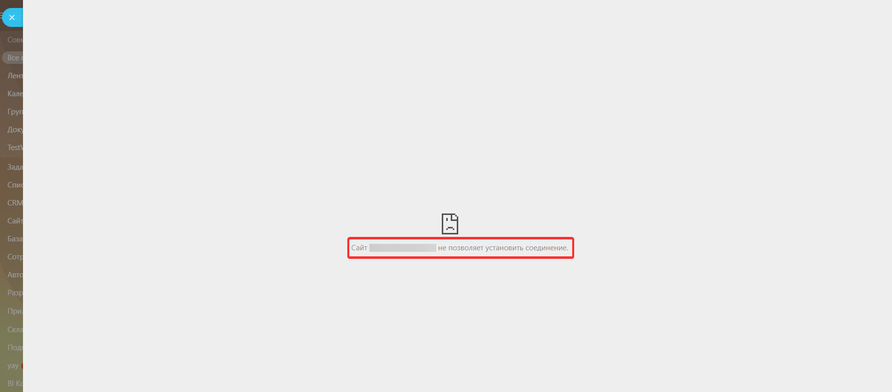
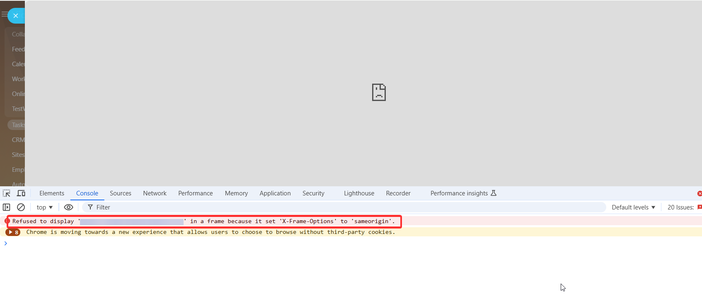
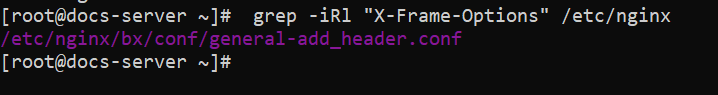
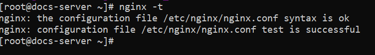
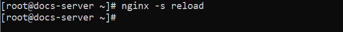
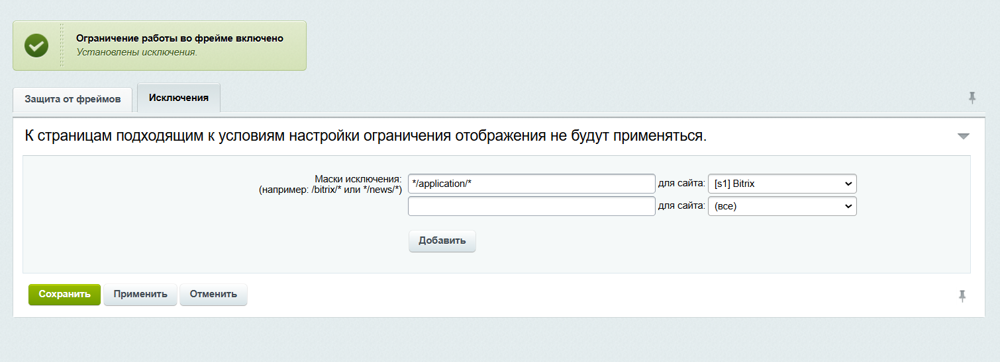

# Как исправить ошибку «Сайт не позволяет установить соединение» при открытии приложения

В серверных приложениях может появляться ошибка при загрузке страниц: 



Сайт «адрес_сайта_приложения» не позволяет установить соединение.



## Причина ошибки

Ошибка появляется, когда сервер приложения запрещает загрузку страниц во фрейме. Детали ошибки можно найти в консоли браузера.



Refused to display 'https://адрес_сайта_приложения/'; in a frame because it set 'X-Frame-Options' to 'sameorigin'.



Ошибка означает, что на сервере приложения стоит запрет на открытие страниц сайта во фрейме с других сайтов. Запрет регулируется заголовком  `X-Frame-Options` . Заголовок указывает браузеру, можно ли загружать страницы сайта через `<frame>/<iframe>`. 

Стандартная настройка большинства серверов для заголовка `X-Frame-Options` — `sameorigin`. Значение разрешит загрузку сайта только если фрейм и страница приложения находятся на одном домене. 

Заголовок  `X-Frame-Options`  для одного сайта может быть указан на нескольких серверах: основном сервере приложения и промежуточных прокси-серверах. При наличии разных заголовков `X-Frame-Options` текст ошибки будет содержать детали конфликтующих заголовков: 



Refused to display 'https://адрес_сайта_приложения/'; in a frame because it set multiple 'X-Frame-Options' headers with conflicting values ('ALLOW-FROM https://your-domain.bitrix24.ru/, SAMEORIGIN'). Falling back to 'deny'.



## Как исправить ошибку

Чтобы разрешить загрузку сайта во фрейме на конкретном домене Битрикс, измените настройки заголовка `X-Frame-Options`. Внесите изменения в конфигурацию nginx на сервере с файлами приложения и на промежуточных прокси-серверах, если они используются.

Если у вас нет доступа к файлам конфигурации nginx или ваши настройки отличаются —проконсультировать по настройкам заголовков и выдать доступ может администратор сервера или администратор хостинга, на котором лежат файлы приложения. 



Если у вас нет доступа к файлам конфигурации nginx или ваши настройки отличаются — проконсультировать по настройкам заголовков и выдать доступ может администратор сервера или администратор хостинга, на котором лежат файлы приложения. 



1. Найдите файлы конфигурации, в которых есть заголовок  `X-Frame-Options`.  Для поиска используйте команду:
   
    `grep -iRl "X-Frame-Options" /etc/nginx`

    

2. В найденном файле измените заголовок. Замените ограничение `SAMEORIGIN` на разрешение для домена Битрикс24:

    `add_header X-Frame-Options "ALLOW-FROM https://your-domain.bitrix24.ru/";`

3. Если файлов с заголовком  `X-Frame-Options` найдено несколько, проверьте, чтобы настройки в них не конфликтовали.

4. Выполните проверку конфигурации nginx командой `nginx -t`.   
   
    

    Если в ответе test is successfull, можно перезагрузить конфигурацию. Если в ответе присутствуют ошибки, сначала внесите исправления в файлы из текста ошибки.

5. Перезапустите nginx командой `nginx -s reload`. Без перезапуска изменения не применятся. 
   
    

## Настройка защиты от фреймов в коробочном Битрикс24

Если сервером приложения выступает коробочный Битрикс24 на виртуальной машине BitrixVM, защита от открытия сайта во фрейме может настраиваться в двух местах:

* в конфигурации nginx сервера 
* на сайте — «Защита от фреймов» (Настройки > Проактивная защита > Защита от фреймов) 

### Стандартная настройка 

Предустановленная настройка BitrixVM — заголовок `add_header X-Frame-Options SAMEORIGIN;` в файле /etc/nginx/bx/conf/general-add_header.conf. 

Когда защита от фреймов включена на сайте, в файле конфигурации nginx /etc/nginx/bx/conf/general-add_header.conf добавляется такой же заголовок `add_header X-Frame-Options SAMEORIGIN;`. 

### Конфликт настроек

При стандартных настройках BitrixVM может возникнуть ситуация, когда конфигурация nginx перекроет настройку защиты от фреймов на сайте:

* заголовок будет активен, даже если на сайте защита выключена
* при включённой защите от фреймов, заголовок будет дублироваться

Вариант решения конфликта — использовать только один инструмент. Рекомендуем пользоваться инструментом «Защита от фрейма» на сайте, чтобы не менять конфигурационные файлы сервера: 

1.	В BitrixVM закомментируйте заголовок в файле /etc/nginx/bx/conf/general-add_header.conf:

    `#add_header X-Frame-Options SAMEORIGIN;`

2.	Включите защиту от фреймов на странице «Защита от фреймов» (Настройки > Проактивная защита > Защита от фреймов) и задайте необходимые исключения на действие защиты.

    

