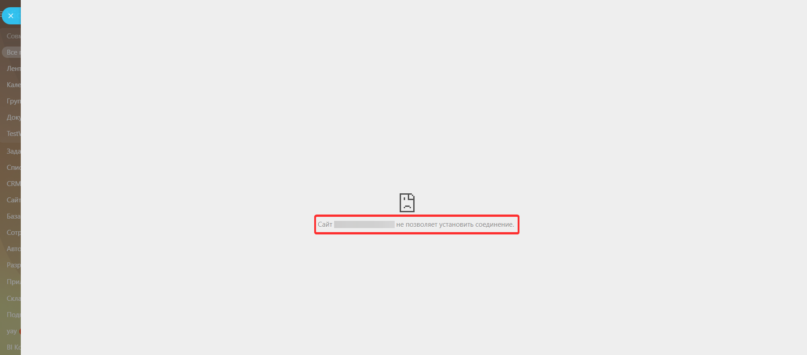
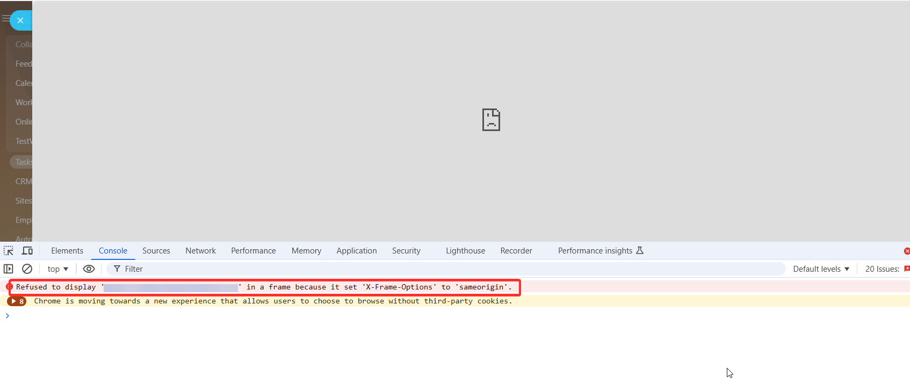
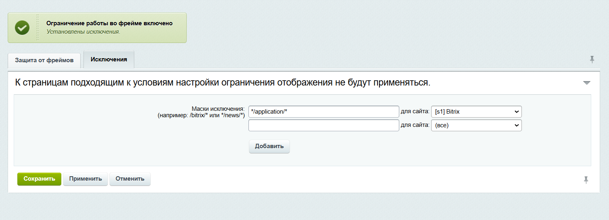

# Как исправить ошибку «Сайт не позволяет установить соединение» при открытии приложения



Выберите инструмент для разработки с AI-агентом:

- используйте [Битрикс24 Вайбкод](../ai-tools/vibecode.md), чтобы создать приложение для Битрикс24 по описанию задачи без знания языков программирования. Агент напишет код и разместит приложение на сервере без ручной настройки хостинга
- используйте [MCP-сервер](../ai-tools/mcp.md), чтобы разрабатывать интеграцию через REST API в своем проекте. Агент будет обращаться к официальной REST-документации



Интерфейс серверного приложения размещен на внешнем сервере. Когда пользователь открывает приложение, Битрикс24 загружает страницу интерфейса во встроенный блок `<iframe>`.

Например, пользователь запускает локальное приложение, но вместо его интерфейса видит сообщение «Сайт не позволяет установить соединение». Так происходит, если сервер приложения отправляет заголовки, которые запрещают встраивать страницу в Битрикс24. Браузер отменяет загрузку и показывает ошибку:

```text
Сайт «адрес_сайта_приложения» не позволяет установить соединение
```



Чтобы исправить ошибку, проверьте заголовки ответа страницы приложения, определите, где они добавляются, и разрешите встраивание для адреса вашего Битрикс24.

## Почему приложение не открывается

Встраивание страницы регулируют два HTTP-заголовка:

- [`X-Frame-Options`](https://developer.mozilla.org/en-US/docs/Web/HTTP/Reference/Headers/X-Frame-Options) со значением `SAMEORIGIN` разрешает открывать страницу во фрейме только на сайте с тем же источником
- директива [`frame-ancestors`](https://developer.mozilla.org/en-US/docs/Web/HTTP/Reference/Headers/Content-Security-Policy/frame-ancestors) заголовка `Content-Security-Policy` задает список источников, которым разрешено встраивать страницу

В консоли браузера можно увидеть, какой заголовок заблокировал страницу, например:

```text
Refused to display 'https://адрес_сайта_приложения/' in a frame because it set 'X-Frame-Options' to 'sameorigin'
```





Не отключайте защиту от встраивания для всего сайта без необходимости. Разрешите только точный адрес Битрикс24 и только для страниц приложения. Изменения конфигурации сервера должен выполнять администратор.



## Как проверить заголовки ответа

1. Откройте приложение в Битрикс24 и запустите инструменты разработчика браузера
2. На вкладке *Console* найдите сообщение с `X-Frame-Options` или `frame-ancestors`
3. На вкладке *Network* перезагрузите страницу и выберите запрос документа приложения
4. В блоке *Response Headers* проверьте значения `X-Frame-Options` и `Content-Security-Policy`
5. Определите, какой компонент добавляет ограничивающий заголовок: приложение, веб-сервер, прокси-сервер или CDN

Проверяйте заголовки фактического ответа, а не только файлы конфигурации. Например, приложение может добавить заголовок из PHP, а прокси-сервер — продублировать или заменить его.

## Как разрешить открытие приложения

Укажите точный источник Битрикс24, в котором открывается приложение. Для адреса `https://your-domain.bitrix24.ru` политика CSP может выглядеть так:

```http
Content-Security-Policy: frame-ancestors 'self' https://your-domain.bitrix24.ru;
```

Если сервер уже отправляет `Content-Security-Policy`, добавьте адрес Битрикс24 в существующую директиву `frame-ancestors`. Не заменяйте остальные директивы политики.

Не заменяйте `SAMEORIGIN` на `X-Frame-Options: ALLOW-FROM`: директива `ALLOW-FROM` устарела. Уберите ограничивающий `X-Frame-Options` для страниц приложения на том уровне, где он добавляется, и настройте разрешенные источники через `frame-ancestors`.

### Пример для nginx

Перед изменением конфигурации создайте резервную копию файлов. Затем найдите директивы, которые управляют встраиванием:

```bash
grep -iR -E "X-Frame-Options|Content-Security-Policy|frame-ancestors" /etc/nginx
```

Если политика CSP еще не задана на другом уровне, добавьте ее для страниц приложения:

```nginx
add_header Content-Security-Policy "frame-ancestors 'self' https://your-domain.bitrix24.ru" always;
```

Если заголовки добавляются на нескольких уровнях, измените настройки каждого из них.

Проверьте конфигурацию nginx:

```bash
nginx -t
```

Успешная проверка содержит сообщения `syntax is ok` и `test is successful`. Если nginx сообщает об ошибке, исправьте ее и повторите проверку. Не перезагружайте конфигурацию с ошибками.

После успешной проверки перезагрузите конфигурацию:

```bash
nginx -s reload
```

Снова откройте приложение и проверьте заголовки ответа во вкладке *Network*. Адрес Битрикс24 должен присутствовать в `frame-ancestors`, а ограничивающий `X-Frame-Options` не должен добавляться для страницы приложения.

## Если приложение размещено на коробочном Битрикс24

Когда в коробочном Битрикс24 включена настройка *Защита от фреймов*, PHP добавляет к ответу два заголовка:

```http
X-Frame-Options: SAMEORIGIN
Content-Security-Policy: frame-ancestors 'self';
```

Для страниц приложения безопаснее настроить исключение, чем отключать защиту для всего сайта:

1. В административном разделе откройте *Настройки > Проактивная защита > Защита от фреймов*
2. Перейдите на вкладку *Исключения*
3. Добавьте маску URL страниц приложения, например `/application/*`, и выберите нужный сайт
4. Сохраните настройки и снова проверьте заголовки ответа



Для URL, который соответствует маске исключения, Битрикс24 не добавляет `X-Frame-Options` и `Content-Security-Policy` из настройки защиты от фреймов. Если заголовки остались в ответе, их добавляет другой компонент. Повторите проверку заголовков ответа.

## Что проверить, если ошибка осталась

| Что видно в ответе | Что проверить |
|---|---|
| `X-Frame-Options: SAMEORIGIN` | Какой компонент продолжает добавлять заголовок для страницы приложения |
| `frame-ancestors 'self'` без адреса Битрикс24 | Существующую политику CSP или маску исключения в коробочном Битрикс24 |
| Несколько `X-Frame-Options` или `Content-Security-Policy` | Настройки приложения, веб-сервера, прокси-сервера и CDN |
| Заголовки исправлены, но браузер показывает прежнюю ошибку | Ответ запроса документа приложения после полной перезагрузки страницы |
