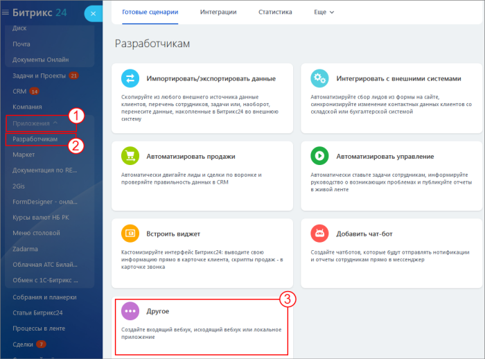
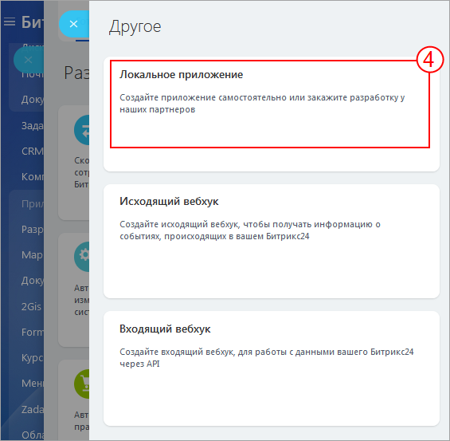
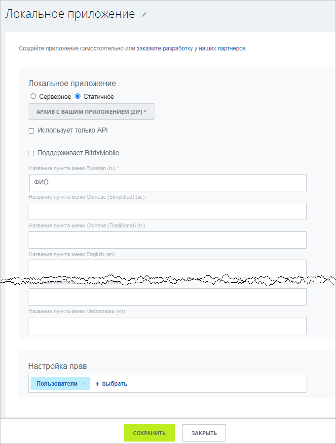
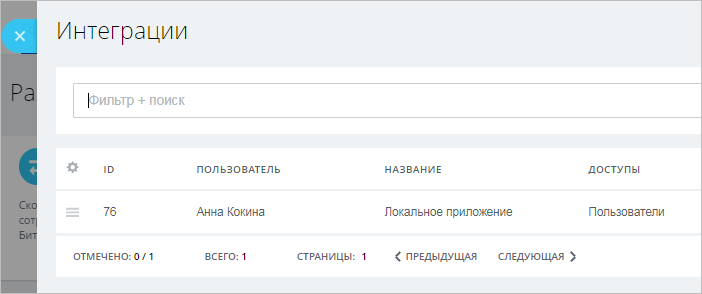

# Статичное локальное приложение



Тут может не хватать некоторых данных — дополним в ближайшее время







- нужно ли замечание?





> **Внимание!** Статичное локальное приложение и описанное ниже его размещение предназначено для облачных порталов Битрикс24.
> 
> Такой тип можно применять в коробочных порталах, если:
> - приложение загружено в любую папку файловой структуры коробочного портала
> - в обработчике указывается путь до этой папки

Архив с примером содержит один файл и представляет собой готовое приложение, обращающееся к REST API и показывающее ФИО текущего пользователя.

[Скачать архив](https://helpdesk.bitrix24.ru/examples/index.html.zip)

Установить локальное приложение можно либо из раздела **Разработчикам** (*Приложения > Разработчикам, вкладка «Готовые сценарии» > Другое > Локальное приложение*), либо перейдя по цепочке: Приложения (1) — Разработчикам (2) — Другое (3) — Локальное приложение (4):

В открывшейся форме заполните базовые поля, загрузите архив и укажите необходимые права (для нашего примера нужны права на управление пользователями):

После сохранения новое приложение будет показано в списке интеграций (*Приложения > Разработчикам > Интеграции*) в вашем Битрикс24.

 

Найдите **ФИО** в левом меню или в меню **Ещё** в разделе Приложения и запустите. Запущенное приложение выведет ФИО текущего пользователя, получая его по REST API через JS-библиотеку. Поскольку статичное локальное приложение работает в интерфейсе Битрикс24, то JS SDK автоматически получает и использует авторизацию текущего пользователя, который открыл приложение, и действует исключительно только в рамках прав этого пользователя. 

## Продолжите изучение

- [{#T}](serverside-local-app-with-ui.md)
- [{#T}](serverside-local-app-with-no-ui.md)
