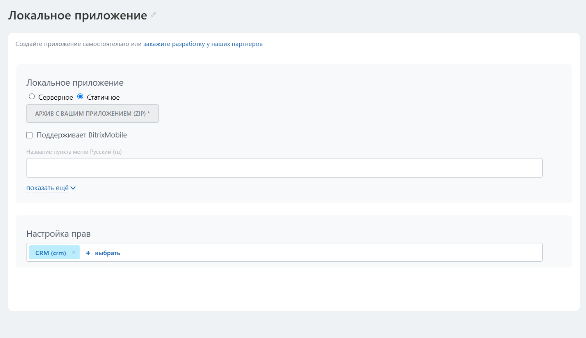

# Статичное локальное приложение



Выберите инструмент для разработки с AI-агентом:

- используйте [Битрикс24 Вайбкод](../ai-tools/vibecode.md), чтобы создать приложение для Битрикс24 по описанию задачи без знания языков программирования. Агент напишет код и разместит приложение на сервере без ручной настройки хостинга
- используйте [MCP-сервер](../ai-tools/mcp.md), чтобы разрабатывать интеграцию через REST API в своем проекте. Агент будет обращаться к официальной REST-документации



Статичное локальное приложение — это HTML-страница с JavaScript, которую Битрикс24 открывает во фрейме внутри своего интерфейса. Такой вариант подходит, если приложению нужен интерфейс в Битрикс24, но не нужен собственный сервер.

Если нужно выполнять код на своем сервере, хранить на нем секреты или получать события Битрикс24, выберите [серверное локальное приложение с пользовательским интерфейсом](./serverside-local-app-with-ui.md).



Описанный ниже способ загрузки статичного локального приложения предназначен для облачных Битрикс24.

В коробочном Битрикс24 загрузите приложение в папку файловой структуры портала и укажите эту папку в качестве пути обработчика.



## Подготовьте архив

Поместите файл `index.html` в корень ZIP-архива. Этот файл служит основной страницей приложения. CSS, JavaScript, изображения и другие файлы можно добавить в архив и подключить к `index.html` относительными путями.

Если перед первым запуском нужна настройка, добавьте в корень архива файл `install.html`. Битрикс24 откроет его как [мастер установки](../settings/app-installation/local-apps/installation-master.md).

Пример `index.html` получает имя текущего пользователя методом [user.current](../api-reference/user/user-current.md):

```html
<!doctype html>
<html lang="ru">
<head>
    <meta charset="utf-8">
    <title>Текущий пользователь</title>
    <script src="//api.bitrix24.tech/api/v1/"></script>
</head>
<body>
    <p id="user-name">Загрузка...</p>

    <script>
        BX24.init(() => {
            BX24.callMethod('user.current', {}, (result) => {
                const output = document.getElementById('user-name');

                if (result.error())
                {
                    output.textContent = 'Не удалось получить данные пользователя';
                    console.error(result.error());
                    return;
                }

                const user = result.data();
                output.textContent = [user.NAME, user.LAST_NAME]
                    .filter(Boolean)
                    .join(' ');
            });
        });
    </script>
</body>
</html>
```

Пример работает через [BX24.js](../sdk/bx24-js-sdk/index.md). Когда приложение открывается во фрейме, библиотека получает данные авторизации из окружения Битрикс24 и использует их в вызовах REST API. Поэтому в коде статичного приложения не нужно хранить вебхук, `client_secret` или OAuth-токены.

## Создайте приложение

1. Откройте *Приложения > Разработчикам > Другое > Локальное приложение*. Если пункта *Локальное приложение* нет, попросите администратора [настроить доступ к созданию приложений](./local-apps.md#local-app-access)
    

    
2. Выберите тип *Статичное*
    
3. Загрузите ZIP-архив приложения
4. Включите опцию *Поддерживает BitrixMobile*, если приложение должно работать в мобильном приложении Битрикс24
5. Укажите название пункта меню хотя бы для одного языка
6. В блоке *Настройка прав* выберите права доступа, необходимые REST-вызовам приложения
7. Нажмите *Создать*

После создания приложение появится в списке *Приложения > Разработчикам > Интеграции*.


REST-вызовы выполняются от имени сотрудника, который открыл приложение. Доступность методов ограничена правами сотрудника и правами, выбранными при создании приложения.

## Продолжите изучение

- [{#T}](local-apps.md)
- [{#T}](../sdk/bx24-js-sdk/index.md)
- [{#T}](serverside-local-app-with-ui.md)
- [{#T}](serverside-local-app-with-no-ui.md)
