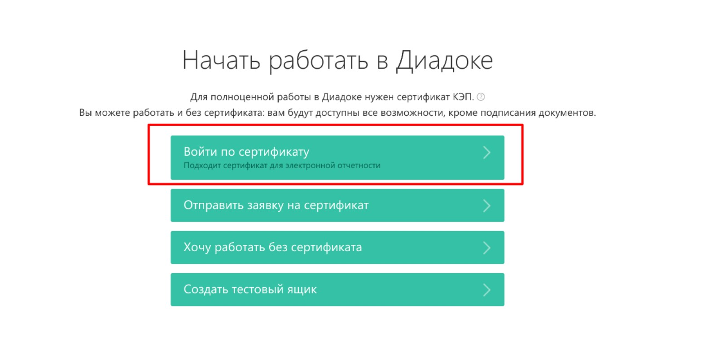

# Как подключиться к ЭДО

На текущий момент для обмена документами, связанными с подписной моделью продаж приложений Битрикс24 Маркетплейс мы используем систему **Диадок**. Поскольку именно мы будем присылать вам все документы для подписи, то использование Диадок будет для вас бесплатным.

Чтобы подключиться к ней, вам достаточно перейти по ссылке на [упрощенную регистрацию](https://diadoc.kontur.ru/easyregistration) и выбрать вариант **Войти по сертификату** (конечно, к этому моменту у вас уже должен быть [приобретена и настроена](esign.md) к использованию ЭЦП):

