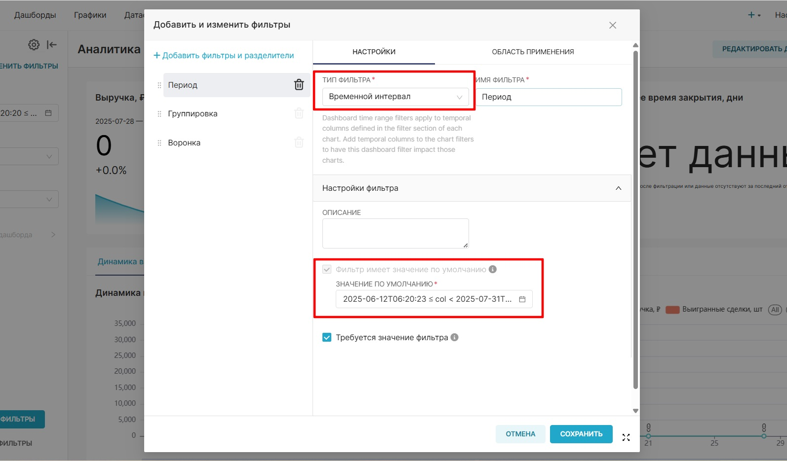
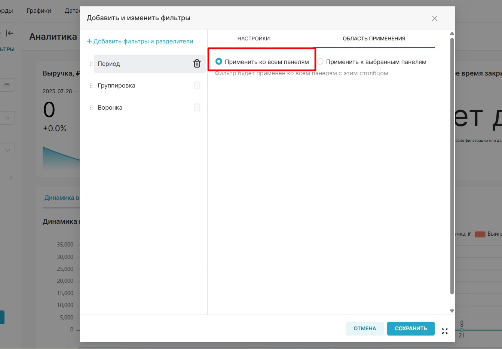
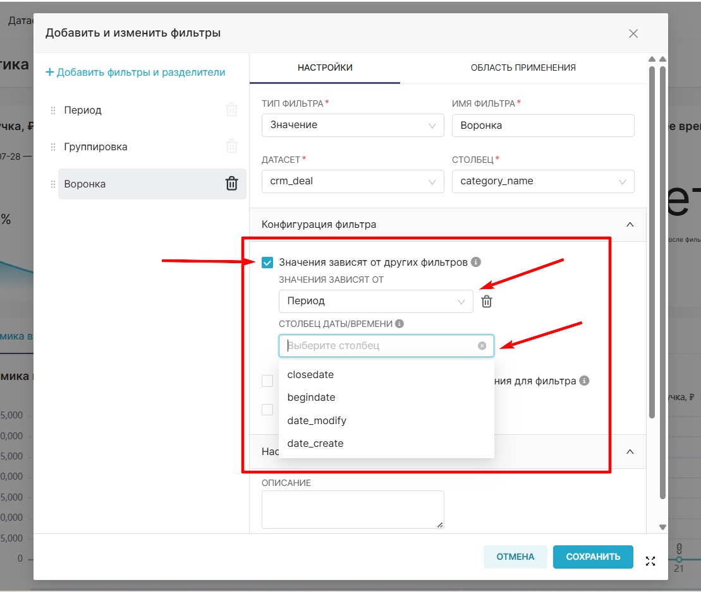
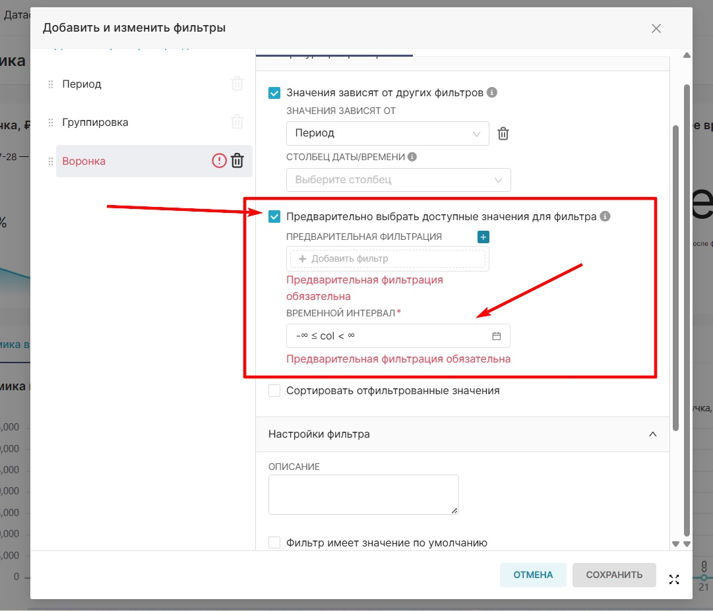
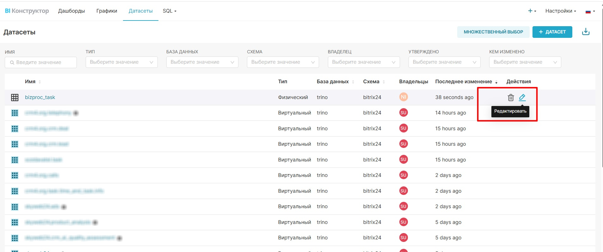
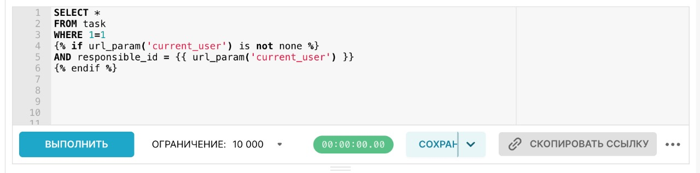
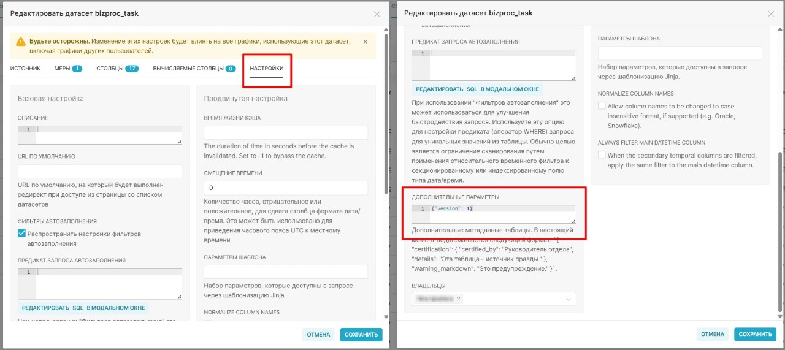
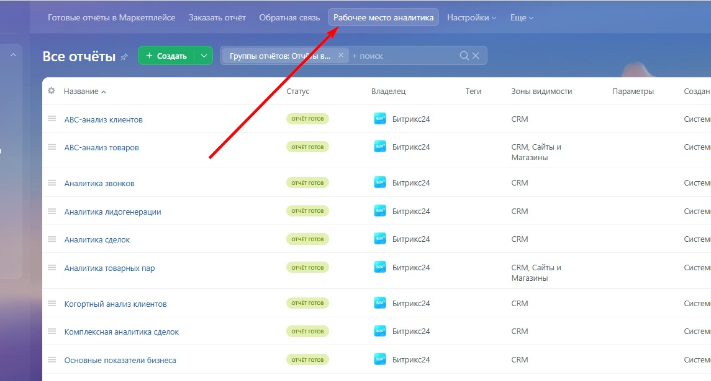
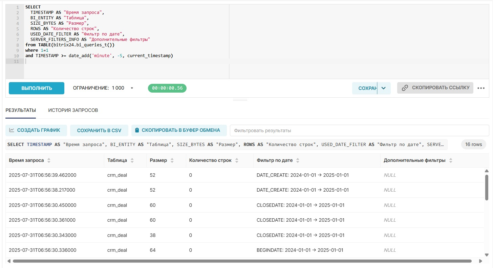

# Рекомендации по разработке отчетов 

##	1. Привязка только к 1 группе отчетов.

##	2. Фильтрация по дате.

Фильтрация по дате является **обязательной** для всех отчетов.
Без нее возрастает риск перегрузки конструктора (лимит на выгрузку – 10 000 строк), что может привести к блокировке модуля.

### 2.1	В фильтрации:

* Использование фильтра с типом **Временной интервал**, который позволяет выбирать период дат.
* В фильтре установлено **значение по умолчанию**.
* **Максимальный диапазон** выбора значения по умолчанию – не более одного года.



* Необходимо, чтобы фильтр по дате применялся **ко всем графикам** в отчете.



Требования к другим фильтрам: 

* Для всех фильтров, кроме **Единицы времени**, должна быть активна опция **Значения зависят от других фильтров**.
* Все фильтры должны быть **зависимы от фильтра по дате**.
* Название фильтра может быть любым, не обязательно "Период".
* Также можно выбрать, по какому полю осуществлять предварительную фильтрацию.



* В каждом фильтре (значение, числовое значение и т. п., кроме «Временной интервал») в параметре **Предварительно выбрать доступные значения** необходимо задать ограничение по дате.
* Это позволяет Superset заранее отфильтровать возможные значения, избегая долгих запросов к большим датасетам. Идея в том, что если датасет очень большой, то предфильтрация доступных значений фильтра займет сильно меньше времени, если предварительно отфильтроваться по времени (или другим полям). _Пример: если для фильтра "Воронка" выполнить запрос_ SELECT category_name FROM crm_deal _с дополнительной фильтрацией по дате, он отработает быстрее_.



### 2.2 Фильтрация в датасете:

Кроме проверки фильтров на уровне визуализации, убедитесь, что фильтрация по дате реализована внутри самого датасета отчета.

Чтобы проверить, какие датасеты используются в отчете, и открыть их: 

1. Перейдите на вкладку «Графики».
2. Найдите нужный отчет через фильтр «Дашборд», чтобы увидеть связанные датасеты.
3. Перейдите во вкладку «Датасеты», нажмите на карандаш в колонке «Действия», чтобы открыть SQL-запрос.



**Важное условие:**

В SQL-запросе датасета должна быть шаблон, который подставляет значения временного фильтра с отчета. Такой подход называется шаблонизация (описание ниже). Примеры таких конструкций: 


**Что такое шаблонизация в Superset и зачем она нужна.**

В **Apache Superset** шаблонизация позволяет создавать **динамические SQL-запросы**, подстраивающиеся под пользовательские фильтры, диапазоны дат, пользователей и параметры URL. Она реализуется на основе движка **Jinja**, встроенного в Superset. **Jinja-шаблон** в Superset — это часть SQL-запроса, обёрнутая в специальный синтаксис ({{ ... }} или ), которая будет обработана до отправки запроса в базу данных.

Таким образом, Superset сначала подставляет значения переменных и выполняет Python-логику внутри шаблона, а уже затем отправляет результат как обычный SQL-запрос в БД.

**Шаблонизация делает возможным:**

* применять динамическую фильтрацию по выбранному периоду;
* настраивать поведение отчета под конкретного пользователя;
* переиспользовать один датасет для разных сценариев;
* оптимизировать SQL-запросы без жесткой привязки к фиксированным параметрам; 
* адаптировать поведение графиков под URL-параметры;
* учитывать значения фильтров дашборда.

**Где используется шаблонизация**

* SQL Lab – при ручной разработке запросов;
* Virtual Datasets – для динамических источников данных;
* Calculated Columns и Custom Metrics – при создании вычисляемых выражений;
* Custom WHERE/HAVING – для фильтрации визуализаций;
* Advanced filters – при работе со сложными условиями.

**Основные переменные и функции Jinja в Superset**

#|
|| **Переменная / функция** | **Описание** ||
|| {{ from_dttm }} | Начальная дата и время (из временного фильтра) ||
|| {{ to_dttm }} | Конечная дата и время ||
|| {{ filter_values('column_name') }} | Список значений, выбранных в фильтре ||
|| {{ current_username() }} | Имя текущего пользователя || 
|| {{ current_user_id() }} | ID текущего пользователя ||
|#

**Примеры использования:**

**_Фильтрация по значениям фильтра_**


Если выбраны "HR" и "IT", запрос превратится в


**_Обработка пустого фильтра_**


**_Или короткая форма_**


**_Фильтрация по дате_**


**_Условие на текущего пользователя из url_**



**Важные замечания:**

* filter_values() всегда возвращает список – даже если выбран один элемент.
* Если фильтр не установлен, filter_values() вернёт пустой список – это нужно обрабатывать через .
* Шаблонный код Jinja обрабатывается до выполнения запроса – итогом становится чистый SQL.
* Наиболее частый сценарий применения – фильтрация по дате.

Полезные ссылки:

Пример и описание Jinja-шаблонов в Superset [на русском](https://superset-bi.ru/examples-of-using-jinja-templates-in-apache-superset/)

Официальная документация Superset [на англ.](https://superset.apache.org/docs/creating-charts/jinja-templating)

## 3. Использование конструкции select * from … в датасетах

В запросах датасета **не допускается** использование конструкции SELECT * FROM crm_deal. Это важно для производительности: такие запросы избыточны, особенно при работе с большими таблицами, и могут существенно замедлить работу отчета или перегрузить BI-конструктор.

* Необходимо явно указывать только необходимые поля, которые используются в визуализациях отчета.
* Исключить выборку "всех полей", если вы не используете их все.

На рисунке выше представлен хороший пример запроса, поскольку в результате запроса запрашивается 5 полей из таблицы, которые потом используются в дальнейшем в отчете. На рисунке ниже – плохой пример запроса, поскольку мы видим, что количество столбцов возросло уже до 26.


**Крупные таблицы (особенно чувствительны к SELECT *):**

* задачи (task),
* эффективность задач (task_efficiency),
* лиды (crm_lead),
* сделки (crm_deal),
* задания бизнес-процессов (bizproc_task),
* запущенные бизнес-процессы (bizproc_workflow_state),
* дела в элементах CRM (crm_activity),
* звонки (telephony_call),
* время работы (task_elapsed_time),
* история статусов (crm_lead_status_history),
* товары в лидах (crm_lead_product_row),
* история статусов (crm_deal_stage_history),
* товары в сделках (crm_deal_product_row),
* компании (crm_company),
* контакты (crm_contact),
* связи дел с элементами CRM (crm_activity_relation),
* связи между смарт-процессами и элементами CRM (crm_entity_relation).

**Маленькие таблицы (риск перегрузки меньше, но подход тот же):**

* потоки задач (flow),
* проекты (socialnetwork_group),
* список смарт-процессов (crm_smart_proc),
* пользователи (user),
* структура компании (org_structure),
* стадии задач (task_stages),
* товары (crm_product),
* свойства товаров (crm_product_property),
* значения свойств товаров (crm_product_property_value),
* стадии элементов CRM (crm_stages),
* смарт-процессы цифрового рабочего места (crm_automated_solution_"идентификатор цифрового рабочего места").

## 4. Версионирование датасетов

Каждый виртуальный датасет должен содержать **указание версии**. Это необходимо, чтобы при перевыпуске новой версии отчета у клиента происходила корректная замена старого датасета на новый.

* Версия указывается в числовом формате (только **целые положительные числа**: 1, 2, 3 и т. д.).
* Если в SQL-структуре датасета произошли изменения (например, добавлены или удалены поля, пересобран запрос), версия должна быть **увеличена на единицу**.
* Если изменений не было, версию можно оставить без изменения.

**Где посмотреть или изменить версию:**

1. Откройте датасет на редактирование.
2. Перейдите во вкладку «Настройки».
3. Прокрутите вниз до секции «Дополнительные настройки».
4. Убедитесь, что в поле «Версия» указано актуальное значение.



## 5. Работа с тяжелыми датасетами

При работе с виртуальными датасетами, содержащими миллионы строк, следует соблюдать особую осторожность при использовании вычислений.

**Что не рекомендуется:**

* Не использовать **сложные расчеты** в самих датасетах, если расчеты нужны только в 1–2 визуализациях.
* Избегать **оконных функций** внутри датасета.

Лучше создавать отдельный датасет или выполнять расчет на уровне графика.

## 6. Использование JOIN в запросах

Если в датасете используется объединение нескольких таблиц (JOIN), убедитесь в следующем:

1. В каждой из объединяемых таблиц должна быть **фильтрация по дате** (либо простая, либо через шаблонизацию).
2. Не должно быть JOIN-ов с таблицами, **поля из которых не используются** в визуализациях (если это не требуется специально).

Пример корректного запроса с несколькими таблицами и фильтрацией:


## 7. Проверка запросов к дашборду через «специальные возможности»:

Superset предоставляет встроенные средства анализа работы дашбордов и запросов. Это позволяет выявить:

* какие графики работают без фильтрации по дате;
* объем выгружаемых строк;
* нагрузку на память;
* какие поля используются в каждом графике.

### 7.1 «Статистика использования» в интерфейсе портала:

1. Перейдите в Bi-конструктор на КП.
2. Откройте вкладку **Рабочее место аналитика**.
3. Перейдите в раздел **Статистика использования**.

В интерфейсе можно проверить, используется ли фильтрация по дате. Если поле пустое, это означает, что в запросах к отчету фильтрации по дате нет. Если поле заполнено – фильтрация по дате применяется. 




**Список таблиц, в которых нет поля даты:**

1. пользовательские поля (task_uf),
2. стадии задач (task_stages),
3. потоки задач (flow),
4. товары (crm_product),
5. свойства товаров (crm_product_property),
6. значения свойств товаров (crm_product_property_value).
7. товары в смарт-процессах (crm_dynamic_items_prod_"идентификатор типа"),
8. смарт-процессы цифрового рабочего места (crm_automated_solution_"идентификатор цифрового рабочего места"),
9. список смарт-процессов (crm_smart_proc),
10. связи между смарт-процессами и элементами CRM (crm_entity_relation),
11. связи дел с элементами CRM (crm_activity_relation),
12. пользователи (user),
13. структура компании (org_structure).

### 7.2	Через функцию в суперсете

[Документация](https://helpdesk.bitrix24.ru/open/24771356/)

1. Зайдите в BI Конструкторе или через КП на нужный дашборд.
2. Выполните несколько видов фильтраций по дате и другим полям.
3. Вызовите функцию в sql-lab: 

```
SELECT 
  TIMESTAMP AS "Время запроса",
  BI_ENTITY AS "Таблица",
  SIZE_BYTES AS "Размер",
  ROWS AS "Количество строк",
  USED_DATE_FILTER AS "Фильтр по дате",
  SERVER_FILTERS_INFO AS "Дополнительные фильтры"
from TABLE(bitrix24.bi_queries_t())
where 1=1
and TIMESTAMP >= date_add('minute', -5, current_timestamp)
````

4. Функция отрабатывает и возвращает пользователю следующую таблицу:



## 8. Использование функции EXPLAIN 

Перед финальной публикацией отчета на клиента рекомендуется протестировать SQL-запрос через команду EXPLAIN [документация](https://helpdesk.bitrix24.ru/open/24771356/) 

Зачем:

* Выявить, по каким колонкам происходит фильтрация.
* Проверить, используются ли **индексы** в запросе.
* Оценить, есть ли риски **полного сканирования таблицы** (что может сильно замедлить дашборд).

Если в таблице более 100 000 строк и фильтрация идет по колонке без индекса, возможны серьезные проблемы с производительностью. При необходимости индексы можно добавить, но перед этим необходимо уведомить клиента и проконсультироваться с техподдержкой, если не знаете, как это сделать.

## 9. Советы от Битрикс24

* Всегда **тестируйте отчеты на большом объеме данных** (приближенном к боевому).
* Используйте **статистику BI-запросов**, чтобы отследить количество возвращаемых КП строк.
* Следите за временем загрузки дашборда: рекомендуемое время – **не более 30 секунд** даже при больших данных.
* **Ограничивайте объем данных** при необходимости – с помощью LIMIT или фильтрации на уровне SQL.
* Рекомендуемое количество **графиков** на вкладке в дашборде – **не более 10 штук**.