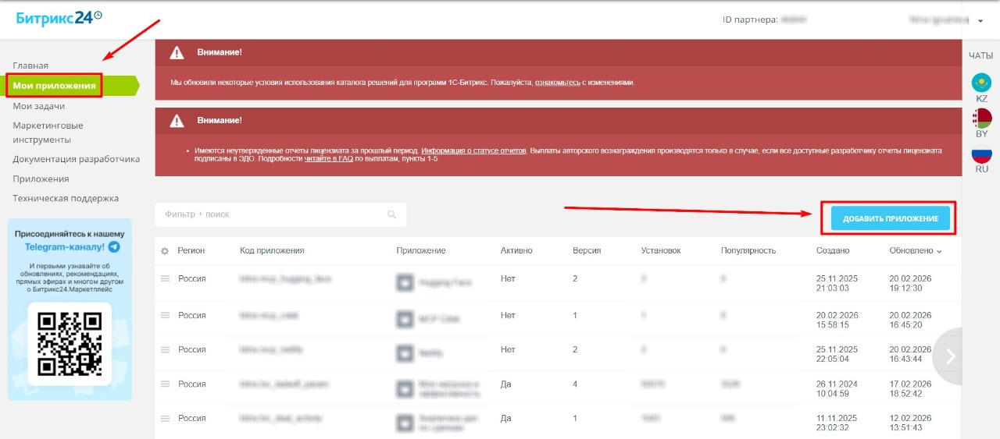
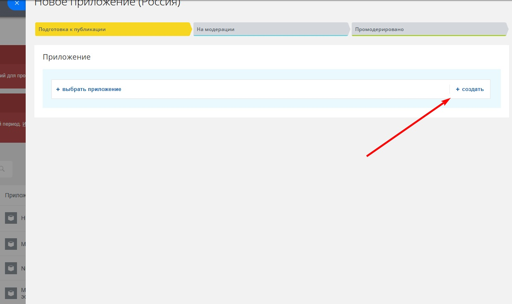
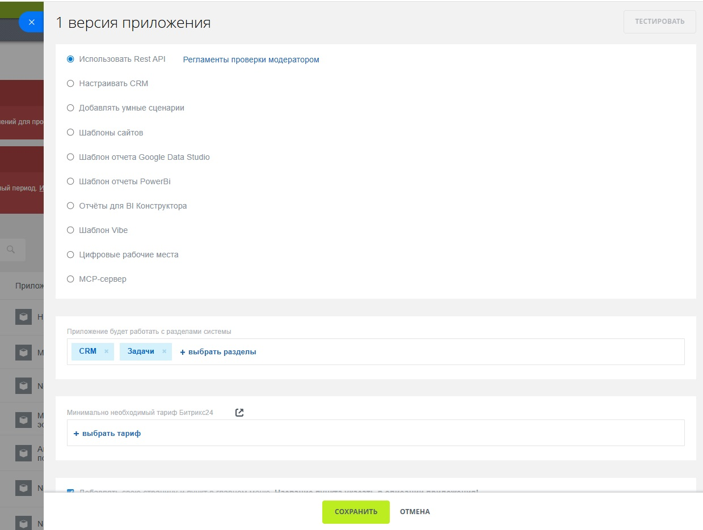
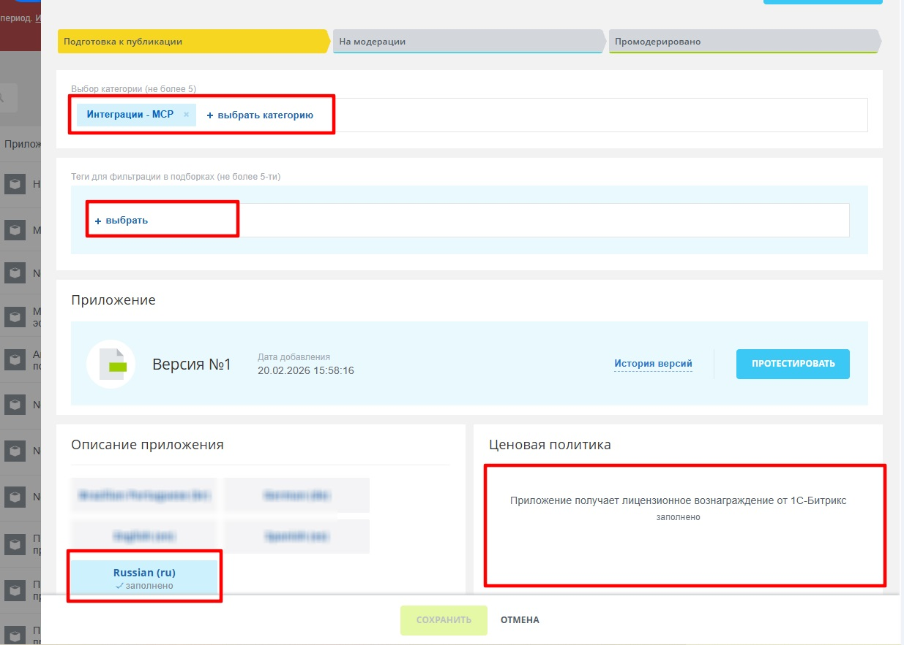
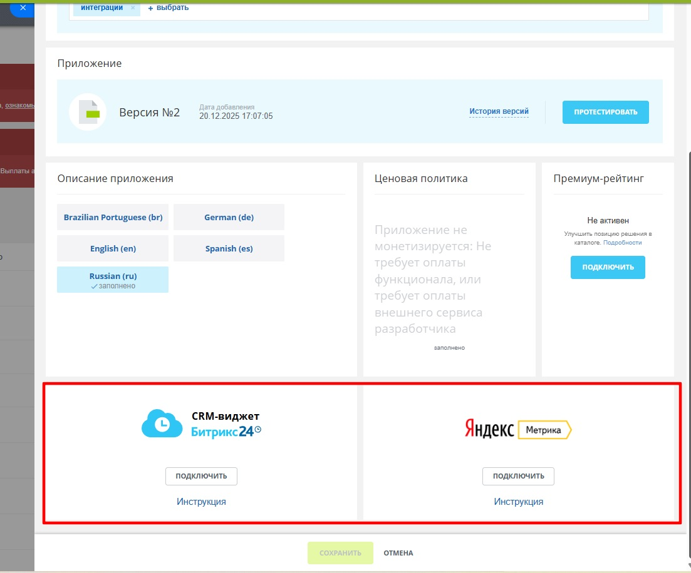
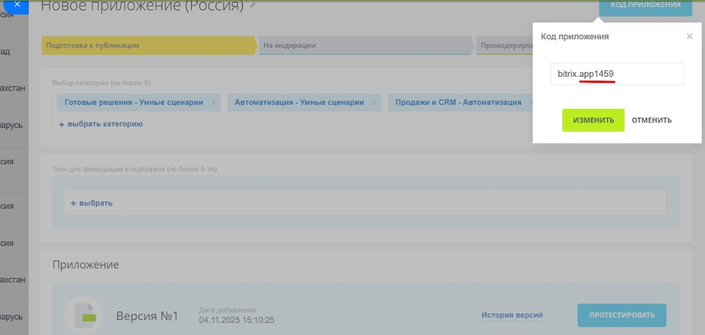

# Как добавить решение в кабинет разработчика

## Добавление приложения

Заходите в кабинете в раздел "Мои приложения" - "Добавить приложение".

Выбираете регион публикации решения и заполняете технические характеристики: тип приложения, разделы системы, с которыми оно работает, указываете ссылки на решение или загружаете архив с ним. Сохраняете данные.

Далее можно сразу указать категории для каталога, ценовую политику и заполнить описание. Русское описание обязательно для публикации в России, Беларуси и Казахстане.

Вы также можете подключить CRM-виджет для коммуникации с клиентами и Метрику для сбора аналитики (Карточка приложения, вниз в самом конце).

Код приложения задается в верхнем правом углу карточки, изменить можно только вторую его часть и только ДО первой положительной модерации.

На этапе тестирования можно отложить заполнение карточки приложения до момента отправки на модерацию (для дальнейшей публикации в Битрикс24 Маркетплейс). На модерации уже ожидаются корректно заполненные данные во всех полях по [регламенту](../preparing-to-publish/common-requirements.md)

## Тестирование функционала

В карточке решения нажмите кнопку "Протестировать". Здесь вы найдете [ключи для авторизации](../../settings/oauth/index.md) (`client_id` и `secret_id`) и сможете указать адрес портала Битрикс24 для тестирования. В новой вкладке откроется ваш портал с карточкой решения в Маркетплейсе и кнопкой "Установить"

Тестирование основных пользовательских сценариев, включая установку, деинсталляцию и переустановку решения, вы должны провести самостоятельно.

## Подписание документов

Перед отправкой на модерацию готового и протестированного решения, понадобится заключить соглашения с компанией 1С-Битрикс.

Для этого перейдите на главной странице в раздел ["Настройки продаж"](https://vendors.bitrix24.ru/sale/), выберите регион публикации, типы размещения и добавьте контрагента (данные о юр.лице разработчика).

Типы размещения:
1. "Отдельные продажи" – для Маркетплейса БУС
2. "Бесплатные" и "по Подписке" – для Маркетплейса Битрикс24
3. (в регионе Россия действует только тип продаж "по Подписке")

Для бесплатного размещения достаточно согласиться с офертой общих условий использования партнерского каталога решений. Для публикации решений, доступных по подписке  Битрикс24 Маркетплейс, мы проверим вашего контрагента и направим необходимое соглашение вам на подпись в выбранную вами систему ЭДО в течение 1-2 рабочих дней.

Для России и Беларуси доступно размещение бесплатных решений (для России только в Маркетплейсе БУС) и решений по подписке Битрикс24 Маркетплейс. Для Казахстана только размещение бесплатных приложений, однако вы можете самостоятельно реализовать прием встроенных покупок внутри вашего решения.

В правом верхнем углу по кнопке "Инструкция" вы можете найти пояснения по заполнению данного раздела и требования к контрагентам.

## Публикация решения

Проверьте соответствие вашего решения [регламенту публикации](./publication-requirements.md) и [требованиям к оформлению](./common-requirements.md). Очень рекомендуем проверить приложение по нашему [чек-листу](./checklist.md).

Если все в порядке, перейдите в список ваших приложений (раздел «Мои приложения») и нажмите кнопку «На модерацию». Если кнопки нет, значит карточка заполнена не до конца.

В случае каких-то ошибок заполнения информации в карточке решения, вы получите автоматические пояснения при подаче на модерацию. При необходимости, обратитесь в чат с модератором (верхний правый угол кабинета, чаты RU/BY/KZ)

Модерация занимает 1-3 рабочих дня. В случае несоответствий, модератор вернет решение на доработку с комментариями, которые вы сможете найти в чате в правом верхнем углу кабинета. После исправлений отправьте решение на повторную модерацию.

При успешной модерации вы получите уведомление снова в чате с модератором. Решение сразу станет доступным в каталоге, но индексация для поиска происходит раз в сутки (не получится  найти через поиск свое приложение сразу же после модерации, только на следующий день).

## Публикация решения в другом регионе

Ранее опубликованное решение вы можете так же опубликовать в другом регионе.

Например, вы хотите опубликованное в России решение также опубликовать в Беларуси:

- Вы можете создать совсем новое приложение, выбрав регион публикации Беларусь, и заполнить все шаги из п.1.
- Либо вы можете при создании приложения выбрать новый регион, но в выпадающем списке выбрать уже существующее решение. В этом случае вам потребуется указать только категории каталога, описания и технические характеристики будут уже заполнены.

В списке решений напротив нового региона у решения нажать кнопку "На модерацию".

Не забудьте проверить в разделе ["Настройки продаж"](https://vendors.bitrix24.ru/sale/), что у вас подписаны документы для этого региона.

Обращаем внимание, что если решение опубликовано по подписке Битрикс24 Маркетплейс в России, то его нельзя будет опубликовать как бесплатное в других регионах. Вам надо будет создать два отдельных приложения с разным статусом.
