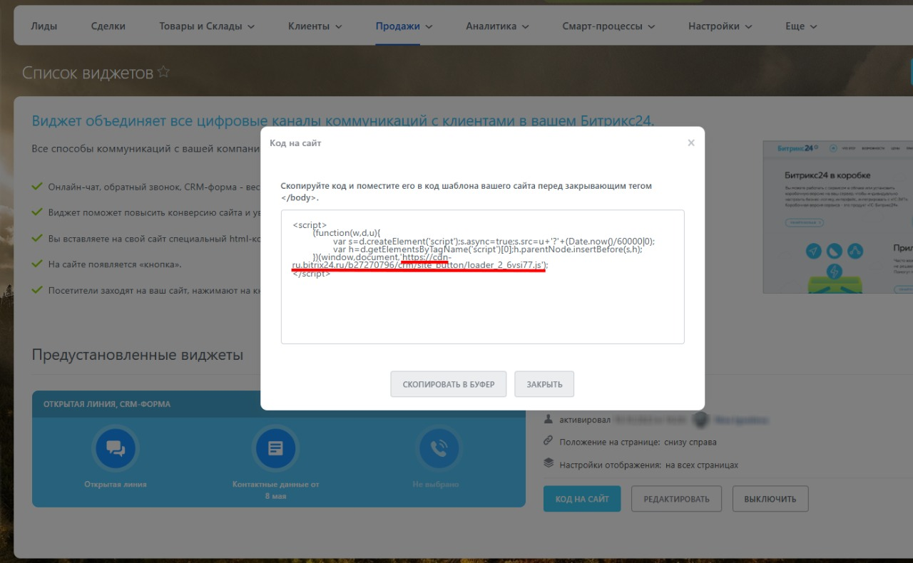

# CRM-виджет

**Показывайте CRM виджет Битрикс24 на страницах своих решений.**

Люди привыкли общаться с компаниями онлайн – через онлайн-чаты, социальные сети и мессенджеры. Теперь у авторов решений Битрикс24 Маркетплейс есть возможность подключить свой CRM-виджет Битрикс24 на страницы своих решений для предпродажных консультаций и технической поддержки.

Настройте свой виджет в Битрикс24, откройте диалог получения кода виджета, скопируйте URL

и вставьте его в поле "CRM-виджет Битрикс24" в карточке решения – может потребоваться некоторое время для обновления кэша публичной страницы решения.

**Важные правила использования виджета**

1. В настоящий момент, в связи с требованиями безопасности, поддерживаются только виджеты облачных Битрикс24.

2. При оказании консультаций пользователям необходимо придерживаться общих правил Маркетплейс (в частности, запрещено предлагать покупки решений и/или продуктов 1С-Битрикс напрямую у автора). Пожалуйста, будьте честны перед другими участниками партнерской сети, чтобы они могли рекомендовать ваши решения своим клиентам.

Рекомендуем подключать к виджету максимально доступный для вас набор коннекторов – не только онлайн-чат, но также социальные сети и мессенджеры. Помимо того, что это будет удобно для пользователей, это поможет и вам, поскольку вы сможете получать контактные данные потенциальных клиентов.