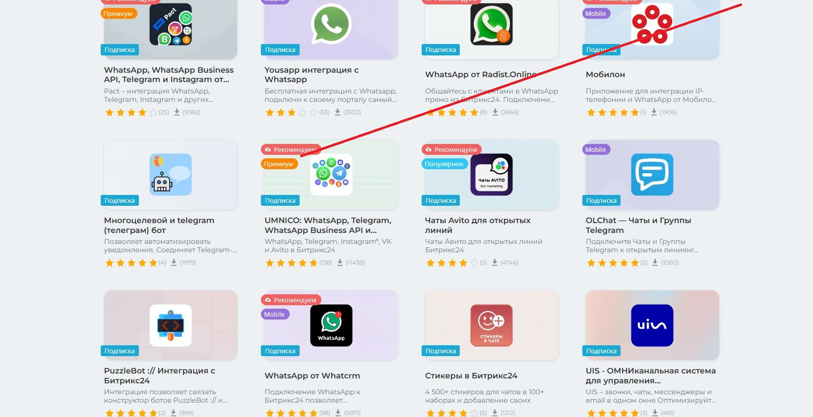
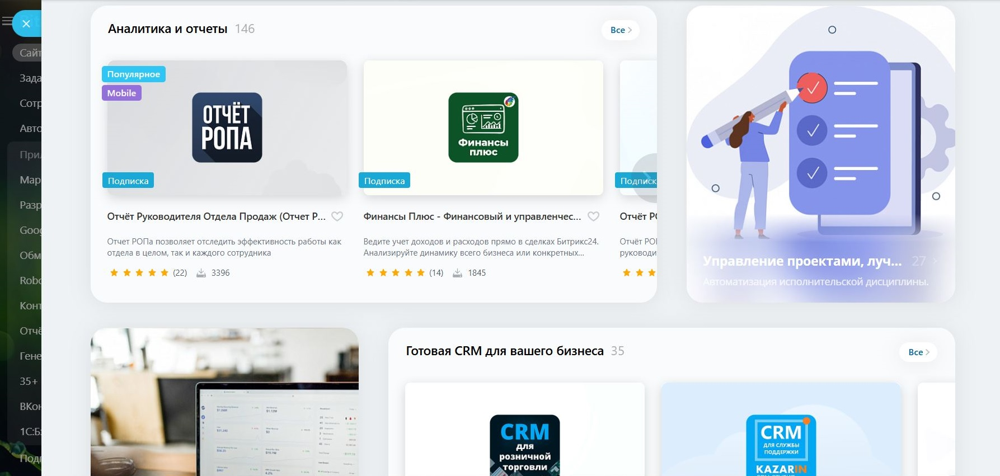
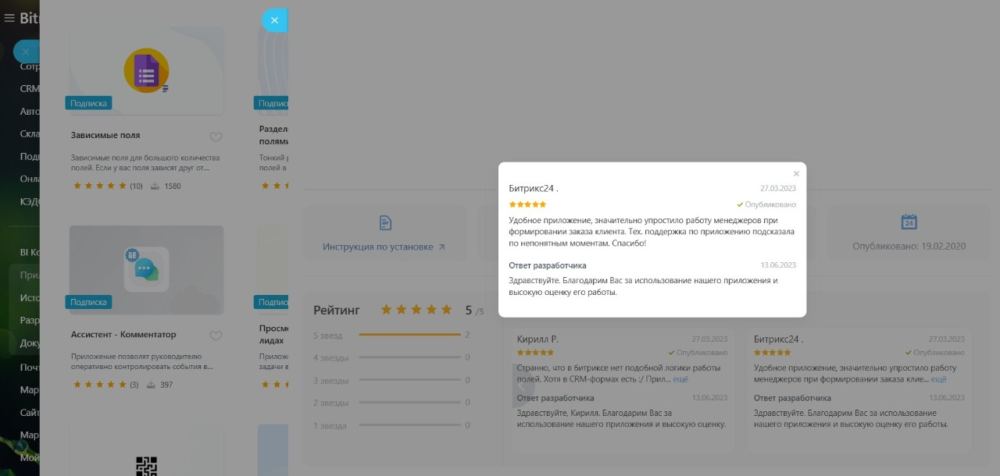
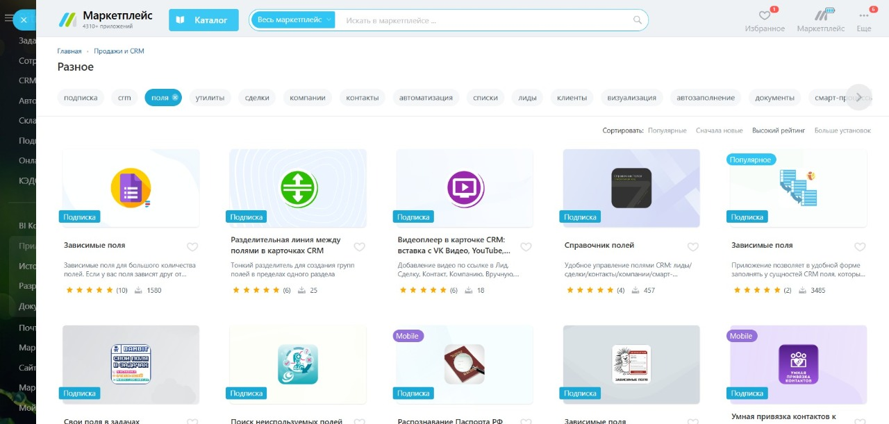
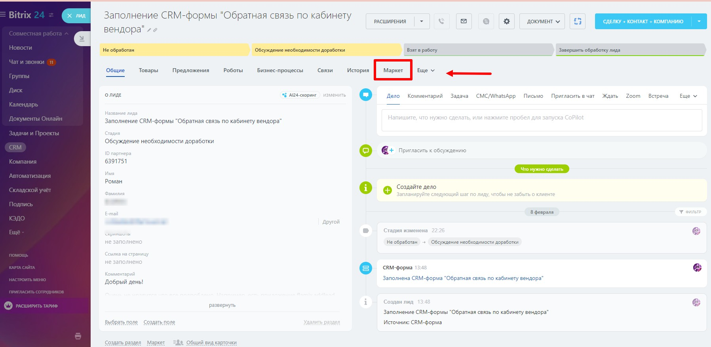
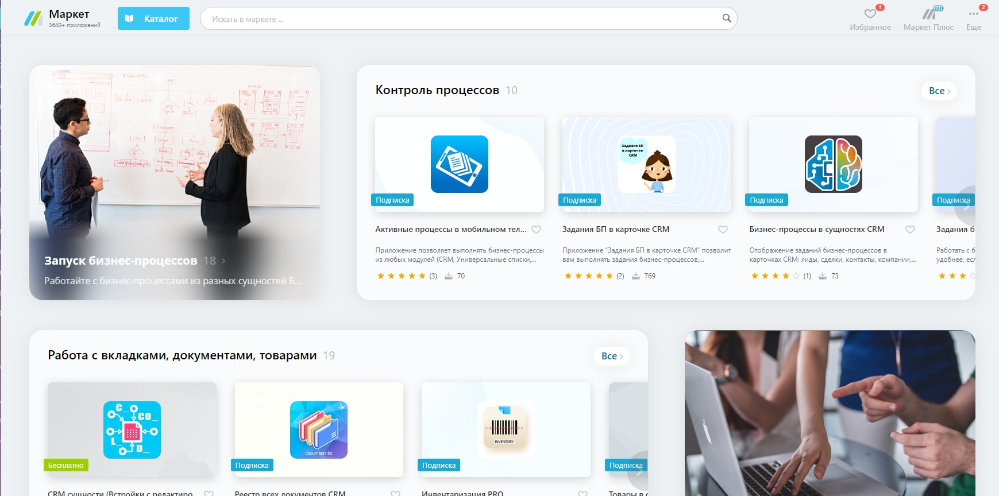
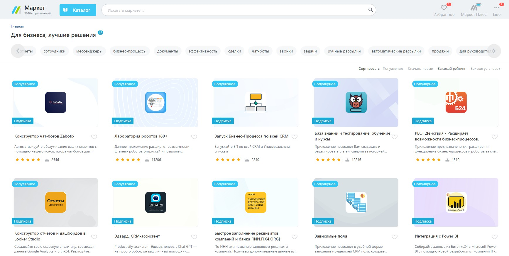
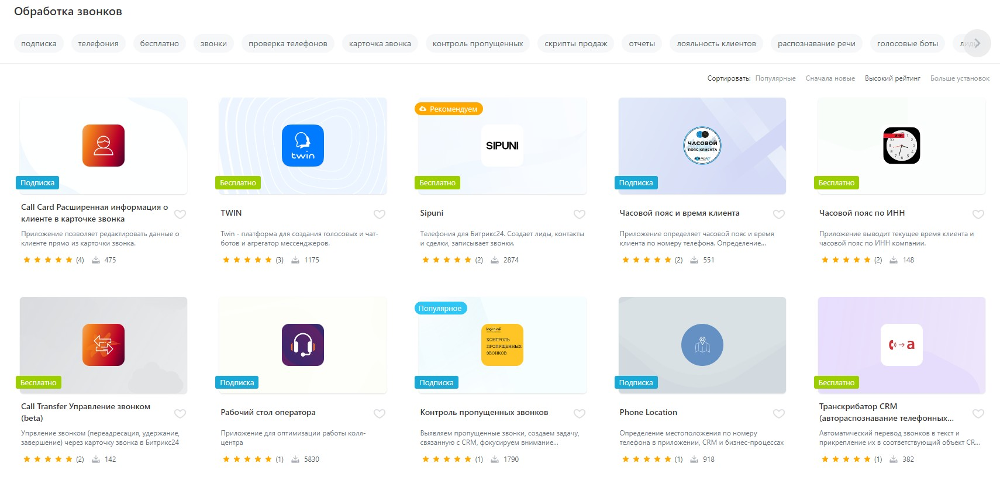
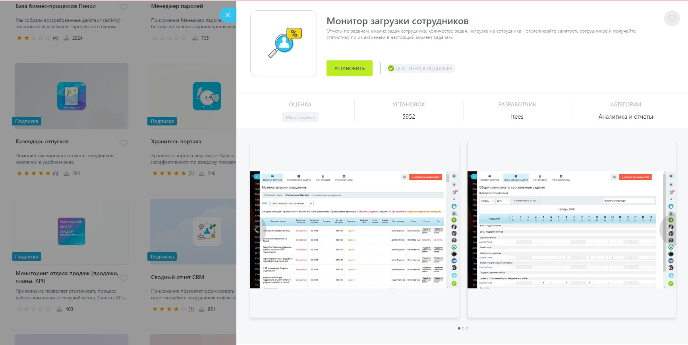

# Маркетинговые возможности в Битрикс24 Маркетплейс

Еще до того, как вы приступите к разработке решений, желательно понимать, каким образом вы будете в дальнейшем их маркетировать, и какие возможности и инструменты дает для этого наша витрина.

## Как помочь пользователям найти ваше решение? 

Расскажите потенциальным клиентам о том, как ваше решение уже пригодилось другим компаниям, работайте с подборками, отзывами и используйте потенциал ключевых слов для быстрого и качественного поиска, воспользуйтесь возможностями платного продвижения.

## Включите Премиум-Рейтинг

Решения с Премиум-рейтингом поднимаются на первые позиции в своих категориях и отмечены специальной меткой. Решения в каталоге можно отсортировать по популярности, количеству установок, рейтингу. Премиум-рейтинг отлично подходит для новых интеграций – нет необходимости ждать набора установок, можно сразу рассказать о себе потенциальным покупателям. Включить премиум-рейтинг можно в карточке решения.

## Тематические подборки

На витрине Маркетплейса вы найдете разнообразные тематические подборки решений. Они доступны как на главной странице, так и в различных разделах продукта, где пользователи ищут нужный функционал.

Мы собираем интересные и полезные приложения и формируем из них обзоры.

Просмотрите витрину, найдите подходящую категорию и обратитесь к модераторам. Если ваше решение совпадает по тематике и функционалу, мы добавим его в подборку.

## Работа с отзывами

Работа с отзывами – это способ получить обратную связь от пользователей и эффективный инструмент для продвижения вашего приложения.

Высокие оценки и положительные отзывы помогут занять первые места в сортировке по рейтингу на витрине Маркетплейса.

Почему это важно? – Решение автоматически поднимется в топ выдачи и будет одним из первых, которые увидит потенциальный клиент.

## Ключевые слова

Правильно подобранные ключевые слова могут значительно повысить видимость приложения в Маркетплейсе и привлечь больше пользователей.

Ключевые слова должны быть связаны с функциональностью и основными особенностями приложения, поисковый "спам" не несет пользы и недопустим.

Пересмотрите список ваших ключевых слов, ведь поисковая выдача очень важна для продвижения решения, чтобы пользователь смог быстро найти нужное. И пусть это будет именно ваше решение.

## Как рассказать пользователям о своем приложении?

Мы стараемся направлять пользователей на приложения непосредственно внутри Битрикс24, предлагая готовые решения прямо там, где они смогут их использовать. И все, что вам нужно – это добавить [встраивание своего приложения](../../api-reference/widgets/index.md) в виде виджетов Битрикс24.

### Виджеты в приложениях

Если ваше приложение добавляет виджет (или несколько), то мы начинаем рекомендовать пользователям ваше приложение в подборке «подходящих» приложений для каждого конкретного места встройки виджета. Вот так это выглядит на примере приложений, добавляющих дополнительные виджеты в виде вкладок карточки CRM.

По клику пользователя на пункт «Маркетплейс» мы показываем слайдер с подборкой нужных решений.

Тоже самое касается и решений, добавляющих действия бизнес-процессов, роботов и т.д. – мы будем рекомендовать ваши решения прямо внутри соответствующих инструментов.

Чем больше сценариев интеграции и встройки вы реализуете, тем чаще ваше приложение будет «попадаться пользователю на глаза».

## Как выделиться на фоне других решений?

Грамотное описание приложения, которое поможет потенциальным пользователям понять, какие именно их проблемы будет решать ваше приложение – залог успеха. Пусть ваше описание отвечает на главный вопрос: **зачем приложение нужно пользователям**. Хуже, если описание отвечает на вопрос «что делает» приложение – ведь это означает, что пользователь сам должен сообразить, а «зачем» в итоге нужно все то, «что делает» приложение?

### Понятное название

В Маркетплейсе много решений и пользователь скорее откроет то приложение, которое заинтересует его в списке альтернатив. А значит название должно быть понятным и коротким, чтобы умещаться на экране при просмотре списка.

### Маркетинговый слоган

Помимо названия важно давать понятный и побуждающий маркетинговый слоган приложению. Он должен дополнять, а не копировать название, и быть достаточно коротким, чтобы целиком умещаться в списках приложений. 

Не копируйте название в маркетинговый слоган. Убирайте вводные слова и фразы. Пишите коротко и четко, зачем нужно.

### Информативные скриншоты

Второй важный нюанс – качественные скриншоты, которые показывают живые кейсы использования приложения. Скриншоты тоже должны помочь пользователю понять, зачем ему нужно это приложение и как он его сможет использовать. Как вам кажется, скриншот интерфейса настроек или скриншот с сообщением об успешной установке приложения очень в этом помогают? Если есть сомнения, то скорее это значит, что нет. Подумайте над другими вариантами.

## Продолжите изучение

- [{#T}](users-rating.md)