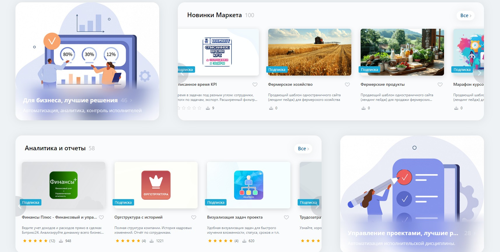
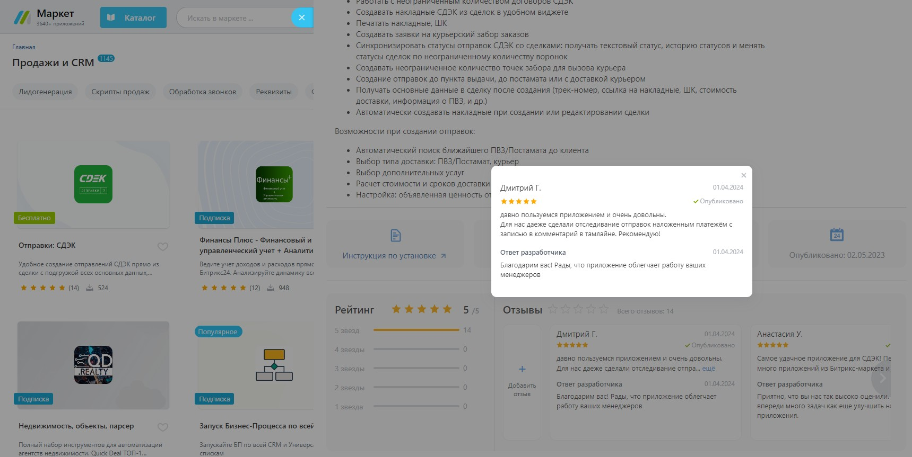
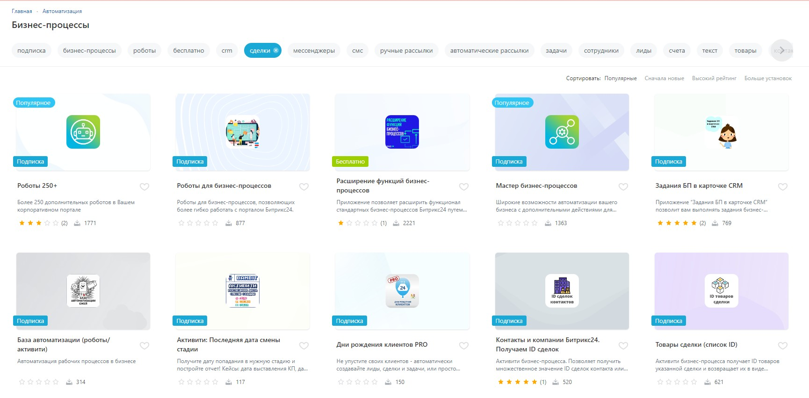

# Продвижение в Маркете

Еще до того, как вы приступите к разработке решений, желательно понимать, каким образом вы будете в дальнейшем их маркетировать, и какие возможности и инструменты дает для этого наша витрина.

## Как рассказать пользователям Битрикс24 о своем приложении?

Мы стараемся направлять пользователей на приложения непосредственно внутри Битрикс24, предлагая готовые решения прямо там, где они смогут их использовать. И все, что вам нужно - это добавить [встраивание своего приложения](../../api-reference/widgets/index.md) в виде виджетов Битрикс24.

### Виджеты в приложениях

Если ваше приложение добавляет виджет (или несколько), то мы начинаем рекомендовать пользователям ваше приложение в подборке «подходящих» приложений для каждого конкретного места встройки виджета. Вот так это выглядит на примере приложений, добавляющих дополнительные виджеты в виде вкладок карточки CRM.

По клику пользователя на пункт «Маркет» мы показываем слайдер с подборкой нужных решений.

Тоже самое касается и решений, добавляющих действия бизнес-процессов, роботов и т.д. – мы будем рекомендовать ваши решения прямо внутри соответствующих инструментов.

Чем больше сценариев интеграции и встройки вы реализуете, тем чаще ваше приложение будет «попадаться пользователю на глаза».

## Как выделиться на фоне других решений?

Грамотное описание приложения, которое поможет потенциальным пользователям понять, какие именно их проблемы будет решать ваше приложение – залог успеха. Пусть ваше описание отвечает на главный вопрос: **зачем приложение нужно пользователям**. Хуже, если описание отвечает на вопрос «что делает» приложение – ведь это означает, что пользователь сам должен сообразить, а «зачем» в итоге нужно все то, «что делает» приложение?

### Понятное название

В Маркете много решений и пользователь скорее откроет то приложение, которое заинтересует его в списке альтернатив. А значит название должно быть понятным и коротким, чтобы умещаться на экране при просмотре списка.

### Краткое описание

Помимо названия важно давать понятное и побуждающее краткое описание приложению. Оно должно дополнять, а не копировать название, и быть достаточно коротким, чтобы целиком умещаться в списках приложений.

Не копируйте название в краткое описание. Убирайте вводные слова и фразы. Пишите коротко и четко, зачем нужно.

### Информативные скриншоты

Второй важный нюанс – качественные скриншоты, которые показывают живые кейсы использования приложения. Скриншоты тоже должны помочь пользователю понять, зачем ему нужно это приложение и как он его сможет использовать. Как вам кажется, скриншот интерфейса настроек или скриншот с сообщением об успешной установке приложения очень в этом помогают? Если есть сомнения, то скорее это значит, что нет. Подумайте над другими вариантами.

## Как помочь пользователям найти ваше приложение?

Расскажите потенциальным клиентам о том, как ваше решение уже пригодилось другим компаниям, работайте с подборками, отзывами и используйте потенциал ключевых слов для быстрого и качественного поиска.

### Тематические подборки

На витрине Маркета вы найдете разнообразные тематические подборки решений. Они доступны как на главной странице, так и в различных разделах продукта, где пользователи ищут нужный функционал.

Мы собираем интересные и полезные приложения и формируем из них обзоры.

Просмотрите витрину, найдите подходящую категорию и обратитесь к модераторам. Если ваше решение совпадает по тематике и функционалу, мы добавим его в подборку.

### Работа с отзывами

Работа с отзывами — это способ получить обратную связь от пользователей и эффективный инструмент для продвижения вашего приложения.

Высокие оценки и положительные отзывы помогут занять первые места в сортировке по рейтингу на витрине Маркета.

Почему это важно? - Решение автоматически поднимется в топ выдачи и будет одним из первых, которые увидит потенциальный клиент.

### Поисковая оптимизация

Огромная часть установок решений Маркет происходит с помощью поиска, где мы стараемся показывать в выдаче приложения, наиболее релевантные запросам.

Для формирования поискового индекса мы используем (в порядке степени влияния):

- название приложения;
- ключевые слова, которые вы указываете в карточке своего решения;
- полное описание приложения.

Отсюда правила использования ключевых слов:

1. Самые важные слова - в заголовке; менее важные - в поле "ключевые слова", а самый широкий диапазон - в описании приложения;
2. Чем "левее" позиция слова в заголовке, ключевых словах и описании, тем выше вес этого слова. Например, по запросу "склад", выше будет приложение с названием "**Складской** учет", а не "Автоматизация **складского** учета".
3. Чем короче текст, те выше вес каждого слова в этом тексте. Например, по запросу "роботы", выше будет приложение с названием "Роботы и триггеры" (длина в 2 слова), а не "Роботы и триггеры CRM" (длина 3 слова).



Вы должны решить для себя, какие ключевые слова для вас наиболее интересны, и оптимизировать контент в карточке приложения именно под них. Не получится одинаково успешно в сравнении с другими приложениями быть на высоких позициях одновременно по большому количеству разных слов.



## Продолжите изучение

- [{#T}](users-rating.md)