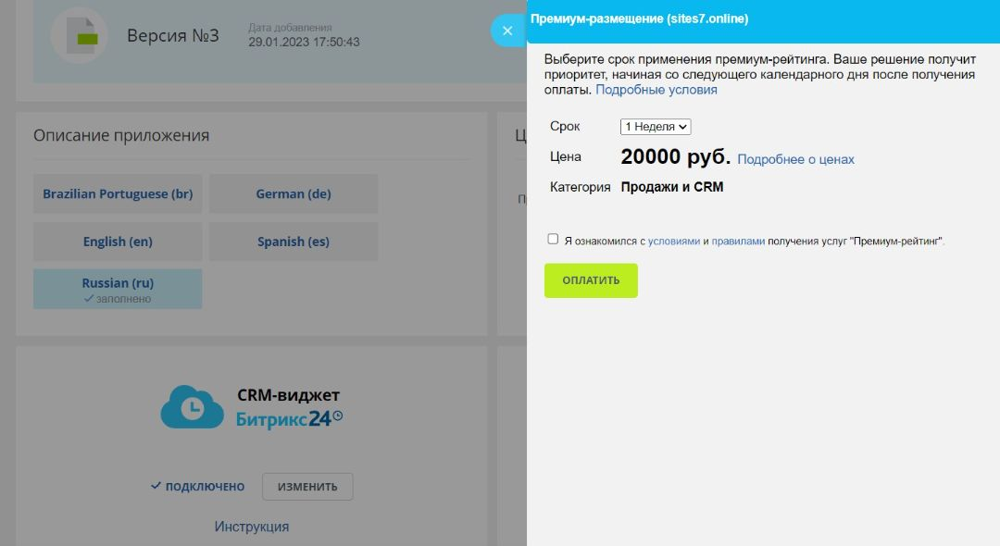

# Премиум-рейтинг

Как сделать так, чтобы решение увидели в каталоге.

## Что это такое?

**Премиум-рейтинг** – услуга по продвижению вашего решения на Маркетплейсе. Поможет привлечь новых клиентов и продвинуть свою интеграцию среди пользователей Битрикс24. Решения с Премиум-рейтингом поднимаются на первые позиции в своих категориях и отмечены специальной меткой.

**Используйте возможность заявить о себе.** Решения в каталоге можно отсортировать по популярности, количеству установок, рейтингу. Премиум-рейтинг отлично подходит для новых интеграций – нет необходимости ждать набора установок, можно сразу рассказать о себе потенциальным покупателям.

**Подключить услугу просто** – выбрать параметры прямо в карточке решения. Цена Премиум-рейтинга зависит от категории, к которой привязана интеграция. Услуга активируется автоматически на следующие сутки после поступления оплаты.

## Преимущества

* Широкая целевая аудитория. Клиенты Битрикс24 – компании из разных сфер деятельности. Найдите аудиторию для своего приложения среди 15 000 000 компаний.

* Эффективное размещение. Решение показывается на первых позициях в категории каталога на сайте и внутри продукта. Клиенты везде увидят ваше решение первым.

* Фиксированная цена. Стоимость услуги зависит от категории, к которой привязана интеграция. Никаких подводных камней, процентных ставок и прочего. Просто и удобно определиться с бюджетом на продвижение.

* Автоматическая активация. Услуга автоматически активируется на следующие сутки после оплаты, что исключает вероятность воздействия человеческого фактора. Все происходит точно и вовремя.

* Простой документооборот. Покупая услугу, достаточно просто согласиться с офертой. Это легче и удобнее, чем комиссионные договоры с необходимостью постоянно контролировать отчетность.

* Быстрое подключение. В карточке решения нажать кнопку Премиум-Размещение. – Выбрать период действия приоритета. – Согласиться с офертой и правилам. – Оплатить.

## Как подключить услугу?

**Выберите услугу прямо в карточке решения.** Простой способ подключить Премиум-рейтинг без дополнительных договоров и закрывающих документов.

**Кнопка премиум.** Нажимаете на кнопку и в слайдере увидите условия, цену, сроки и возможность оплатить услугу.

**Решение поднимется на первые позиции витрины маркетплейса.** Потенциальные покупатели не пропустят вашу интеграцию на страницах каталога. 

## Тарифы для немонетизируемых приложений

#|
|| **Раздел в каталоге** | **Тариф** ||
|| Продажи и CRM | 40 000 р/неделя ||
|| Сайты и магазины | 12 500 р/неделя ||
|| Импорт, экспорт | 25 000 р/неделя ||
|| Интеграции | 45 000 р/неделя || 
|| Аналитика и отчеты | 25 000 р/неделя ||
|| Автоматизация | 40 000 р/неделя ||
|| Задачи и проекты | 35 000 р/неделя ||
|| Маркетинг и рассылки | 35 000 р/неделя ||
|| Каналы и коммуникации | 45 000 р/неделя ||
|| Готовые решения | 25 000 р/неделя ||
|| HR-менеджмент | 35 000 р/неделя ||
|| Документооборот | 25 000 р/неделя ||
|#

## Тарифы для монетизируемых приложений

#|
|| **Раздел в каталоге** | **Тариф** ||
|| Продажи и CRM | 20 000 р/неделя ||
|| Сайты и магазины | 12 500 р/неделя ||
|| Импорт, экспорт | 12 500 р/неделя ||
|| Интеграции | 22 500 р/неделя || 
|| Аналитика и отчеты | 12 500 р/неделя ||
|| Автоматизация | 20 000 р/неделя ||
|| Задачи и проекты | 17 500 р/неделя ||
|| Маркетинг и рассылки | 17 500 р/неделя ||
|| Каналы и коммуникации | 22 500 р/неделя ||
|| Готовые решения | 12 500 р/неделя ||
|| HR-менеджмент | 17 500 р/неделя ||
|| Документооборот | 12 500 р/неделя ||
|#

## Уважаемые коллеги, появилась новая маркетинговая возможность.
 
Скидка при длительном подключении Премиум-рейтинга:
– 25% скидка при подключении на 12 недель;
– 50% скидка при подключении на 24 недели.

Чем более долгий срок активации вы подключаете – тем выгоднее для вас.
Это не временное предложение – это стратегия для устойчивого продвижения вашего решения в каталоге.

Нужны подробности? Ознакомьтесь с текстом соглашения об оказании услуг и правилами. 

[Соглашение](https://vendors.bitrix24.ru/oferta_premium.pdf)

[Правила](https://vendors.bitrix24.ru/premium_rules.pdf)