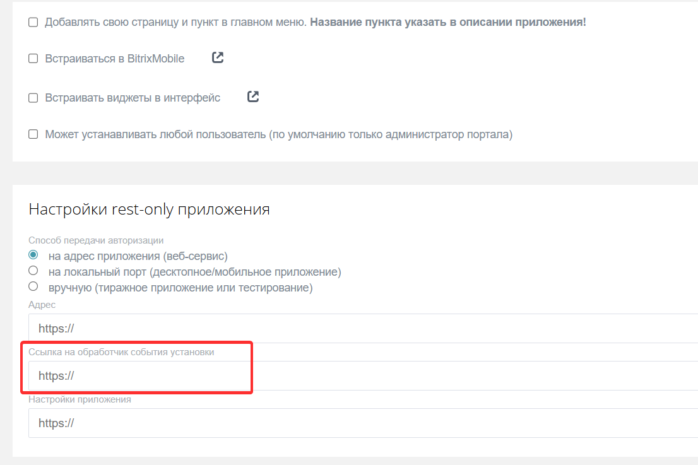
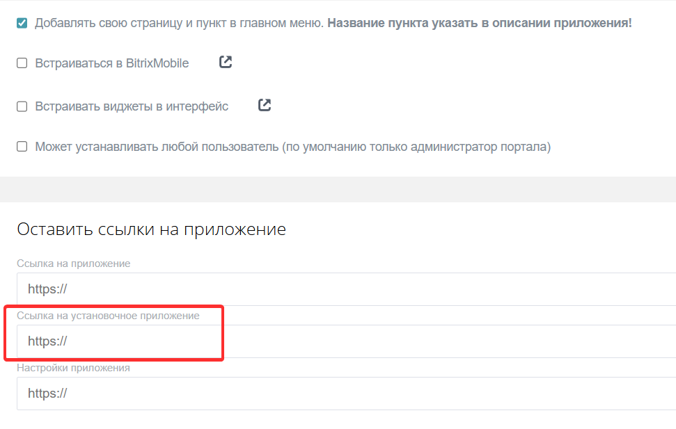

# Завершение установки приложений

Основное отличие в установке приложений в Битрикс24 — наличие или отсутствие пользовательского интерфейса UI. От этого зависит, нужно ли подтверждать установку приложения.

## Приложение без интерфейса

Приложение без интерфейса работает в фоне и не требует действий пользователя.

- Для локальных приложений включите опцию «Использует только API».

   

- Для тиражных — выключите опцию «Добавлять свою страницу и пункт в главном меню».

   

**Как работает.** Установка приложения обрабатывается автоматически. На URL-адрес приложения придет POST-запрос с данными авторизации OAuth 2.0: `access_token` и `refresh_token`.

- Для локальных приложений — на URL из поля «Путь для первоначальной установки».

   

- Для тиражных — «Ссылка на обработчик события установки».

   

**Роль разработчика.** Обработайте входящий callback: проверьте данные, сохраните токены и подготовьте приложение к работе. Приложение сразу считается установленным в Битрикс24.

## Приложение с интерфейсом

Работа приложения с интерфейсом зависит от действий, которые совершает пользователь.

- Для локальных приложений выключите опцию «Использует только API».

   

- Для тиражных — включите опцию «Добавлять свою страницу и пункт в главном меню».

   

**Как работает установка.** При первом открытии администратор увидит страницу настройки приложения.

- Для локальных приложений — страницу из поля «Путь для первоначальной установки».

   

- Для тиражных — «Ссылка на установочное приложение».

   

На этом этапе приложение считается не установленным. Автоматическая установка невозможна, так как для работы приложения требуются действия пользователя в мастере настройки.

**Как завершить установку.** После того как пользователь выполнил настройку, используйте метод `installFinish` для завершения установки. Метод вызывается только из фронтенда, со страницы настройки приложения.

## Что не работает, пока установка не завершена

Пока из приложения не придет сигнал об окончании установки через `installFinish`, приложение будет считаться не настроенным. Работа функционала будет заблокирована.

- Встройки не появятся в интерфейсе, даже если [placement.bind](../../api-reference/widgets/placement-bind.md) завершился успешно.

- События не отправятся на обработчик, даже после успешного [event.bind](../../api-reference/events/event-bind.md).

- Интерфейс приложения не будет загружаться: 
    -  обычные пользователи увидят сообщение *«Приложение еще не установлено до конца. Обратитесь к администратору вашего Битрикс24, чтобы он завершил установку».* 
    -  администратор будет видеть страницу из поля «Путь для первоначальной установки» для локального приложения или «Ссылка на установочное приложение» для тиражного.

## Как проверить статус установки

Используйте метод [app.info](../../api-reference/common/system/app-info.md), чтобы проверить установку приложения.



- JS

    ```javascript
    try {
        const response = await $b24.callMethod('app.info', {});
        console.log(response.getData().result.INSTALLED); // true или false
    } catch(error) {
        console.error(error);
    }
    ```

- BX24.js

    ```javascript
    BX24.callMethod(
        "app.info",
        {},
        function(result) {
            if(result.error())
                console.error(result.error());
            else
                console.log(result.data().INSTALLED); // true или false
        }
    );
    ```



Если в ответе:

- `"INSTALLED": false` — установка не завершена. Вызовите `installFinish`.

- `"INSTALLED": true` — установка прошла корректно.

## Как и когда вызывать installFinish

Вызывайте метод на странице настройки приложения:

- для локального приложения в файле из поля «Путь для первоначальной установки»,

- для тиражного — «Ссылка на установочное приложение».

Вызывайте метод после того, как выполнили необходимые настройки: зарегистрировали встройки, подписались на события, сохранили конфигурацию.



- JS

    [installFinish()](https://bitrix-tools.github.io/b24jssdk/reference/frame-index.html#installFinish)

    ```html
        <script setup lang="ts">
    import { onMounted } from 'vue'
    import { initializeB24Frame } from '@bitrix24/b24jssdk'

    const $b24 = await initializeB24Frame();

    onMounted(async () => {
        try {
            // 1. Регистрируем встройку
            await $b24.callMethod('placement.bind', {
                PLACEMENT: 'CRM_DEAL_DETAIL_TAB',
                HANDLER: 'https://example.com/deal-tab',
                TITLE: 'Данные приложения'
            });

            // 2. Подписываемся на событие
            await $b24.callMethod('event.bind', {
                event: 'ONCRMDEALADD',
                handler: 'https://example.com/event-handler'
            });

            // 3. Завершаем установку
            await $b24.installFinish();

        } catch (error) {
            console.error('Ошибка установки:', error);
        }
    });
    </script>
    ```

- BX24.js

    [BX24.installFinish()](../../sdk/bx24-js-sdk/system-functions/bx24-install-finish.md)

    ```javascript
        BX24.init(function() {
        // 1. Регистрируем встройку в карточке сделки
        BX24.callMethod('placement.bind', {
            PLACEMENT: 'CRM_DEAL_DETAIL_TAB',
            HANDLER: 'https://example.com/deal-tab',
            TITLE: 'Данные приложения'
        });

        // 2. Подписываемся на событие создания сделки
        BX24.callMethod('event.bind', {
            event: 'ONCRMDEALADD',
            handler: 'https://example.com/event-handler'
        });

        // 3. Завершаем установку
        BX24.installFinish();
    });
    ```




## Чек-лист для проверки установки приложения

1. Тип приложения и необходимость вызова `installFinish`.

   - Без интерфейса, только API — вызов `installFinish` не требуется. Установка завершается автоматически.

   - С интерфейсом и мастером настройки — вызов `installFinish` обязателен.

2. Проверка вызова `installFinish`.

   - Метод вызван после успешного выполнения других методов в установочном файле.

   - Метод вызван только один раз.

3. Проверка работы после установки.

   - Статус установки `INSTALLED: true`.

   - Встройки отображаются в интерфейсе и загружают интерфейс обработчиков.

   - События приходят на обработчик.

   - Интерфейс приложения открывается у сотрудников без прав администратора.

