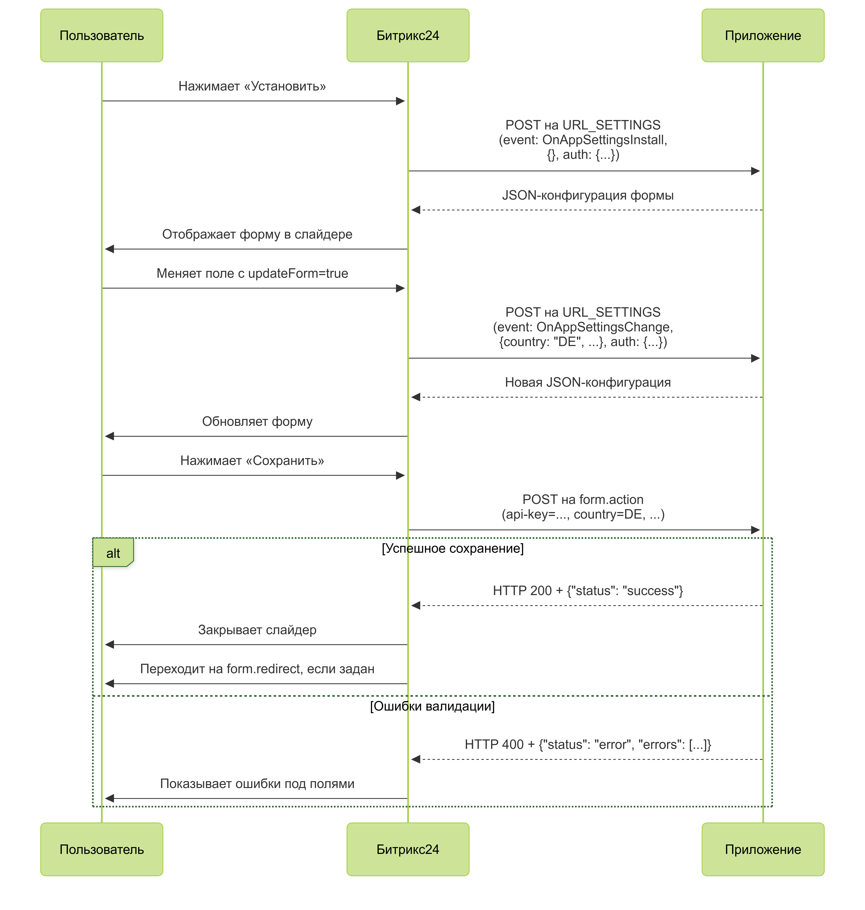

# Мастер настройки для REST-only приложений

Мастер настройки REST-only приложений — это встроенная форма Битрикс24 для приложений без интерфейса. При разработке достаточно описать поля в формате JSON. Мастер настройки сам сформирует пошаговую форму, соберет данные и отправит их в указанный обработчик.

Используйте мастер настройки:

- если у приложения нет своего интерфейса,
- нужны простые настройки: ввод текста в строку, выбор варианта из списка,
- нужен интерфейс в стиле Битрикс24, без отдельного UI,
- данных от callback-обработчика события установки недостаточно.

## Принцип работы мастера

Укажите параметр `URL_SETTINGS` при регистрации приложения в кабинете разработчика. Если параметр заполнен, после установки приложения пользователь увидит слайдер с формой настройки.

### Жизненный цикл формы

1. Пользователь устанавливает приложение.
2. Битрикс24 делает POST-запрос на `URL_SETTINGS`.
3. Приложение возвращает JSON-конфигурацию формы.
4. Битрикс24 показывает форму в слайдере.
5. При `updateForm: true` Битрикс24 повторно запрашивает `URL_SETTINGS`.
6. Пользователь нажимает «Сохранить», и данные уходят на `form.action`.
7. Приложение возвращает `success` или список ошибок. При `success` Битрикс24 закрывает слайдер и при необходимости выполняет переход на `form.redirect`.



## Структура JSON-конфигурации

Конфигурация состоит из трех блоков:

- заголовок,
- шаги с полями,
- параметры сохранения.

### Заголовок

Заголовок задает название страницы настроек и версию конструктора.

```json
{
  "title": "Название мастера",
  "version": "1"
}
```



#|
|| **Название**
`тип` | **Описание** ||
|| **title*** 
`string` | Заголовок в интерфейсе ||
|| **version*** 
`string` | Версия конструктора, всегда `"1"` ||
|#

### Шаги

`steps` — массив шагов. Каждый шаг описывает отдельный экран формы.

```json
{
  "id": "step1",
  "title": "API-ключ",
  "description": "Введите ключ доступа",
  "fields": [
    {
      "id": "api-key",
      "name": "api-key",
      "type": "input",
      "label": "API-ключ",
      "placeholder": "Введите API-ключ"
    }
  ]
}
```



#|
|| **Название**
`тип` | **Описание** ||
|| **id*** 
`string` | Уникальный идентификатор шага ||
|| **title*** 
`string` | Заголовок шага ||
|| **description** 
`string` | Пояснительный текст ||
|| **help** 
`boolean` | Флаг отображения значка справки ||
|| **fields*** 
`array` | Массив полей, [подробное описание](#fields) ||
|#

#### Параметр fields {#fields}



#|
|| **Название**
`тип` | **Описание** ||
|| **id*** 
`string` | Идентификатор поля ||
|| **name*** 
`string` | Имя поля, ключ в данных ||
|| **type*** 
`string` | Тип поля: 
- `input` — строка ввода данных,
- `dropdown-list` — список ||
|| **label** 
`string` | Подпись над полем ||
|| **placeholder** 
`string` | Подсказка внутри поля ||
|| **value** 
`string` | Значение по умолчанию ||
|| **items** 
`array` | Список вариантов для `dropdown-list` ||
|| **updateForm** 
`boolean` | Флаг обновления формы при изменении поля ||
|#

Если параметр `updateForm` равен `true`, Битрикс24 повторно запросит `URL_SETTINGS` и передаст в запросе текущие значения полей.
Это позволяет обновлять форму в процессе ее заполнения пользователем. Например, можно добавить новое поле со списком регионов в зависимости от выбранного значения в поле страна. 

### Параметры сохранения

Блок `form` описывает, куда отправлять данные и какие кнопки показать.

```json
"form": {
  "id": "config-form",
  "action": "https://example.ru/save-handler.php",
  "clientId": "local.123...",
  "redirect": "/crm/",
  "saveCaption": "Сохранить",
  "cancelCaption": "Отмена"
}
```



#|
|| **Название**
`тип` | **Описание** ||
|| **id*** 
`string` | Идентификатор формы ||
|| **action*** 
`string` | URL обработчика сохранения ||
|| **clientId*** 
`string` | Идентификатор приложения client_id ||
|| **redirect** 
`string` | Путь после успешного сохранения ||
|| **saveCaption** 
`string` | Подпись кнопки «Сохранить» ||
|| **cancelCaption** 
`string` | Подпись кнопки «Отмена» ||
|#

## Пример конфигурации

```json
{
  "title": "Storecove e-invoice connector",
  "version": "1",
  "steps": [
    {
      "id": "step1",
      "title": "API-ключ",
      "description": "Укажите ключ из личного кабинета Storecove",
      "fields": [
        {
          "id": "api-key",
          "name": "api-key",
          "type": "input",
          "label": "Storecove API-ключ",
          "placeholder": "Введите API-ключ"
        }
      ]
    },
    {
      "id": "step2",
      "title": "Страна",
      "fields": [
        {
          "id": "country",
          "name": "country",
          "type": "dropdown-list",
          "label": "Ваша страна",
          "items": [
            { "value": "RU", "name": "Россия" },
            { "value": "DE", "name": "Германия" },
            { "value": "US", "name": "США" }
          ],
          "updateForm": true
        }
      ]
    },
    {
      "id": "step3",
      "title": "Реквизиты компании",
      "fields": [
        {
          "id": "vat-id",
          "name": "vat-id",
          "type": "input",
          "label": "VAT ID",
          "placeholder": "Введите VAT ID"
        }
      ]
    }
  ],
  "form": {
    "id": "config-form",
    "action": "https://example.ru/save.php",
    "clientId": "local.6537665f598492.98090704",
    "redirect": "/",
    "saveCaption": "Подключить",
    "cancelCaption": "Позже"
  }
}
```

## Обработчик URL_SETTINGS

Битрикс24 отправляет POST-запрос на `URL_SETTINGS` для получения конфигурации формы.

```php
[
  'event' => 'OnAppSettingsInstall', // или OnAppSettingsChange / OnAppSettingsDisplay
  'data'  => [ /* текущие значения полей */ ],
  'auth'  => [
    'access_token' => '***',
    'expires' => 1768385511,
    'expires_in' => 3600,
    'scope' => 'crm,bizproc,appform,user_brief,placement,catalog',
    'domain' => 'some-domain.bitrix24.ru',
    'server_endpoint' => 'https://oauth.bitrix24.tech/rest/',
    'status' => 'F',
    'client_endpoint' => 'https://some-domain.bitrix24.ru/rest/',
    'member_id' => '***',
    'refresh_token' => '***',
    'user_id' => 431,
    'client_id' => '***',
    'application_token' => '***'
  ]
]
```

#|
|| **Название**
`тип` | **Описание** ||
|| **event** 
`string` | Тип события:
- `OnAppSettingsInstall` - при установке приложения,
- `OnAppSettingsChange` - при изменении поля с `updateForm: true`,
- `OnAppSettingsDisplay` - при открытии настроек приложения ||
|| **data**
`object` | Текущие значения полей формы ||
|| **auth**
`object` | Данные авторизации ||
|#

## Обработчик после сохранения

Когда пользователь нажимает «Сохранить», Битрикс24 отправляет данные формы на адрес из поля `form.action`.

```php
$_POST = [
  'data' => [
    'api-key' => 'cc1107f4-...',
    'country' => 'DE',
    // остальные поля по имени (name)
  ],
  'auth' => [
    'access_token' => '***',
    'expires' => 1768385511,
    'expires_in' => 3600,
    'scope' => 'crm,bizproc,appform,user_brief,placement,catalog',
    'domain' => 'some-domain.bitrix24.ru',
    'server_endpoint' => 'https://oauth.bitrix24.tech/rest/',
    'status' => 'F',
    'client_endpoint' => 'https://some-domain.bitrix24.ru/rest/',
    'member_id' => '***',
    'refresh_token' => '***',
    'user_id' => 431,
    'client_id' => '***',
    'application_token' => '***'
  ],
  'saveform' => 'Y'
];
```

Пример чтения данных:

```php
$data = $_POST['data'] ?? [];
$apiKey = $data['api-key'] ?? null;
$country = $data['country'] ?? null;
```

### Успешный ответ

Успешный ответ сообщает Битрикс24, что данные сохранены. После этого слайдер закрывается. Если задан параметр `form.redirect`, будет выполнен переход по адресу в параметре.

```php
header("HTTP/1.1 200 OK");
header("Content-Type: application/json");
echo json_encode(['status' => 'success']);
```

### Ответ с ошибками

Если данные некорректны, верните HTTP 400 и список ошибок. Поле `field` должно совпадать со значением `name` в конфигурации.

```php
header("HTTP/1.1 400 Bad Request");
header("Content-Type: application/json");
echo json_encode([
  'status' => 'error',
  'errors' => [
    ['field' => 'api-key', 'message' => 'Неверный формат API-ключа'],
    ['field' => 'country', 'message' => 'Страна обязательна']
  ]
]);
```

Битрикс24 показывает ошибки под соответствующими полями. Можно вернуть несколько ошибок для одного поля.

#### Пример обработчика для возврата статуса

```php
<?php
$data = $_POST['data'] ?? [];

if (($data['api-key'] ?? null) === 'error')
{
    header("HTTP/1.1 400 Bad Request");
    header("Content-Type: application/json");

    echo json_encode([
        'status' => 'error',
        'errors' => [
            [
                'field' => 'api-key',
                'message' => 'You input invalid value',
            ],
            [
                'field' => 'api-key',
                'message' => 'You input invalid value 2',
            ],
        ],
    ]);
    exit();
}

file_put_contents('./settings.json', json_encode($_POST));

header("HTTP/1.1 200 OK");
header("Content-Type: application/json");
echo json_encode(['status' => 'success']);
exit();
?>
```

## Устаревший способ показа формы

Метод `appform.show` — альтернативный способ открытия формы через push-событие `showForm`.

Особенности:

- требуется активная сессия пользователя в Битрикс24, иначе событие теряется,
- нужен `access_token` для вызова от имени пользователя.

### Пример вызова appform.show через PHP SDK

```php
use Bitrix24\SDK\Core\Credentials\ApplicationProfile;
use Bitrix24\SDK\Services\ServiceBuilderFactory;
use Psr\Log\NullLogger;
use Symfony\Component\EventDispatcher\EventDispatcher;
use Symfony\Component\HttpFoundation\Request;

require_once __DIR__ . '/vendor/autoload.php';

$appProfile = ApplicationProfile::initFromArray([
    'BITRIX24_PHP_SDK_APPLICATION_CLIENT_ID'     => 'local.6537665f598492.98090704',
    'BITRIX24_PHP_SDK_APPLICATION_CLIENT_SECRET' => 'client_secret',
    'BITRIX24_PHP_SDK_APPLICATION_SCOPE'         => 'crm,appform,placement',
]);

// Предполагается, что запрос пришел от Битрикс24 (placement)
$serviceBuilder = ServiceBuilderFactory::createServiceBuilderFromPlacementRequest(
    Request::createFromGlobals(),
    $appProfile,
    new EventDispatcher(),
    new NullLogger()
);

$config = [
    'title' => 'Push-инициированная форма',
    'version' => '1',
    'steps' => [
        [
            'id' => 'step1',
            'title' => 'API-ключ',
            'fields' => [
                ['id' => 'key', 'name' => 'key', 'type' => 'input']
            ]
        ]
    ],
    'form' => [
        'id' => 'config-form',
        'action' => 'https://example.ru/save.php',
        'clientId' => 'local.6537665f598492.98090704',
        'redirect' => '/'
    ]
];

try {
    $serviceBuilder->core->call('appform.show', [
        'config' => json_encode($config, JSON_THROW_ON_ERROR)
    ]);
} catch (\Throwable $e) {
    // обработка ошибки
}
```

Основной способ — автоматический запрос к `URL_SETTINGS` после установки приложения. Метод `appform.show` устарел.
