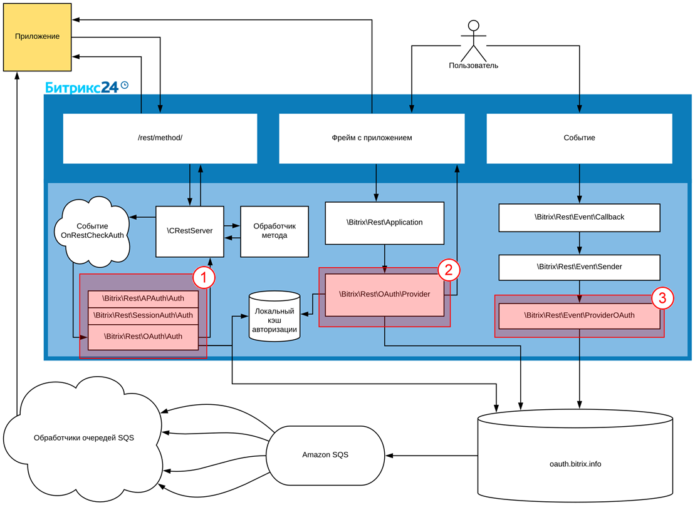
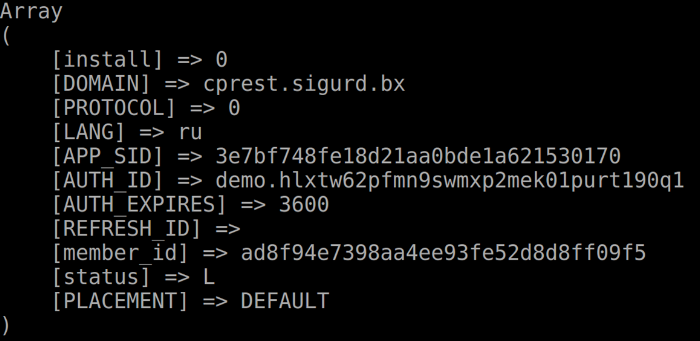

# Авторизация приложений в изолированной коробке Битрикс24





- что делать со ссылкой в последнем примечании? [собственном модуле](https://dev.1c-bitrix.ru/learning/course/index.php?COURSE_ID=101&LESSON_ID=2902)





Политика безопасности компаний может иметь самые разные ограничения для внутренних и внешних сетевых ресурсов, из-за чего приложения на REST для Битрикс24 не всегда могут «достучатся» до коробочного Битрикс24 или внешних облачных сервисов. Тем не менее, существует решение, которое позволяет разрабатывать приложения на стандартном REST API для Битрикс24 даже в таких случаях.



Описанное ниже решение (исключение из процесса авторизации сервера oauth.bitrix24.tech) рекомендуется к использованию только в крайнем случае, поскольку в этом случае вы самостоятельно должны будете решать вопросы безопасного использования приложений и управления авторизацией



## Обращения к внешним ресурсам

В работе Rest-приложения есть три момента, когда происходит обращение из портала вовне:

1. валидатор авторизации
2. провайдер авторизации
3. провайдер событий



Рассмотрим способы, которые позволят избежать обращений к внешним ресурсам.



В примере рассматривается ситуация, когда необходимо только какое-то одно конкретное приложение пустить в обход основной цепочки.



## Валидатор авторизации

Создадим свой обработчик событий

```php
<?php
namespace Demo\AuthProvider;

class AuthSimple
{
    const AUTH_TYPE = 'demo_simple';

    const AUTH_PARAM_NAME = 'secret_word';
    const AUTH_PARAM_VALUE = 'MySuperSecurePassword123456';

    public static function onRestCheckAuth(array $query, $scope, &$res)
    {
        if(array_key_exists(static::AUTH_PARAM_NAME, $query))
        {
            $res = array(
                'error' => 'INVALID_CREDENTIALS',
                'error_description' => 'Invalid request credentials'
            );

            return false;
        }

        return null;
    }
}
```

На вход валидатор получает все полные данные запроса приложения. Если в запросе нет параметра `secret_word`, то он отвечает `return null`, то есть «не мой запрос». Если этот параметр в запросе присутствует, то обработчик проверяет запрос по значению. Если значение существует, но не соответствует сохраненному, то в ответ сообщается: «да, запрос мой, но неверное значение». Если значение верное, то он сообщает `ID` пользователя, список доступных скоупов, указывает, какие параметры нужно удалить, прежде чем отдавать запрос разработчику, и сообщает идентификатор типа авторизации, так как некоторые методы имеют ограничение по типам авторизации.

После этого обработчиком вызывается метод модуля REST, который авторизует на данном хите пользователя. Если все прошло хорошо, то возвращается *true*.

## Провайдер событий

Отнаследуем оригинальный класс провайдера событий и укажем что он реализует интерфейс провайдера событий. В своем классе мы переопределим только одну функцию *send*, которая и занимается отправкой. В данном примере покажем, как мы вместо обращения к внешней очереди событий, будем выполнять прямой http-запрос обработчика (`$http->post(...)`), в случае необходимости вызвать внешний обработчик

```php
<?php
namespace Demo\AuthProvider;

use Bitrix\Rest\Event\ProviderInterface;
use Bitrix\Rest\Event\ProviderOAuth;
use Bitrix\Rest\Event\Sender;

class EventProvider extends ProviderOAuth implements ProviderInterface
{
    public static function onEventManagerInitialize()
    {
        Sender::setProvider(static::instance());
    }

    public function send(array $queryData)
    {
        $http = new \Bitrix\Main\Web\HttpClient();
        foreach($queryData as $key => $item)
        {
            if($this->checkItem($item))
            {
                $http->post($item['query']['QUERY_URL'], $item['query']['QUERY_DATA']);
                unset($queryData[$key]);
            }
        }

        if(count($queryData) > 0)
        {
            parent::send(array_values($queryData));
        }
    }

    protected function checkItem(array $item)
    {
        return AuthProvider::instance()->checkClient($item['client_id']);
    }
}
```

В обработчике проверяется весь массив вызова событий на предмет того, наше ли это приложение и наш ли обработчик. Если это не наше приложение, то запрос будет переадресован родительскому классу, если наше, то на этом же хите будет совершен *post* запрос к приложению. Затем зарегистрируем новый провайдер событий в качестве основного и вызовем событие.

## Провайдер авторизации

Самая сложная часть.

Принцип прежний: отнаследуется оригинальный класс провайдера и создастся свой класс провайдера, реализующий нужный нам альтернативный интерфейс провайдера авторизации.

```php
<?php
namespace Demo\AuthProvider;
use Bitrix\Main\Context;
use Bitrix\Main\NotImplementedException;
use Bitrix\Main\ObjectNotFoundException;
use Bitrix\Main\Security\Random;
use Bitrix\Rest\Application;
use Bitrix\Rest\AppTable;
use Bitrix\Rest\AuthProviderInterface;
use Bitrix\Rest\OAuth\Provider;
use Bitrix\Rest\RestException;
class AuthProvider extends Provider implements AuthProviderInterface
{
    const TOKEN_TTL = 3600;
    const TOKEN_PREFIX = 'demo.';
    protected $applicationList = array();
    /**
     * @var AuthProvider
     */
    protected static $instance = null;
    /**
     * @var AuthStorageInterface
     */
    protected $storage;
    /**
     * @return AuthProvider
     */
    public static function instance()
    {
        if(static::$instance === null)
        {
            static::$instance = new static();
        }
        return static::$instance;
    }
    public static function onApplicationManagerInitialize()
    {
        Application::setAuthProvider(static::instance());
    }
    public function get($clientId, $scope, $additionalParams, $userId)
    {
        if(!$this->checkClient($clientId))
        {
            return parent::get($clientId, $scope, $additionalParams, $userId);
        }
        if($userId > 0)
        {
            $applicationData = AppTable::getByClientId($clientId);
            if($applicationData)
            {
                $authResult = array(
                    'access_token' => $this->generateToken(),
                    'user_id' => $userId,
                    'client_id' => $clientId,
                    'expires' => time() + static::TOKEN_TTL,
                    'expires_in' => static::TOKEN_TTL,
                    'scope' => $applicationData['SCOPE'],
                    'domain' => Context::getCurrent()->getServer()->getHttpHost(),
                    'status' => AppTable::STATUS_LOCAL,
                    'client_endpoint' => \CRestUtil::getEndpoint(),
                    'member_id' => \CRestUtil::getMemberId(),
                );
                $this->store($authResult);
                return $authResult;
            }
            else
            {
                $authResult = array('error' => RestException::ERROR_OAUTH, 'Application not installed');
            }
            return $authResult;
        }
        return false;
    }
    public function authorizeClient($clientId, $userId, $state = '')
    {
        if(!$this->checkClient($clientId))
        {
            return parent::authorizeClient($clientId, $userId, $state);
        }
        throw new NotImplementedException('Full OAuth authorization is not implemented in this demo');
    }
    public function checkClient($clientId)
    {
        return in_array($clientId, $this->applicationList);
    }
    protected function store(array $authResult)
    {
        $this->getStorage()->store($authResult);
    }
    public function checkToken($token)
    {
        return substr($token, 0, strlen(static::TOKEN_PREFIX)) === static::TOKEN_PREFIX;
    }
    protected function generateToken()
    {
        return static::TOKEN_PREFIX.Random::getString(32);
    }
    /**
     * @return AuthStorageInterface
     * @throws ObjectNotFoundException
     */
    public function getStorage()
    {
        if($this->storage === null)
        {
            throw new ObjectNotFoundException('No token storage set. Use '.__CLASS__.'::instance()->setStorage().');
        }
        return $this->storage;
    }
    /**
     * @param AuthStorageInterface $storage
     * @return AuthProvider
     */
    public function setStorage(AuthStorageInterface $storage)
    {
        $this->storage = $storage;
        return $this;
    }
    /**
     * @param string $clientId
     * @return AuthProvider
     */
    public function addApplication($clientId)
    {
        $this->applicationList[] = $clientId;
        return $this;
    }
}
```

Основной метод — метод *get*, который служит для выдачи авторизации приложению. Метод получает на вход приложение, которое «затребовало» авторизацию и проверяет, является ли это приложение тем самым, которое мы хотим «пустить в обход» стандартного механизма авторизации. Далее получаются данные о приложении и формируется структура, схожая со структурой, которую получают все приложения от стандартного OAuth-сервера Битрикс24. В массиве:

- **access_token** — созданный токен
- **user_id** — пользователь, для которого нужно дать авторизацию
- **client_id** — приложение. Обратите внимание, что можно указать любое время жизни токена, а не только час времени, используемый по умолчанию в обычной авторизации
- **expires** — дата истечения токена
- **scope** — требуемые скоупы
- служебные данные

Далее эти данные сохраняются на портале. Сформированная структура возвращается.



Метод сохранения куда либо.

```php
protected function store(array $authResult)
{
    $this->getStorage()->store($authResult);
}
```

Метод генерации токена. Берется строка случайных 32-х символов, снабжается префиксом.

```php
protected function generateToken()
{
    return static::TOKEN_PREFIX.Random::getString(32);
}
```

Метод проверки токена. Проверяется наличие префикса.

```php
public function checkToken($token)
{
    return substr(
        $token,
        0,
        strlen(static::TOKEN_PREFIX)
    ) === static::TOKEN_PREFIX;
}
```

Метод проверки клиента (приложения), где проверяется, что приложение входит в некий разрешенный список.

```php
public function checkClient($clientId)
{
    return in_array(
        $clientId,
        $this->applicationList
    );
}
```



Далее регистрируем наш провайдер в качестве текущего провайдера авторизации:

```php
\Bitrix\Rest\Application::setAuthProvider(
    Demo\AuthProvider\AuthProvider::instance()
);
```

Если теперь совершить запрос с этим авторизационным токеном и вызвать метод [`\Bitrix\Rest\AppInfo`](../../../api-reference/common/system/app-info.md), то мы получим данные приложения в текущем Битрикс24:



Делаем свой валидатор авторизации.

```php
<?php
namespace Demo\AuthProvider;

use Bitrix\Rest\OAuth\Auth;

class AuthFull extends Auth
{
    protected static function check($accessToken)
    {
        if(!AuthProvider::instance()->checkToken($accessToken))
        {
            return parent::check($accessToken);
        }

        $authResult = AuthProvider::instance()->getStorage()->restore($accessToken);

        if($authResult === false)
        {
            $authResult = array(
                'error' => 'invalid_token',
                'error_description' => 'Token expired or invalid'
            );
        }

        return $authResult;
    }

}
```

В валидаторе достаточно отнаследоваться от оригинального валидатора авторизации и переопределить у него функцию *check*, которая и занимается проверкой `accessToken`. Если проверка прошла, то происходит восстановление приложения из хранилища. Затем регистрируем обработчик события, выполнив код на портале один раз:

```php
\Bitrix\Main\EventHandler::getInstance()
    ->registerEventHadler(
        "rest",
        "onRestCheckAuth",
        "demo.authprovider",
        "\\Demo\\AuthProvider\\AuthFull",
        "onRestCheckAuth",
        90
    );
```

Последний параметр — сортировка. Необходимо встроиться до того, как сработает оригинальный обработчик.

Если теперь совершить запрос с этим авторизационным токеном и вызвать метод [`\Bitrix\Rest\AppInfo`](../../../api-reference/common/system/app-info.md), то можно получить данные приложения на этом портале.

Осталось только дополнить провайдер событий, чтобы передавать приложению авторизационные данные в обработчики событий:

```php
if($item['additional']['sendAuth'])
{
    $item['query']['QUERY_DATA']['auth'] = AuthProvider::instance()->get(
        $item['client_id'],
        '',
        $item['auth'],
        $item['auth'][AuthFull::PARAM_LOCAL_USER]
    );
}
```

Полный код провайдера событий:

```php
<?php
namespace Demo\AuthProvider;
class AuthSimple
{
    const AUTH_TYPE = 'demo_simple';
    const AUTH_PARAM_NAME = 'secret_word';
    const AUTH_PARAM_VALUE = 'MySuperSecurePassword123456';
    public static function onRestCheckAuth(array $query, $scope, &$res)
    {
        if(array_key_exists(static::AUTH_PARAM_NAME, $query))
        {
            if($query[static::AUTH_PARAM_NAME] === static::AUTH_PARAM_VALUE)
            {
                $error = false;
                $res = array(
                    'user_id' => 1,
                    'scope' => implode(',', \CRestUtil::getScopeList()),
                    'parameters_clear' => array(static::AUTH_PARAM_NAME),
                    'auth_type' => static::AUTH_TYPE,
                );
                if(!\CRestUtil::makeAuth($res))
                {
                    $res = array(
                        'error' => 'authorization_error',
                        'error_description' => 'Unable to authorize user'
                    );
                    $error = true;
                }
                return !$error;
            }
            $res = array(
                'error' => 'INVALID_CREDENTIALS',
                'error_description' => 'Invalid request credentials'
            );
            return false;
        }
        return null;
    }
}
```

В результате обработчик получит полную структуру данных, которые ему требуются для работы.

**Небольшое замечание по поводу производительности.** Код, добавленный в провайдер событий в нашем примере выше, выполняется непосредственно в обработчике события. В коде есть *post* запрос к стороннему серверу. Следовательно, если сторонний сервер «тормозит», то будет «тормозить» и весь портал. Если производится какая-то массовая операция, например: импорт данных в CRM, то этот код серьезно может замедлить работу портала.

Обойти эту проблему производительности можно двумя способами:

- Построение очереди. Вместо отправки *post* запроса складывать данные в какую-то таблицу и какими-то дополнительными процессами выбирать из нее данные. По сути — кастомная реализация очереди
- Воспользоваться механизмом [офлайн событий](../../../api-reference/events/offline-events.md)



Файл с провайдером лучше разместить в [собственном модуле](https://dev.1c-bitrix.ru/learning/course/index.php?COURSE_ID=101&LESSON_ID=2902).

