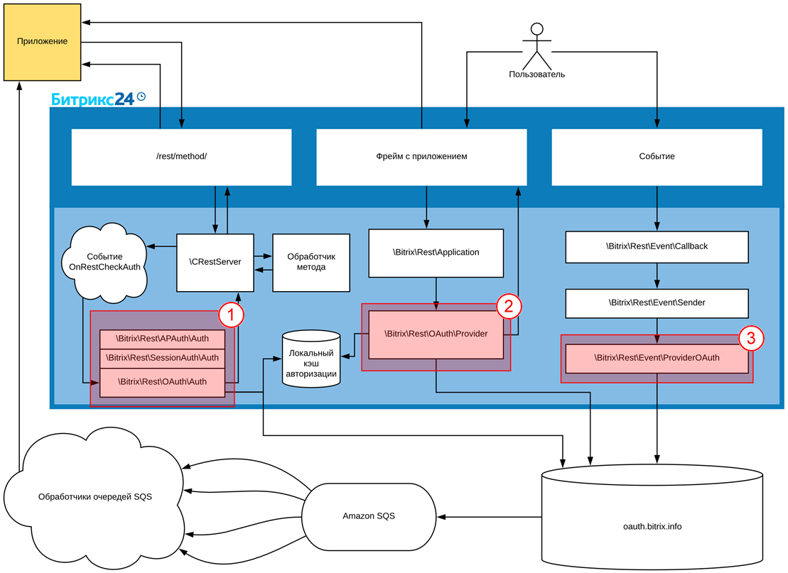

# Авторизация приложений в изолированной коробке Битрикс24



Выберите инструмент для разработки с AI-агентом:

- используйте [Битрикс24 Вайбкод](../../../ai-tools/vibecode.md), чтобы создать приложение для Битрикс24 по описанию задачи без знания языков программирования. Агент напишет код и разместит приложение на сервере без ручной настройки хостинга
- используйте [MCP-сервер](../../../ai-tools/mcp.md), чтобы разрабатывать интеграцию через REST API в своем проекте. Агент будет обращаться к официальной REST-документации



Политика безопасности компании может ограничивать доступ к внутренним и внешним сетевым ресурсам. Из-за этого приложения на REST для Битрикс24 не всегда могут подключиться к коробочному Битрикс24 или внешним облачным сервисам. Альтернативная схема авторизации позволяет разрабатывать приложения на стандартном REST API для Битрикс24 в изолированной инфраструктуре.



Описанное ниже решение исключает сервер `oauth.bitrix24.tech` из процесса авторизации. Используйте его только в крайнем случае: вы самостоятельно отвечаете за безопасность приложений, хранение секретов и управление авторизацией



Решение подходит для коробочной версии Битрикс24, если:

- администратор имеет доступ к файлам Битрикс24 на сервере
- можно создать собственный модуль в папке `local/modules/`
- приложение должно работать только для заранее разрешенных `client_id`
- секреты и токены хранятся в защищенном хранилище, а не в системных файлах продукта

## Обращения к внешним ресурсам

Во время работы приложения на REST обращения из Битрикс24 к внешним ресурсам выполняют три компонента:

1. валидатор авторизации
2. провайдер событий
3. провайдер авторизации



Ниже показано, как заменить эти обращения локальными обработчиками для одного конкретного приложения, которому нужно обойти основную цепочку.

## Валидатор авторизации

Создайте валидатор авторизации. Он проверяет запрос по параметру `secret_word` и авторизует пользователя во время текущего запроса.

```php
<?php
namespace Demo\AuthProvider;

class AuthSimple
{
    const AUTH_TYPE = 'demo_simple';

    const AUTH_PARAM_NAME = 'secret_word';
    const AUTH_PARAM_VALUE = 'change_this_secret';

    public static function onRestCheckAuth(array $query, $scope, &$res)
    {
        if(array_key_exists(static::AUTH_PARAM_NAME, $query))
        {
            if($query[static::AUTH_PARAM_NAME] === static::AUTH_PARAM_VALUE)
            {
                $error = false;
                $res = array(
                    'user_id' => 1,
                    'scope' => implode(',', \CRestUtil::getScopeList()),
                    'parameters_clear' => array(static::AUTH_PARAM_NAME),
                    'auth_type' => static::AUTH_TYPE,
                );

                if(!\CRestUtil::makeAuth($res))
                {
                    $res = array(
                        'error' => 'authorization_error',
                        'error_description' => 'Unable to authorize user'
                    );
                    $error = true;
                }

                return !$error;
            }

            $res = array(
                'error' => 'INVALID_CREDENTIALS',
                'error_description' => 'Invalid request credentials'
            );

            return false;
        }

        return null;
    }
}
```

Валидатор получает все данные запроса приложения. Если в запросе нет параметра `secret_word`, он возвращает `return null`, чтобы запрос проверил другой валидатор. Если параметр есть, обработчик проверяет его значение.

Если значение не совпадает с сохраненным, валидатор возвращает ошибку `INVALID_CREDENTIALS`. Если значение верное, он передает `ID` пользователя, список доступных скоупов, параметры, которые нужно удалить из запроса, и идентификатор типа авторизации. Тип авторизации нужен методам, которые ограничивают доступ по способу авторизации.

В примере значение `AUTH_PARAM_VALUE` указано в коде для демонстрации. В рабочем модуле храните секрет в защищенном хранилище и не передавайте его в репозиторий.

После этого обработчик вызывает метод модуля REST, который авторизует пользователя во время текущего запроса. Если авторизация прошла успешно, возвращается `true`.

Зарегистрируйте валидатор при установке модуля:

```php
\Bitrix\Main\EventManager::getInstance()->registerEventHandler(
    'rest',
    'onRestCheckAuth',
    'demo.authprovider',
    '\\Demo\\AuthProvider\\AuthSimple',
    'onRestCheckAuth',
    80
);
```

## Провайдер событий

Создайте класс провайдера событий. Он наследует стандартный провайдер `Bitrix\Rest\Event\ProviderOAuth` и реализует интерфейс `Bitrix\Rest\Event\ProviderInterface`. В примере переопределяется метод PHP-класса `send`: вместо обращения к внешней очереди событий он выполняет прямой HTTP-запрос к обработчику приложения через `$http->post(...)`.

```php
<?php
namespace Demo\AuthProvider;

use Bitrix\Rest\Event\ProviderInterface;
use Bitrix\Rest\Event\ProviderOAuth;
use Bitrix\Rest\Event\Sender;

class EventProvider extends ProviderOAuth implements ProviderInterface
{
    public static function onEventManagerInitialize()
    {
        Sender::setProvider(static::instance());
    }

    public function send(array $queryData)
    {
        $http = new \Bitrix\Main\Web\HttpClient();
        foreach($queryData as $key => $item)
        {
            if($this->checkItem($item))
            {
                if($item['additional']['sendAuth'])
                {
                    $item['query']['QUERY_DATA']['auth'] = AuthProvider::instance()->get(
                        $item['client_id'],
                        '',
                        $item['auth'],
                        $item['auth'][AuthFull::PARAM_LOCAL_USER]
                    );
                }

                $http->post($item['query']['QUERY_URL'], $item['query']['QUERY_DATA']);
                unset($queryData[$key]);
            }
        }

        if(count($queryData) > 0)
        {
            parent::send(array_values($queryData));
        }
    }

    protected function checkItem(array $item)
    {
        return AuthProvider::instance()->checkClient($item['client_id']);
    }
}
```

Провайдер проверяет каждый элемент массива событий. Если событие относится к разрешенному приложению, провайдер добавляет данные авторизации и выполняет POST-запрос к обработчику приложения. Если событие относится к другому приложению, запрос передается стандартному провайдеру.

## Провайдер авторизации

Создайте класс провайдера авторизации. Он наследует стандартный провайдер `Bitrix\Rest\OAuth\Provider` и реализует интерфейс `Bitrix\Rest\AuthProviderInterface`.

```php
<?php
namespace Demo\AuthProvider;
use Bitrix\Main\Context;
use Bitrix\Main\NotImplementedException;
use Bitrix\Main\ObjectNotFoundException;
use Bitrix\Main\Security\Random;
use Bitrix\Rest\Application;
use Bitrix\Rest\AppTable;
use Bitrix\Rest\AuthProviderInterface;
use Bitrix\Rest\AuthStorageInterface;
use Bitrix\Rest\OAuth\Provider;
use Bitrix\Rest\RestException;
class AuthProvider extends Provider implements AuthProviderInterface
{
    const TOKEN_TTL = 3600;
    const TOKEN_PREFIX = 'demo.';
    protected $applicationList = array();
    /**
     * @var AuthProvider
     */
    protected static $instance = null;
    /**
     * @var AuthStorageInterface
     */
    protected $storage;
    /**
     * @return AuthProvider
     */
    public static function instance()
    {
        if(static::$instance === null)
        {
            static::$instance = new static();
        }
        return static::$instance;
    }
    public static function onApplicationManagerInitialize()
    {
        Application::setAuthProvider(static::instance());
    }
    public function get($clientId, $scope, $additionalParams, $userId)
    {
        if(!$this->checkClient($clientId))
        {
            return parent::get($clientId, $scope, $additionalParams, $userId);
        }
        if($userId > 0)
        {
            $applicationData = AppTable::getByClientId($clientId);
            if($applicationData)
            {
                $authResult = array(
                    'access_token' => $this->generateToken(),
                    'user_id' => $userId,
                    'client_id' => $clientId,
                    'expires' => time() + static::TOKEN_TTL,
                    'expires_in' => static::TOKEN_TTL,
                    'scope' => $applicationData['SCOPE'],
                    'domain' => Context::getCurrent()->getServer()->getHttpHost(),
                    'status' => AppTable::STATUS_LOCAL,
                    'client_endpoint' => \CRestUtil::getEndpoint(),
                    'member_id' => \CRestUtil::getMemberId(),
                );
                $this->store($authResult);
                return $authResult;
            }
            else
            {
                $authResult = array('error' => RestException::ERROR_OAUTH, 'Application not installed');
            }
            return $authResult;
        }
        return false;
    }
    public function authorizeClient($clientId, $userId, $state = '')
    {
        if(!$this->checkClient($clientId))
        {
            return parent::authorizeClient($clientId, $userId, $state);
        }
        throw new NotImplementedException('Full OAuth authorization is not implemented in this demo');
    }
    public function checkClient($clientId)
    {
        return in_array($clientId, $this->applicationList);
    }
    protected function store(array $authResult)
    {
        $this->getStorage()->store($authResult);
    }
    public function checkToken($token)
    {
        return substr($token, 0, strlen(static::TOKEN_PREFIX)) === static::TOKEN_PREFIX;
    }
    protected function generateToken()
    {
        return static::TOKEN_PREFIX.Random::getString(32);
    }
    /**
     * @return AuthStorageInterface
     * @throws ObjectNotFoundException
     */
    public function getStorage()
    {
        if($this->storage === null)
        {
            throw new ObjectNotFoundException('No token storage set. Use '.__CLASS__.'::instance()->setStorage().');
        }
        return $this->storage;
    }
    /**
     * @param AuthStorageInterface $storage
     * @return AuthProvider
     */
    public function setStorage(AuthStorageInterface $storage)
    {
        $this->storage = $storage;
        return $this;
    }
    /**
     * @param string $clientId
     * @return AuthProvider
     */
    public function addApplication($clientId)
    {
        $this->applicationList[] = $clientId;
        return $this;
    }
}
```

Основной метод PHP-класса — `get`. Он выдает авторизационные данные приложению. Метод получает `client_id`, проверяет, входит ли приложение в список разрешенных, получает данные приложения и формирует структуру, похожую на ответ стандартного OAuth-сервера Битрикс24. В массиве авторизации:

- `access_token` — созданный токен
- `user_id` — пользователь, для которого нужно дать авторизацию
- `client_id` — приложение. В провайдере можно указать любое время жизни токена, а не только час, который используется по умолчанию в обычной авторизации
- `expires` — дата истечения токена
- `scope` — требуемые скоупы
- `domain` — адрес Битрикс24
- `status` — статус локального приложения
- `client_endpoint` — адрес REST endpoint
- `member_id` — идентификатор Битрикс24

Далее эти данные сохраняются в хранилище токенов. Сформированная структура возвращается приложению.

Для сохранения и восстановления токенов нужен класс хранилища. Он должен реализовывать интерфейс `Bitrix\Rest\AuthStorageInterface`. Методы PHP-класса хранилища выполняют такие действия: `store` сохраняет новый токен, `rewrite` обновляет параметры существующего токена, `restore` возвращает сохраненные данные по `access_token`.

```php
<?php
namespace Demo\AuthProvider;

use Bitrix\Main\Application;
use Bitrix\Rest\AuthStorageInterface;

class AuthStorage implements AuthStorageInterface
{
    const CACHE_TTL = 3600;
    const CACHE_PREFIX = 'demo_auth_';

    public function store(array $authResult)
    {
        $cache = $this->getCache();
        $cache->read(static::CACHE_TTL, $this->getCacheId($authResult['access_token']));
        $cache->set($this->getCacheId($authResult['access_token']), $authResult);
    }

    public function rewrite(array $authResult)
    {
        $cache = $this->getCache();
        $cache->clean($this->getCacheId($authResult['access_token']));
        $cache->read(static::CACHE_TTL, $this->getCacheId($authResult['access_token']));
        $cache->set($this->getCacheId($authResult['access_token']), $authResult);
    }

    public function restore($accessToken)
    {
        $cache = $this->getCache();

        if($cache->read(static::CACHE_TTL, $this->getCacheId($accessToken)))
        {
            return $cache->get($this->getCacheId($accessToken));
        }

        return false;
    }

    protected function getCacheId($accessToken)
    {
        return static::CACHE_PREFIX.$accessToken;
    }

    protected function getCache()
    {
        return Application::getInstance()->getManagedCache();
    }
}
```

Перед выдачей токена передайте хранилище провайдеру:

```php
AuthProvider::instance()
    ->setStorage(new AuthStorage())
    ->addApplication('local.demo.application');
```



Метод сохранения данных.

```php
protected function store(array $authResult)
{
    $this->getStorage()->store($authResult);
}
```

Метод генерации токена добавляет префикс к случайной строке из 32 символов.

```php
protected function generateToken()
{
    return static::TOKEN_PREFIX.Random::getString(32);
}
```

Метод проверки токена. Проверяется наличие префикса.

```php
public function checkToken($token)
{
    return substr(
        $token,
        0,
        strlen(static::TOKEN_PREFIX)
    ) === static::TOKEN_PREFIX;
}
```

Метод `checkClient` проверяет, что `client_id` приложения есть в списке разрешенных приложений.

```php
public function checkClient($clientId)
{
    return in_array(
        $clientId,
        $this->applicationList
    );
}
```



Зарегистрируйте провайдер как текущий провайдер авторизации:

```php
\Bitrix\Rest\Application::setAuthProvider(
    Demo\AuthProvider\AuthProvider::instance()
);
```

После регистрации провайдер становится текущим провайдером авторизации для разрешенного приложения.

Создайте валидатор полного токена.

```php
<?php
namespace Demo\AuthProvider;

use Bitrix\Rest\OAuth\Auth;

class AuthFull extends Auth
{
    protected static function check($accessToken)
    {
        if(!AuthProvider::instance()->checkToken($accessToken))
        {
            return parent::check($accessToken);
        }

        $authResult = AuthProvider::instance()->getStorage()->restore($accessToken);

        if($authResult === false)
        {
            $authResult = array(
                'error' => 'invalid_token',
                'error_description' => 'Token expired or invalid'
            );
        }

        return $authResult;
    }

}
```

В валидаторе нужно наследовать стандартный валидатор авторизации и переопределить метод PHP-класса `check`. Метод проверяет `accessToken`: если токен создан вашим провайдером, данные приложения восстанавливаются из хранилища. Затем зарегистрируйте обработчик события при установке модуля:

```php
\Bitrix\Main\EventManager::getInstance()
    ->registerEventHandler(
        "rest",
        "onRestCheckAuth",
        "demo.authprovider",
        "\\Demo\\AuthProvider\\AuthFull",
        "onRestCheckAuth",
        90
    );
```

Последний параметр — сортировка. Значение `90` позволяет выполнить ваш обработчик раньше стандартного обработчика.

После регистрации полного валидатора выполните запрос с авторизационным токеном и вызовите метод [`app.info`](../../../api-reference/common/system/app-info.md). Битрикс24 вернет данные приложения. Обработчик события также получит структуру авторизации, которую добавляет `EventProvider`.

```text
Array
(
    [install] => 0
    [DOMAIN] => example.bitrix24.ru
    [PROTOCOL] => 1
    [LANG] => ru
    [APP_SID] => [redacted]
    [AUTH_ID] => demo.[redacted]
    [AUTH_EXPIRES] => 3600
    [REFRESH_ID] =>
    [member_id] => [redacted]
    [status] => L
    [PLACEMENT] => DEFAULT
)
```



Код провайдера событий выполняется непосредственно в обработчике события. Пример содержит POST-запрос к стороннему серверу. При медленном ответе стороннего сервера выполнение события в Битрикс24 замедляется. При массовых операциях, например импорте данных в CRM, такой код может заметно увеличить время обработки.



Снизить риск замедления можно двумя способами:

- Построить очередь. Вместо отправки POST-запроса сохранять данные в таблицу и обрабатывать их отдельным агентом или фоновым процессом
- Использовать механизм [офлайн событий](../../../api-reference/events/offline-events.md)

## Где хранить код

Разместите код в [собственном модуле](https://dev.1c-bitrix.ru/learning/course/index.php?COURSE_ID=101&LESSON_ID=2902), а не в системных файлах продукта. Так изменения не будут потеряны при обновлении Битрикс24. Ниже приведен пример раскладки для модуля `demo.authprovider` в папке `local/modules/demo.authprovider/`:

```text
local/
`-- modules/
    `-- demo.authprovider/
        |-- include.php
        |-- install/
        |   `-- index.php
        `-- lib/
            |-- authprovider.php
            |-- authstorage.php
            |-- authsimple.php
            |-- authfull.php
            `-- eventprovider.php
```

Назначение файлов:

| Файл | Что хранит |
|---|---|
| `local/modules/demo.authprovider/include.php` | Подключает модуль и настраивает провайдер: `AuthProvider::instance()->setStorage(new AuthStorage())->addApplication('local.demo.application')` |
| `local/modules/demo.authprovider/lib/authprovider.php` | Класс `Demo\AuthProvider\AuthProvider`, который реализует `Bitrix\Rest\AuthProviderInterface` и выдает авторизационные данные приложению |
| `local/modules/demo.authprovider/lib/authstorage.php` | Класс `Demo\AuthProvider\AuthStorage`, который реализует `Bitrix\Rest\AuthStorageInterface` и хранит токены |
| `local/modules/demo.authprovider/lib/authsimple.php` | Класс `Demo\AuthProvider\AuthSimple` для проверки запроса по параметру `secret_word` |
| `local/modules/demo.authprovider/lib/authfull.php` | Класс `Demo\AuthProvider\AuthFull`, который наследует `Bitrix\Rest\OAuth\Auth` и восстанавливает данные приложения по токену |
| `local/modules/demo.authprovider/lib/eventprovider.php` | Класс `Demo\AuthProvider\EventProvider`, который наследует `Bitrix\Rest\Event\ProviderOAuth` и отправляет события без внешней очереди OAuth |

В `include.php` подключите модуль REST и настройте провайдер:

```php
<?php
use Bitrix\Main\Loader;
use Demo\AuthProvider\AuthProvider;
use Demo\AuthProvider\AuthStorage;

if(Loader::includeModule('rest'))
{
    AuthProvider::instance()
        ->setStorage(new AuthStorage())
        ->addApplication('local.demo.application');
}
```

Замените `local.demo.application` на `client_id` приложения, которому разрешен обход стандартной цепочки авторизации.

Регистрацию обработчиков выполняйте при установке модуля в `local/modules/demo.authprovider/install/index.php`. Добавьте вызовы в метод установки модуля после `RegisterModule('demo.authprovider')`:

```php
\Bitrix\Main\EventManager::getInstance()->registerEventHandler(
    'rest',
    'onRestCheckAuth',
    'demo.authprovider',
    '\\Demo\\AuthProvider\\AuthSimple',
    'onRestCheckAuth',
    80
);

\Bitrix\Main\EventManager::getInstance()->registerEventHandler(
    'rest',
    'onRestCheckAuth',
    'demo.authprovider',
    '\\Demo\\AuthProvider\\AuthFull',
    'onRestCheckAuth',
    90
);

\Bitrix\Main\EventManager::getInstance()->registerEventHandler(
    'rest',
    'onApplicationManagerInitialize',
    'demo.authprovider',
    '\\Demo\\AuthProvider\\AuthProvider',
    'onApplicationManagerInitialize'
);

\Bitrix\Main\EventManager::getInstance()->registerEventHandler(
    'rest',
    'onEventManagerInitialize',
    'demo.authprovider',
    '\\Demo\\AuthProvider\\EventProvider',
    'onEventManagerInitialize'
);
```

Подключайте код в таком порядке:

1. Создайте модуль `demo.authprovider` в папке `local/modules/demo.authprovider/`
2. Разложите классы по файлам в папке `lib/`
3. Настройте провайдер и список разрешенных `client_id` в `include.php`
4. Зарегистрируйте обработчики `AuthSimple::onRestCheckAuth`, `AuthFull::onRestCheckAuth`, `onApplicationManagerInitialize` и `onEventManagerInitialize` в `install/index.php`
5. Установите модуль в административной части Битрикс24
6. Выполните запрос с авторизационным токеном и проверьте результат методом [`app.info`](../../../api-reference/common/system/app-info.md)

Если код не оформлен как модуль, его нужно подключать вручную до обращения к REST. Для рабочей коробочной установки оформите код как модуль: он дает автозагрузку классов из `lib/` и сохраняет регистрацию обработчиков после обновлений.
