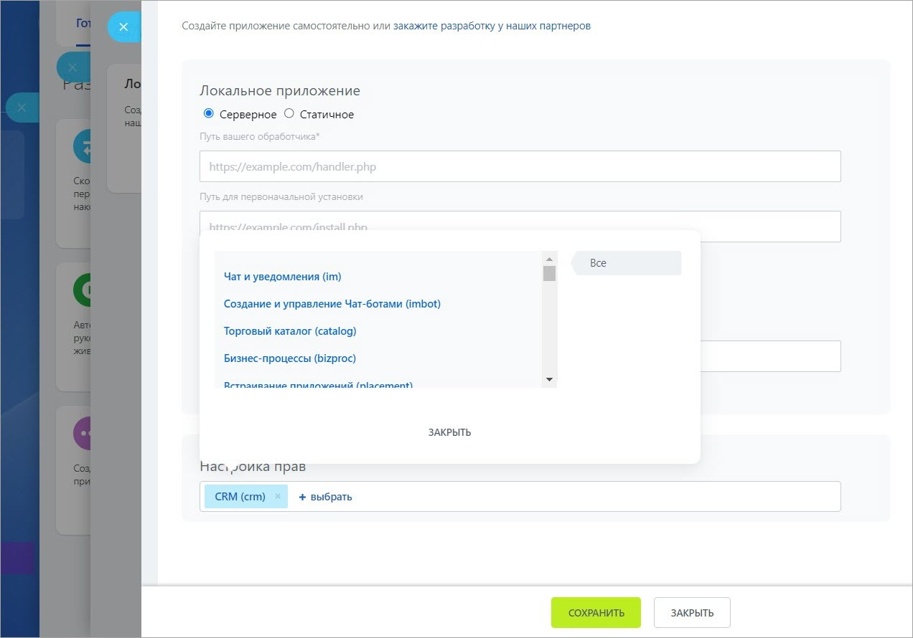

# Добавление своих методов в REST API коробочной версии Битрикс24





- что делать со ссылкой? [Регистрируется](https://dev.1c-bitrix.ru/learning/course/index.php?COURSE_ID=43&CHAPTER_ID=03493)





При создании собственных приложений для коробочных редакций возникает потребность в добавлении новых методов для них в REST API.

Порядок действий:

1. [Регистрируется](https://dev.1c-bitrix.ru/learning/course/index.php?COURSE_ID=43&CHAPTER_ID=03493) обработчик события **OnRestServiceBuildDescription** модуля **rest**. Обработчик возвращает массив вот такой структуры:

```php
return array(
    'имя_scope' => array(
        'имя_метода' => array(
            'callback' => обработчик_метода,
            'options' => array(),
        ),
        'имя_метода' => array(
            'callback' => обработчик_метода,
            'options' => array(),
        ),
    )
);
```

Имя **scope** — произвольное. Если регистрируется собственный scope, то он будет доступен в списке разрешений для локальных приложений. Для добавления методов в существующий scope, укажите имя метода. Если добавляются методы, доступные всем приложениям, то вместо имени указывается константа `\CRestUtil::GLOBAL_SCOPE`.

Имя метода также произвольное, допускается использование как верхнего, так и нижнего регистра. Но рекомендуется придерживаться нижнего регистра. Традиционное именование — **имя_scope.имя_сущности.действие**.

Обработчик метода — стандартный PHP псевдо-тип [callback](http://www.php.net/types.callable). Анонимные функции пока не поддерживаются.

2. Функция-обработчик получит на вход 3 параметра:
    - ассоциативный массив данных вызова без авторизационных параметров
    - параметр для возврата постранички
    - экземпляр класса **\CRestServer**, из которого получаются некоторые полезные данные

3. Функция-обработчик может:
    - вернуть ответ (массив или скалярное значение), которые будут приведены к json- или xml-виду
    - бросить исключение, которое будет перехвачено и отображено в виде REST-ошибки

Если требуется указать HTTP-статус ошибки, то воспользуйтесь классом `\Bitrix\Rest\RestException`. Если при этом ранее ядром было сгенерировано старое исключение (`$APPLICATION->ThrowException()`), то оно перезапишет ошибку в ответе.

К моменту вызова функции-обработчика проверки прав доступа уже выполнены, а объект `$USER` уже проинициализирован с авторизацией привязанного к токену пользователя.

Пример:

```php
class RestTest
{
    public static function OnRestServiceBuildDescription()
    {
        return array(
            'sigurdtest' => array(
                'sigurdtest.test' => array(
                    'callback' => array(__CLASS__, 'test'),
                    'options' => array(),
                ),
            )
        );
    }

    public static function test($query, $n, \CRestServer $server)
    {
        if($query['error'])
        {
            throw new \Bitrix\Rest\RestException(
                'Message',
                'ERROR_CODE',
                \CRestServer::STATUS_PAYMENT_REQUIRED
            );
        }

        return array(
            'yourquery' => $query,
            'myresponse' => 'My own response'
        );
    }
}

AddEventHandler(
    'rest',
    'OnRestServiceBuildDescription',
    array(
        '\RestTest',
        'OnRestServiceBuildDescription'
    )
);
```



```js
http://cp.sigurd.bx/rest/sigurdtest.test?auth=qcdfzzjtp8hvcbjl42eg93wuw5n0mvsb&test=222
HTTP/1.1 200 OK
Content-Type: application/json; charset=utf-8
{
	"result": {
		"myresponse": "My own response",  
		"yourquery": {
			"test": "222"
		}
	}
}
http://cp.sigurd.bx/rest/sigurdtest.test.xml?auth=qcdfzzjtp8hvcbjl42eg93wuw5n0mvsb&error=1
HTTP/1.1 402 Payment Required
Content-Type: text/xml; charset=utf-8
<?xml version="1.0" ?>
<response>
	<error>ERROR_CODE</error>
	<error_description>Message</error_description>
</response>
```

## Как определить обработчик отсутствующего в описании REST-метода "на лету"

Для этого используйте событие **onFindMethodDescription**, вызываемое перед отдачей ошибки `METHOD_NOT_FOUND`. Оно позволяет подставить описание метода "на лету".

## Как работать с навигацией в своих методах реста

```php
\Bitrix\Main\Loader::includeModule('rest');
class ApiTest extends \IRestService
{
    public static function OnRestServiceBuildDescription()
    {
        return array(
            'apitest' => array(
                'api.test.list' => array(
                    'callback' => array(__CLASS__, 'getList'),
                    'options' => array(),
                ),
            )
        );
    }

    public static function getList($query, $nav, \CRestServer $server)
    {
        $navData = static::getNavData($nav, true);

        $res = \Bitrix\Main\UserTable::getList(
            [
                'filter' => $query['filter']?:[],
                'select' => $query['select']?:['*'],
                'order' => $query['order']?:['ID' => 'ASC'],
                'limit' => $navData['limit'],
                'offset' => $navData['offset'],
                'count_total' => true,
            ]
        );

    $result = array();
    while($user = $res->fetch())
    {
        $result[] = $user;
    }

    return static::setNavData(
        $result,
        array(
            "count" => $res->getCount(),
            "offset" => $navData['offset']
        )
    );
    }
}

AddEventHandler(
    'rest',
    'OnRestServiceBuildDescription',
    array(
        '\ApiTest',
        'OnRestServiceBuildDescription'
    )
);
```

На примере ORM-класса работы с пользователями показывается как зарегистрировать свой метод для работы с таблицами пользователей. Если вам необходимо сделать постраничную навигацию для методов не ORM-классов, например, для *getNavData()*, то вторым параметром передайте: `false ($navData = static::getNavData($nav, false);)`, тогда вернется навигация, соответствующая методам старого ядра.

Пример запроса:

```bash
/rest/api.test.list?order[ID]=ASC&filter[<ID]=1000&select[]=ID&select[]=NAME&start=200
```