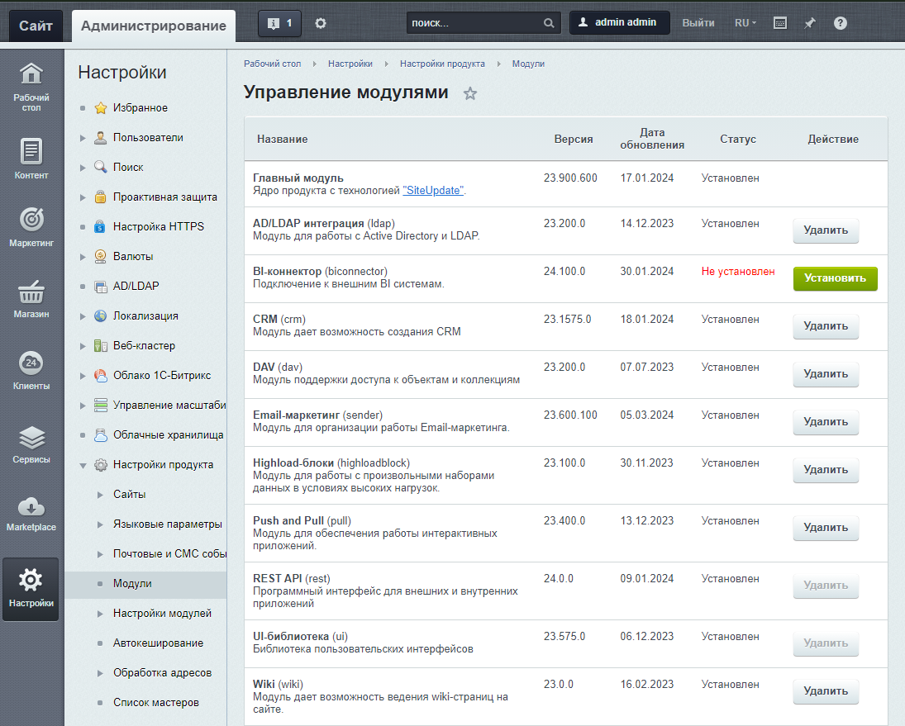

# Версионность модулей в коробочном Битрикс24

При разработке приложений необходимо учитывать, что REST-методы и события, доступные для использования в облачном Битрикс24, могут быть недоступны на отдельных коробочных установках.

Во-первых, график выхода обновлений Битрикс24 для коробочной версии изначально отличается от выпуска обновлений для облачной поскольку такие обновления, как минимум требуют отдельного цикла тестирования, не говоря уже о других особенностях.

Во-вторых, получение обновлений в коробках происходит "по инициативе" конкретной коробочной установки. Иными словами, этот процесс инициируется администратором конкретного коробочного Битрикс24, а значит, новый функционал, уже доступный в облаке Битрикс24, может не "дойти" до конкретной коробки к моменту установки вашего приложения на этой коробке.

Если пользователи вашего приложения столкнулись с проблемой во время эксплаутации на их коробочной версии Битрикс24 из-за отсутствия уже существующего функционала REST API, а вы, как разработчик, не имеете административного доступа к этой коробочной установке, то ориентируясь на нашу документацию вы можете предоставить пользователям информацию о том, какие именно обновления они должны скачать. 

Если вы являетесь администратором коробочной установки, то вы можете самостоятельно обновить Битрикс24 до последней доступной версии.

Список версий всех модулей в коробочной версии вы можете найти в административном разделе: Настройки > Настройки продукта > Модули.

## Продолжить изучение

- [Документация по Битрикс24 в коробке](https://helpdesk.bitrix24.ru/open/9721839/)