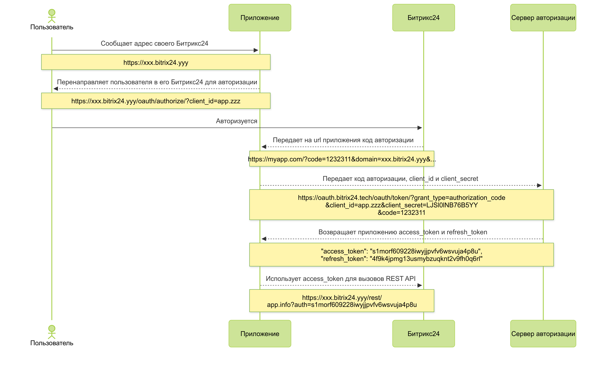

# Полный протокол авторизации OAuth 2.0

[OAuth](http://oauth.net/) — открытый протокол авторизации, который позволяет предоставить третьей стороне ограниченный доступ к защищенным ресурсам пользователя без необходимости передавать ей (третьей стороне) логин и пароль.

В Битрикс24 протокол OAuth используется для [локальных](../../local-integrations/local-apps.md) и [тиражных](../../market/index.md) приложений и не используется в случае с [локальными вебхуками](../../local-integrations/local-webhooks.md).

Чтобы понять, нужно ли вам в вашем приложении реализовывать авторизацию пользователей по полному протоколу, можно свериться со следующими утверждениями:

1. У меня есть свой веб-сервис (своё внешнее приложение, своё отдельное ПО и т.д.)
1. Пользователь уже авторизован в моём сервисе.
1. Я хочу, чтобы теперь пользователь авторизовался в своём Битрикс24, а мой сервис получил токены авторизации для этого Битрикс24, чтобы мой сервис мог работать с REST API этого Битрикс24.
1. Я не хочу, чтобы пользователь работал с моим сервисом "внутри" Битрикс24, REST будет использован для обмена данными, но все сценарии останутся на стороне моего сервиса.

В случае, если вы ответили "да" на все перечисленные вопросы, вам дейстительно нужно реализовывать подключение по полному протоколу OAuth. Если хотя бы где-то ваш ответ "нет", то стоит посмотреть в сторону [упрощенного сценария](simple-way.md) использования OAuth.

## Как работает протокол

Протокол очень распространен и используется огромным количеством сервисов по всему миру, поскольку позволяет приложению получить доступ к API от имени конкретного пользователя конкретного портала.

Для OAuth-сервера авторизация — это указание на то, что пользователь дал доступ приложению. Приложение предоставляет свой секрет. Портал это все объединяет и выдает приложению соответствующий тип доступа.

Протокол состоит из нескольких шагов:



1. Пользователь сообщает вашему приложению адрес своего Битрикс24.
2. Приложение отправляет пользователя в его Битрикс24, чтобы тот авторизовался там, добавляя к запросу свой `client_id`.
3. В случае успешной авторизации пользователя в его Битрикс24, он будет автоматически перенаправлен на url приложения с дополнительным параметром - авторизационный кодом `code`. Обратите внимание - это ещё не токен авторизации, который будет использован для работы с REST. Это код, который понадобится для получения токена авторизации
4. Приложение, получив `code` для конкретного Битрикс24, обращается уже напрямую к серверу авторизации, передавая туда `code`, `client_id` и `client_secret`.
5. В ответ, сервер авторизации возвращает первую пару токенов:
    - `access_token` — параметр, который собственно требуется для работы с REST API
    - `refresh_token` — токен, который требуется в дальнейшем для продления `access_token`



Время жизни авторизационного кода `code` составляет всего 30 секунд, то есть, он должен быть использован сразу после получения.



## Общий порядок работы с OAuth

- Добавляется и устанавливается тиражное приложение, либо локальное в своем отдельном Битрикс24
- Запрашиваются с удаленного сервера ключи
- Сервер перенаправляет браузер на URL, зарегистрированный приложением 
- Обрабатывается ответ
- Подписываются полученным ключом все запросы к Rest API

## Полная OAuth-авторизация в Битрикс24

В качестве сервера данных и держателя пользовательской авторизации выступает конкретный Битрикс24. В качестве держателя авторизации приложения служит сервер авторизации, доступный по адресу https://oauth.bitrix24.tech/.

Полный сценарий OAuth-авторизации проходит в несколько шагов.

### Авторизация пользователя в Битрикс24

Приложение запрашивает у пользователя адрес Битрикс24 и переадресует его на специально сформированный URL, например, такой:

```bash
https://portal.bitrix24.com/oauth/authorize/?
     client_id=app.573ad8a0346747.09223434
     &state=JJHgsdgfkdaslg7lbadsfg
```

Параметры URL:



- **сlient_id*** — код приложения, получаемый: 
  - в партнерском кабинете при регистрации приложения и действующий для любых Битрикс24
  - в конкретном Битрикс24 в случае локального приложения (будет действовать только для этого Битрикс24)
- **state** — дополнительный параметр, позволяющий приложению передать произвольные дополнительные данные между шагами авторизации

По данной ссылке пользователю будет выведена форма авторизации. После авторизации (либо при наличии авторизованной сессии), если приложение с переданным `client_id` установлено на портале, портал вернет пользователя на `redirect_uri` приложения. Если же приложение на портал не установлено, пользователю будет выведено соответствующее сообщение об ошибке.

Итогом успешной пользовательской авторизации должен стать возврат пользователя на зарегистрированный адрес приложения с дополнительными параметрами:

```bash
https://www.applicationhost.com/application/?
     code=avmocpghblyi01m3h42bljvqtyd19sw1
     &state=JJHgsdgfkdaslg7lbadsfg
     &domain=portal.bitrix24.com
     &member_id=a223c6b3710f85df22e9377d6c4f7553
     &scope=crm%2Centity%2Cim%2Ctask
     &server_domain=oauth.bitrix24.tech
```

Параметры:

- **code** — первый авторизационный код, смотрите [ниже](#авторизация-приложения)
- **state** — значение переданное в первом запросе
- **domain** — домен портала, на котором происходит авторизация
- **member_id** — уникальный идентификатор портала, на котором происходит авторизация
- **scope** — разделенный запятыми список прав доступа к REST API, которые портал предоставляет приложению
- **server_domain** — домен сервера авторизации



В партнерском кабинете можно зарегистрировать приложение, которое не будет иметь «обратного адреса» `redirect_uri` (по redirect_uri получаются авторизационные данные). Такой сценарий возможен для тиражных решений, которые не имеют постоянного адреса. В этом случае предполагается, что пользователь вручную передает первый авторизационный код приложению. Упрощенный первый авторизационный код будет выведен пользователю непосредственно на странице, а приложение должно предоставить пользователю поле для ввода значения кода.



### Авторизация приложения



Предыдущая реализация протокола предполагала отдачу `client_secret` приложения непосредственно Битрикс24. В связи с расширением механизма REST API на коробочные установки Битрикс24 такое действие становится небезопасным. Все операции, предполагающие участие секретного кода приложения, должны проводиться исключительно с сервером авторизации **oauth.bitrix24.tech**. По той же причине этот сервер авторизации должен быть единственным доверенным источником информации о платежном статусе приложения на портале.



Получив тем или иным способом первый авторизационный код `code`, приложение должно совершить второй шаг OAuth-авторизации и сделать скрытый от пользователя запрос вида:

```bash
https://oauth.bitrix24.tech/oauth/token/?
    grant_type=authorization_code
    &client_id=app.573ad8a0346747.09223434
    &client_secret=LJSl0lNB76B5YY6u0YVQ3AW0DrVADcRTwVr4y99PXU1BWQybWK
    &code=avmocpghblyi01m3h42bljvqtyd19sw1
```

Параметры:



- **grant_type*** — параметр, показывающий тип авторизационных данных, подлежащих валидации. Должен иметь значение *authorization_code*
- **client_id*** — код приложения, получаемый в партнерском кабинете при регистрации приложения либо на портале в случае локального приложения
- **client_secret*** — секретный ключ приложения, получаемый в партнерском кабинете при регистрации приложения либо на портале в случае локального приложения
- **code*** — значение параметра code, переданного приложению в конце предыдущего шага



Время жизни первого авторизационного кода code — всего 30 секунд, и он должен быть использован сразу после получения.



В ответ на такой запрос приложение получит `json` следующего содержания:

```json
GET /oauth/token/

HTTP/1.1 200 OK
Content-Type: application/json

{
    "access_token": "s1morf609228iwyjjpvfv6wsvuja4p8u",
    "client_endpoint": "https://portal.bitrix24.com/rest/",
    "domain": "oauth.bitrix24.tech",
    "expires_in": 3600,
    "member_id": "a223c6b3710f85df22e9377d6c4f7553",
    "refresh_token": "4f9k4jpmg13usmybzuqknt2v9fh0q6rl",
    "scope": "app",
    "server_endpoint": "https://oauth.bitrix24.tech/rest/",
    "status": "T"
}
```

Значимые параметры:

- **access_token** — основной авторизационный токен, требуемый для доступа к REST API
- **refresh_token** — дополнительный авторизационный токен, служащий для продления сохраненной авторизации
- **client_endpoint** — адрес REST-интерфейса портала
- **server_endpoint** — адрес REST-интерфейса сервера
- **status** — статус приложения на портале

Также на этом этапе приложение может получить ошибку авторизации. Например, если истек пробный или оплаченный период.

```json
{
    "error": "PAYMENT_REQUIRED",
    "error_description": "Payment required"
}
```