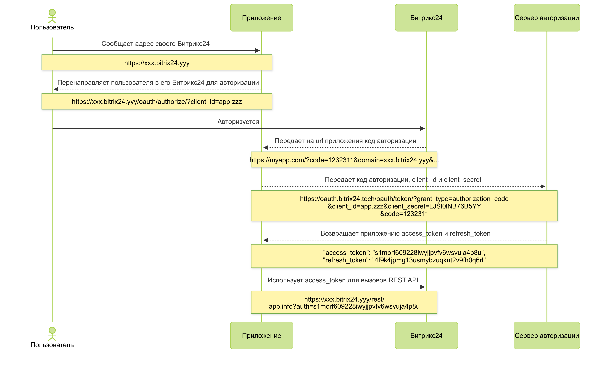

# Полный протокол авторизации OAuth 2.0



Выберите инструмент для разработки с AI-агентом:

- используйте [Битрикс24 Вайбкод](../../ai-tools/vibecode.md), чтобы создать приложение для Битрикс24 по описанию задачи без знания языков программирования. Агент напишет код и разместит приложение на сервере без ручной настройки хостинга
- используйте [MCP-сервер](../../ai-tools/mcp.md), чтобы разрабатывать интеграцию через REST API в своем проекте. Агент будет обращаться к официальной REST-документации



[OAuth](https://oauth.net/) — открытый протокол авторизации, который позволяет предоставить третьей стороне ограниченный доступ к защищенным ресурсам пользователя без передачи логина и пароля.

Полный протокол нужен приложению, которое работает за пределами интерфейса Битрикс24 и хранит токены на своей стороне. Пользователь авторизуется в своем Битрикс24, а приложение получает от сервера авторизации пару токенов для работы с REST API.

Получение первой пары токенов описано ниже. Как продлевать токены, читайте в статье [Автоматическое продление токенов OAuth 2.0](auto-renewal.md), как разбирать ошибки сервера авторизации — в статье [Коды ошибок](error-codes.md).

Протокол OAuth используется для [локальных](../../local-integrations/local-apps.md) и [тиражных](../../market/index.md) приложений. [Локальные вебхуки](../../local-integrations/local-webhooks.md) его не используют: вебхук авторизуется кодом, встроенным в адрес запроса.

## Когда нужен полный протокол

Проверьте, что верны все утверждения:

- у вас есть свой веб-сервис — внешнее приложение или отдельное программное обеспечение
- пользователь уже авторизован в вашем сервисе
- пользователь должен авторизоваться в своем Битрикс24, чтобы ваш сервис получил токены для работы с REST API этого Битрикс24
- пользователь не работает с вашим сервисом внутри интерфейса Битрикс24 — сценарии остаются на стороне сервиса, а REST API нужен только для обмена данными

Если хотя бы одно утверждение неверно, выберите другой способ получить токены.

#|
|| **Способ** | **Когда подходит** ||
|| Полный протокол OAuth 2.0 | Приложение работает вне интерфейса Битрикс24 и само проводит пользователя через авторизацию ||
|| [Упрощенный вариант](simple-way.md) | Приложение открывается во фрейме внутри интерфейса Битрикс24 и получает готовые токены при каждом открытии ||
|| [Callback установки](../app-installation/local-apps/installation-callback.md) | У приложения нет интерфейса, токены приходят на обработчик сразу после установки ||
|| [Входящий вебхук](../../local-integrations/local-webhooks.md) | Интеграция работает в одном Битрикс24 и не распространяется другим пользователям ||
|#

## Как работает протокол

В авторизации участвуют четыре стороны:

- **пользователь** — владелец данных, от имени которого приложение работает с REST API
- **приложение** — ваш сервис, который хранит токены и вызывает методы REST API
- **Битрикс24 пользователя** — источник данных и место, где пользователь проходит авторизацию
- **сервер авторизации** `https://oauth.bitrix24.tech/` — держатель авторизации приложения, только он выдает и продлевает токены



Протокол состоит из пяти шагов:

1. Пользователь сообщает приложению адрес своего Битрикс24.
2. Приложение отправляет пользователя в его Битрикс24 и добавляет к запросу свой `client_id`.
3. Пользователь авторизуется в Битрикс24 и возвращается на адрес приложения с авторизационным кодом `code`. Это еще не токен для работы с REST API, а одноразовый код для получения токенов.
4. Приложение обращается напрямую к серверу авторизации и передает `code`, `client_id` и `client_secret`.
5. Сервер авторизации возвращает первую пару токенов: `access_token` для вызовов REST API и `refresh_token` для продления доступа.



Время жизни авторизационного кода `code` — 30 секунд. Обменяйте его на токены сразу после получения.



## Что подготовить до авторизации

Зарегистрируйте приложение и получите пару `client_id` и `client_secret`:

- для [тиражного приложения](../app-installation/mass-market-apps/index.md) — в партнерском кабинете, ключи действуют для любого Битрикс24
- для [локального приложения](../app-installation/local-apps/index.md) — в самом Битрикс24, ключи действуют только для этого Битрикс24

Приложение должно быть установлено в том Битрикс24, пользователь которого проходит авторизацию. Для неустановленного приложения авторизация завершится ошибкой.

В настройках приложения задается обратный адрес `redirect_uri` — адрес приложения, на который Битрикс24 вернет пользователя после авторизации. В запросе авторизации этот адрес не передается, Битрикс24 берет его из настроек приложения.

Там же задается список прав доступа `scope`. Приложение получает только те права, которые указаны в его карточке. Вызовы методов выполняются от имени пользователя, прошедшего авторизацию, и ограничены его правами в Битрикс24.



Секретный ключ `client_secret` участвует только в запросах к серверу авторизации **oauth.bitrix24.tech**. Битрикс24 может быть развернут в коробке, поэтому передавать секрет в сам Битрикс24 небезопасно. Не размещайте `client_secret` и в коде, который выполняется в браузере. По той же причине сервер авторизации остается единственным доверенным источником информации о платежном статусе приложения.



## Полная OAuth-авторизация в Битрикс24

Полный сценарий проходит в два шага: сначала пользователь авторизуется в своем Битрикс24, затем приложение обменивает полученный код на токены.

### Шаг 1. Авторизация пользователя в Битрикс24

Приложение запрашивает у пользователя адрес Битрикс24 и переадресует его на URL авторизации:

```bash
https://portal.bitrix24.ru/oauth/authorize/?
     client_id=app.573ad8a0346747.09223434
     &state=JJHgsdgfkdaslg7lbadsfg
```

Параметры URL:



#|
|| **Параметр** | **Описание** ||
|| **client_id*** | Код приложения из партнерского кабинета или из формы локального приложения ||
|| **state** | Произвольные данные приложения. Битрикс24 вернет значение без изменений, поэтому по `state` можно связать ответ с исходным запросом ||
|#

По этой ссылке пользователю откроется форма авторизации. Если пользователь уже авторизован в своем Битрикс24, форма не показывается.

Если авторизацию нельзя завершить, Битрикс24 покажет ошибку пользователю на своей странице. Приложение не получит ни переадресации, ни параметров ошибки, поэтому обрабатывать неудачную авторизацию на стороне `redirect_uri` не нужно.

После успешной авторизации Битрикс24 вернет пользователя на `redirect_uri` приложения и добавит к адресу параметры:

```bash
https://www.applicationhost.ru/application/?
     code=avmocpghblyi01m3h42bljvqtyd19sw1
     &state=JJHgsdgfkdaslg7lbadsfg
     &domain=portal.bitrix24.ru
     &member_id=a223c6b3710f85df22e9377d6c4f7553
     &scope=crm%2Centity%2Cim%2Ctask
     &server_domain=oauth.bitrix24.tech
```

Параметры:

#|
|| **Параметр** | **Описание** ||
|| **code** | Авторизационный код. Приложение обменивает его на токены на [шаге 2](#app-authorization) ||
|| **state** | Значение, переданное в первом запросе ||
|| **domain** | Адрес Битрикс24, в котором пользователь прошел авторизацию ||
|| **member_id** | Уникальный идентификатор Битрикс24, который не меняется при смене адреса ||
|| **scope** | Разделенный запятыми список прав доступа к REST API, которые Битрикс24 предоставил приложению. Значение приходит в URL-кодировке, запятая передается как `%2C` ||
|| **server_domain** | Домен сервера авторизации ||
|#



В партнерском кабинете можно зарегистрировать приложение без обратного адреса `redirect_uri`. Такой сценарий подходит тиражным решениям без постоянного адреса. Битрикс24 выведет упрощенный авторизационный код прямо на странице, а приложение должно дать пользователю поле для ввода этого кода.



### Шаг 2. Авторизация приложения {#app-authorization}

Получив авторизационный код `code`, приложение делает скрытый от пользователя GET-запрос к серверу авторизации:

```bash
https://oauth.bitrix24.tech/oauth/token/?
    grant_type=authorization_code
    &client_id=app.573ad8a0346747.09223434
    &client_secret=LJSl0lNB76B5YY6u0YVQ3AW0DrVADcRTwVr4y99PXU1BWQybWK
    &code=avmocpghblyi01m3h42bljvqtyd19sw1
```

Параметры:



#|
|| **Параметр** | **Описание** ||
|| **grant_type*** | Тип авторизационных данных. Для обмена кода на токены передайте значение `authorization_code` ||
|| **client_id*** | Код приложения, то же значение, что на шаге 1 ||
|| **client_secret*** | Секретный ключ приложения из партнерского кабинета или из формы локального приложения ||
|| **code*** | Значение параметра `code`, полученное на шаге 1. Время жизни — 30 секунд ||
|#

Сервер авторизации ответит статусом `200 OK` и телом в формате `application/json`:

```json
{
    "access_token": "s1morf609228iwyjjpvfv6wsvuja4p8u",
    "client_endpoint": "https://portal.bitrix24.ru/rest/",
    "domain": "oauth.bitrix24.tech",
    "expires_in": 3600,
    "member_id": "a223c6b3710f85df22e9377d6c4f7553",
    "refresh_token": "4f9k4jpmg13usmybzuqknt2v9fh0q6rl",
    "scope": "crm,entity,im,task",
    "server_endpoint": "https://oauth.bitrix24.tech/rest/",
    "status": "F"
}
```

Данные ответа:

#|
|| **Параметр** | **Описание** ||
|| **access_token** | Основной авторизационный токен для доступа к REST API. Время жизни — один час ||
|| **refresh_token** | Дополнительный авторизационный токен для продления сохраненной авторизации. Время жизни — 180 дней ||
|| **expires_in** | Время жизни `access_token` в секундах ||
|| **client_endpoint** | Адрес REST-интерфейса Битрикс24. С него начинаются все вызовы методов ||
|| **server_endpoint** | Адрес REST-интерфейса сервера авторизации ||
|| **domain** | Домен сервера авторизации. В параметрах возврата на шаге 1 поле `domain` содержит адрес Битрикс24, а не сервера авторизации ||
|| **member_id** | Уникальный идентификатор Битрикс24 ||
|| **scope** | Разделенный запятыми список прав доступа, выданных приложению ||
|| **status** | Статус приложения в Битрикс24. Значения совпадают с полем `STATUS` метода [app.info](../../api-reference/common/system/app-info.md) ||
|#

Сохраните оба токена на своей стороне. `refresh_token` нужен, чтобы получать новые пары токенов без участия пользователя, поэтому храните его в недоступном из браузера хранилище.

Вызовы методов идут на адрес из `client_endpoint`: к нему добавляется имя метода, а `access_token` передается в параметре `auth`.

```bash
https://portal.bitrix24.ru/rest/crm.deal.list?auth=s1morf609228iwyjjpvfv6wsvuja4p8u
```

На этом шаге приложение может получить ошибку авторизации. Например, если истек пробный или оплаченный период.

```json
{
    "error": "PAYMENT_REQUIRED",
    "error_description": "Payment required"
}
```

Другие ошибки сервера авторизации разобраны в статье [Коды ошибок](error-codes.md).

## Что делать дальше

- вызвать метод REST API с полученным `access_token` — [Как вызывать методы REST API](../how-to-call-rest-api/index.md)
- получить новую пару токенов, когда `access_token` перестанет работать — [Автоматическое продление токенов OAuth 2.0](auto-renewal.md)