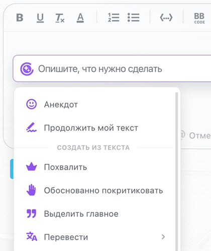
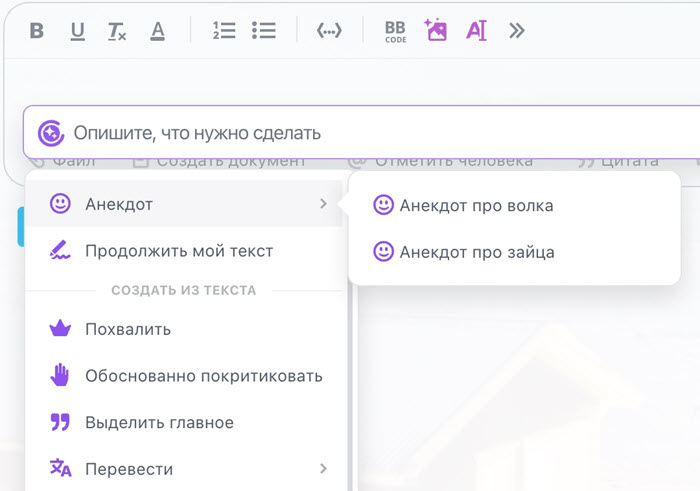
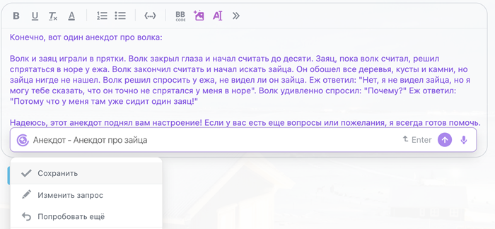
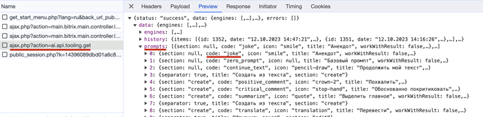
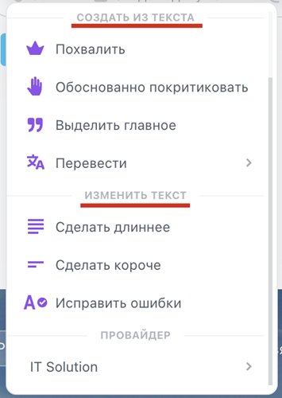

# Добавить новый промпт «Анекдот»

Зарегистрировать новый промпт поможет метод [ai.prompt.register](../../api-reference/ai/prompts/ai-prompt-register.md). Рассмотрим его использование на примере добавления категории шуток. 





- JS

    ```js
    BX24.callMethod(
        'ai.prompt.register',
        {
            category: [
                "livefeed",
                "livefeed_comments"
            ],
            code: 'rest_joke',
            icon: 'smile',
            prompt: 'Расскажи анекдот',
            translate: {
                "en":"A joke",
                "ru":"Анекдот"
            }
        },
        function(result)
        {
            if(result.error())
            {
                console.error(result.error());
            }
            else
            {
                console.info(result.data());
            }
        }
    );
    ```

- PHP

    ```php
    require_once('crest.php');

    $result = CRest::call(
        'ai.prompt.register',
        [
            'category' => [
                "livefeed",
                "livefeed_comments"
            ],
            'code' => 'rest_joke',
            'icon' => 'smile',
            'prompt' => 'Расскажи анекдот',
            'translate' => [
                "en" => "A joke",
                "ru" => "Анекдот"
            ]
        ]
    );

    echo '<PRE>';
    print_r($result);
    echo '</PRE>';
    ```



После выполнения команды появится пункт CoPilot-а, который может генерировать анекдоты.



Пункт меню «Анекдот» теперь кликабелен. Сделаем его родительским пунктом, добавив подпункты (после этого родительский пункт перестанет быть кликабельным).

Для этого нужно в изначальный код добавить код родительской секции `parent_code`, а также `sort` для сортировки пунктов между собой.



- JS

    ```js
    BX24.callMethod(
        'ai.prompt.register',
        {
            category: [
                "livefeed",
                "livefeed_comments"
            ],
            code: 'rest_joke_wolf',
            icon: 'smile',
            prompt: 'Расскажи анекдот про волка',
            translate: {
                "en":"A joke about wolf",
                "ru":"Анекдот про волка"
            },
            parent_code: 'rest_joke',
            sort: 100
        },
        function(result)
        {
            if(result.error())
            {
                console.error(result.error());
            }
            else
            {
                console.info(result.data());
            }
        }
    );
    ```

- PHP

    ```php
    require_once('crest.php');

    $result = CRest::call(
        'ai.prompt.register',
        [
            'category' => [
                "livefeed",
                "livefeed_comments"
            ],
            'code' => 'rest_joke_wolf',
            'icon' => 'smile',
            'prompt' => 'Расскажи анекдот про волка',
            'translate' => [
                "en" => "A joke about wolf",
                "ru" => "Анекдот про волка"
            ],
            'parent_code' => 'rest_joke',
            'sort' => 100
        ]
    );

    echo '<PRE>';
    print_r($result);
    echo '</PRE>';
    ```



После выполнения запроса несколько раз с разными данными меню выглядит так:



Результат:



Чтобы внедриться подпунктом в уже существующие пункты, узнайте код этого пункта и используйте предыдущий код. Код можно узнать, открыв комментарий к посту в ленте новостей. В этот момент отправляется команда на получение информации по CoPilot, где все показано:



Есть еще визуальные категории, в которых можно разместить свои пункты:



Передайте в команде параметр `section`, который может равняться `create` или `edit`. Это визуальное разделение, показывающее, что препромпт меняет текст или создает его.

## Как изменить промпт

Если препромпт вам больше не нужен или вы хотите его изменить, выполните команду [ai.prompt.unregister](../../api-reference/ai/prompts/ai-prompt-unregister.md):



- JS

    ```js
    BX24.callMethod(
        'ai.prompt.unregister',
        {
            code: 'rest_joke_wolf'
        },
        function(result)
        {
            if(result.error())
            {
                console.error(result.error());
            }
            else
            {
                console.info(result.data());
            }
        }
    );
    ```

- PHP

    ```php
    require_once('crest.php');

    $result = CRest::call(
        'ai.prompt.unregister',
        [
            'code' => 'rest_joke_wolf'
        ]
    );

    echo '<PRE>';
    print_r($result);
    echo '</PRE>';
    ```



