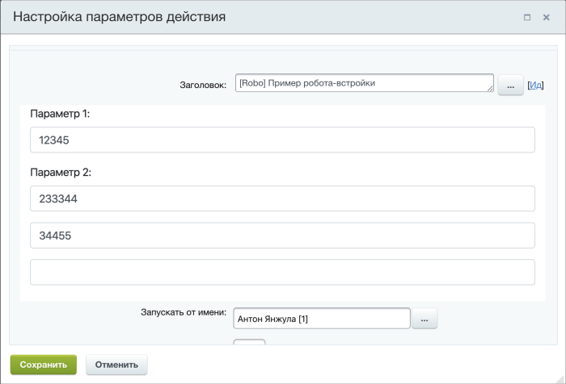

# Настроить REST роботы (действия) через приложение (встройку)

В *Битрикс24* можно настраивать робота/действие, используя интерфейс приложения. Это реализовано стандартным [механизмом встройки виджетов](../../api-reference/widgets/index.md). В коробочной версии доступно с версии [20.0.600](../../api-reference/cloud-and-on-premise/on-premise/versions.md) модуля `Бизнес-процессы`. 

## Реализация на примере приложения

Рассмотрим реализацию на конкретном примере приложения (полный код приложения представлен [ниже](#полный-код-приложения)).


В нашем примере приложение добавляет робота, у которого есть 2 параметра с типом `строка`.





- JS

    ```js
    var params = {
        'CODE': 'robot',
        'HANDLER': 'http://handler.com',
        'AUTH_USER_ID': 1,
        'NAME': 'Пример робота-встройки',
        'USE_PLACEMENT': 'Y',
        'PLACEMENT_HANDLER': 'http://handler.com',
        'PROPERTIES': {
            'string': {
                'Name': 'Параметр 1',
                'Type': 'string'
            },
            'stringm': {
                'Name': 'Параметр 2',
                'Type': 'string',
                'Multiple': 'Y',
                'Default': ['value 1', 'value 2']
            },
        }
    };
    BX24.callMethod(
        'bizproc.robot.add',
        params,
        function(result)
        {
            if(result.error())
                alert("Ошибка: " + result.error());
        }
    );
    ```

- PHP

    ```php
    require_once('crest.php');

    $result = CRest::call(
        'bizproc.robot.add',
        [
            'CODE' => 'robot',
            'HANDLER' => 'http://handler.com',
            'AUTH_USER_ID' => 1,
            'NAME' => 'Пример робота-встройки',
            'USE_PLACEMENT' => 'Y',
            'PLACEMENT_HANDLER' => 'http://handler.com',
            'PROPERTIES' => [
                'string' => [
                    'Name' => 'Параметр 1',
                    'Type' => 'string'
                ],
                'stringm' => [
                    'Name' => 'Параметр 2',
                    'Type' => 'string',
                    'Multiple' => 'Y',
                    'Default' => ['value 1', 'value 2']
                ],
            ]
        ]
    );

    echo '<PRE>';
    print_r($result);
    echo '</PRE>';
    ```



Чтобы параметры можно было настраивать через приложение, при добавлении робота нужно передать параметры `USE_PLACEMENT=Y` и обработчик `PLACEMENT_HANDLER`.

Остается написать обработчик встройки, который отрисует параметры и сохранит их значения. Для этого в обработчик в `PLACEMENT_OPTIONS` нужно передать данные:

- `code` — код вашего робота при регистрации
- `activity_name` — идентификатор действия в шаблоне бизнес-процесса
- `properties` — список свойств и их описание
- `current_values` — текущие значения свойств
- `document_type` — тип документа, для которого проводится настройка
- `document_fields` — список полей документа
- `template` — список доступных полей шаблона (в коробочной версии *Битрикс24* доступно с версии [24.200.0](../../api-reference/cloud-and-on-premise/on-premise/versions.md))

    Для параметра `template` доступны элементы:

    - `parameters` — список параметров шаблона
    - `variables` — список переменных шаблона
    - `constants` — список констант шаблона
    - `global_variables` — список глобальных переменных
    - `global_constants` — список глобальных констант
    - `return_activities` — список действий (роботов), которые генерируют дополнительные результаты

    При этом структура свойств в этих списках приведена к единому формату и представляет из себя структуру:

    ```
    {
        Id: строка, идентификатор (код) свойства
        Type: строка, идентификатор типа свойства

        Name: строка, название
        Description: строка, описание

        Multiple: булевое, множественное свойство или нет
        Required: булевое, обязательное свойство или нет

        Options: смешанное. Зависит от типа свойства
        Settings: список настроек. Зависит от типа свойства
        Default: смешанное. Значение по умолчанию для свойства
    }
    ```

    Список `return_activities` состоит из списка действий, которые возвращают результаты и их свойства. Имеет структуру:

    ```
    {
        Id: строка, идентификатор действия в шаблоне
        Type: строка, тип действия
        Title: строка, название действия в шаблоне
        Return: список, доступные свойства
    }
    ```

В приложение все это приходит в следующем виде:



- JS

    ```js
    Array
    (
        [code] => robot
        [activity_name] => A72788_31169_37133_27365
        [properties] => Array
            (
                [string] => Array
                    (
                        [NAME] => Параметр 1
                        [TYPE] => string
                    )
                [stringm] => Array
                    (
                        [NAME] => Параметр 2
                        [TYPE] => string
                        [MULTIPLE] => Y
                        [DEFAULT] => Array
                            (
                                [0] => value 1
                                [1] => value 2
                            )
                    )
            )
        [current_values] => Array
            (
                [string] => 1
                [stringm] => Array
                    (
                        [0] => 2
                    )
            )
        [document_type] => Array
            (
                [0] => crm
                [1] => CCrmDocumentDeal
                [2] => DEAL
            )
        [document_fields] => Array
            (
                [ID] => Array
                    (
                        [Name] => ID
                        [Type] => int
                        [Filterable] => 1
                        [Editable] => 
                        [Required] => 
                        [BaseType] => int
                    )
                [TITLE] => Array
                    (
                        [Name] => Название
                        [Type] => string
                        [Filterable] => 1
                        [Editable] => 1
                        [Required] => 1
                        [BaseType] => string
                    )
                    
                [...]	
            )
        [template] => Array
            (
                [parameters] => Array
                    (
                    )
                [variables] => Array
                    (
                        [0] => Array
                            (
                                [Id] => Approver
                                [Type] => user
                                [Name] => Утверждающий
                                [Description] => 
                                [Multiple] => 1
                                [Required] => 
                                [Options] => 
                                [Settings] => 
                                [Default] => 
                            )
                    )
                [constants] => Array
                    (
                        [0] => Array
                            (
                                [Id] => Manager
                                [Type] => user
                                [Name] => Кто утверждает
                                [Description] => директор или заместитель
                                [Multiple] => 1
                                [Required] => 1
                                [Options] => 
                                [Settings] => 
                                [Default] => Array
                                    (
                                        [0] => user_4
                                    )
                            )
                    )
                [global_variables] => Array
                    (
                        [0] => Array
                            (
                                [Id] => Variable1666332520655
                                [Type] => user
                                [Name] => test u
                                [Description] => 
                                [Multiple] => 1
                                [Required] => 
                                [Options] => 
                                [Settings] => 
                                [Default] => Array
                                    (
                                        [0] => user_1
                                    )
                            )
                    )
                [global_constants] => Array
                    (
                        [0] => Array
                            (
                                [Id] => Constant1666332578194
                                [Type] => user
                                [Name] => test u 1
                                [Description] => 
                                [Multiple] => 
                                [Required] => 
                                [Options] => 
                                [Settings] => 
                                [Default] => user_1
                            )
                    )
                [return_activities] => Array
                    (
                        [0] => Array
                            (
                                [Id] => A71026_84473_24610_19894
                                [Type] => LogActivity
                                [Title] => Запись в отчет
                                [Return] => Array
                                    (
                                        [0] => Array
                                            (
                                                [Id] => Report
                                                [Name] => Отчет
                                                [Type] => string
                                            )
                                    )
                            )
                        [1] => Array
                            (
                                [Id] => A58853_60082_34258_61777
                                [Type] => ApproveActivity
                                [Title] => Утверждение
                                [Return] => Array
                                    (
                                        [0] => Array
                                            (
                                                [Id] => TaskId
                                                [Name] => ID
                                                [Type] => int
                                            )
                                        [1] => Array
                                            (
                                                [Id] => Comments
                                                [Name] => Комментарии
                                                [Type] => string
                                            )
                                        [2] => Array
                                            (
                                                [Id] => VotedCount
                                                [Name] => Сколько проголосовало
                                                [Type] => int
                                            )
                                        [3] => Array
                                            (
                                                [Id] => TotalCount
                                                [Name] => Сколько должно проголосовать
                                                [Type] => int
                                            )
                                        [4] => Array
                                            (
                                                [Id] => VotedPercent
                                                [Name] => Процент проголосовавших
                                                [Type] => int
                                            )
                                        [5] => Array
                                            (
                                                [Id] => ApprovedPercent
                                                [Name] => Процент утвердивших
                                                [Type] => int
                                            )
                                        [6] => Array
                                            (
                                                [Id] => NotApprovedPercent
                                                [Name] => Процент отклонивших
                                                [Type] => int
                                            )
                                        [7] => Array
                                            (
                                                [Id] => ApprovedCount
                                                [Name] => Количество утвердивших
                                                [Type] => int
                                            )
                                        [8] => Array
                                            (
                                                [Id] => NotApprovedCount
                                                [Name] => Количество отклонивших
                                                [Type] => int
                                            )
                                        [9] => Array
                                            (
                                                [Id] => LastApprover
                                                [Name] => Последний голосовавший
                                                [Type] => user
                                            )
                                        [10] => Array
                                            (
                                                [Id] => LastApproverComment
                                                [Name] => Комментарий последнего голосовавшего
                                                [Type] => string
                                            )
                                        [11] => Array
                                            (
                                                [Id] => UserApprovers
                                                [Name] => Утвердили пользователи
                                                [Type] => user
                                            )
                                        [12] => Array
                                            (
                                                [Id] => Approvers
                                                [Name] => Утвердили пользователи (текст)
                                                [Type] => string
                                            )
                                        [13] => Array
                                            (
                                                [Id] => UserRejecters
                                                [Name] => Отклонили пользователи
                                                [Type] => user
                                            )

                                        [14] => Array
                                            (
                                                [Id] => Rejecters
                                                [Name] => Отклонили пользователи (текст)
                                                [Type] => string
                                            )
                                        [15] => Array
                                            (
                                                [Id] => IsTimeout
                                                [Name] => Автоматическое отклонение
                                                [Type] => int
                                            )
                                    )
                            )
                    )
            )
    )
    ```

- PHP

    ```php
    $array = [
        'code' => 'robot',
        'activity_name' => 'A72788_31169_37133_27365',
        'properties' => [
            'string' => [
                'NAME' => 'Параметр 1',
                'TYPE' => 'string'
            ],
            'stringm' => [
                'NAME' => 'Параметр 2',
                'TYPE' => 'string',
                'MULTIPLE' => 'Y',
                'DEFAULT' => [
                    'value 1',
                    'value 2'
                ]
            ]
        ],
        'current_values' => [
            'string' => 1,
            'stringm' => [
                2
            ]
        ],
        'document_type' => [
            'crm',
            'CCrmDocumentDeal',
            'DEAL'
        ],
        'document_fields' => [
            'ID' => [
                'Name' => 'ID',
                'Type' => 'int',
                'Filterable' => 1,
                'Editable' => false,
                'Required' => false,
                'BaseType' => 'int'
            ],
            'TITLE' => [
                'Name' => 'Название',
                'Type' => 'string',
                'Filterable' => 1,
                'Editable' => 1,
                'Required' => 1,
                'BaseType' => 'string'
            ],
            // ...
        ],
        'template' => [
            'parameters' => [],
            'variables' => [
                [
                    'Id' => 'Approver',
                    'Type' => 'user',
                    'Name' => 'Утверждающий',
                    'Description' => '',
                    'Multiple' => 1,
                    'Required' => false,
                    'Options' => '',
                    'Settings' => '',
                    'Default' => ''
                ]
            ],
            'constants' => [
                [
                    'Id' => 'Manager',
                    'Type' => 'user',
                    'Name' => 'Кто утверждает',
                    'Description' => 'директор или заместитель',
                    'Multiple' => 1,
                    'Required' => 1,
                    'Options' => '',
                    'Settings' => '',
                    'Default' => [
                        'user_4'
                    ]
                ]
            ],
            'global_variables' => [
                [
                    'Id' => 'Variable1666332520655',
                    'Type' => 'user',
                    'Name' => 'test u',
                    'Description' => '',
                    'Multiple' => 1,
                    'Required' => false,
                    'Options' => '',
                    'Settings' => '',
                    'Default' => [
                        'user_1'
                    ]
                ]
            ],
            'global_constants' => [
                [
                    'Id' => 'Constant1666332578194',
                    'Type' => 'user',
                    'Name' => 'test u 1',
                    'Description' => '',
                    'Multiple' => false,
                    'Required' => false,
                    'Options' => '',
                    'Settings' => '',
                    'Default' => 'user_1'
                ]
            ],
            'return_activities' => [
                [
                    'Id' => 'A71026_84473_24610_19894',
                    'Type' => 'LogActivity',
                    'Title' => 'Запись в отчет',
                    'Return' => [
                        [
                            'Id' => 'Report',
                            'Name' => 'Отчет',
                            'Type' => 'string'
                        ]
                    ]
                ],
                [
                    'Id' => 'A58853_60082_34258_61777',
                    'Type' => 'ApproveActivity',
                    'Title' => 'Утверждение',
                    'Return' => [
                        [
                            'Id' => 'TaskId',
                            'Name' => 'ID',
                            'Type' => 'int'
                        ],
                        [
                            'Id' => 'Comments',
                            'Name' => 'Комментарии',
                            'Type' => 'string'
                        ],
                        [
                            'Id' => 'VotedCount',
                            'Name' => 'Сколько проголосовало',
                            'Type' => 'int'
                        ],
                        [
                            'Id' => 'TotalCount',
                            'Name' => 'Сколько должно проголосовать',
                            'Type' => 'int'
                        ],
                        [
                            'Id' => 'VotedPercent',
                            'Name' => 'Процент проголосовавших',
                            'Type' => 'int'
                        ],
                        [
                            'Id' => 'ApprovedPercent',
                            'Name' => 'Процент утвердивших',
                            'Type' => 'int'
                        ],
                        [
                            'Id' => 'NotApprovedPercent',
                            'Name' => 'Процент отклонивших',
                            'Type' => 'int'
                        ],
                        [
                            'Id' => 'ApprovedCount',
                            'Name' => 'Количество утвердивших',
                            'Type' => 'int'
                        ],
                        [
                            'Id' => 'NotApprovedCount',
                            'Name' => 'Количество отклонивших',
                            'Type' => 'int'
                        ],
                        [
                            'Id' => 'LastApprover',
                            'Name' => 'Последний голосовавший',
                            'Type' => 'user'
                        ],
                        [
                            'Id' => 'LastApproverComment',
                            'Name' => 'Комментарий последнего голосовавшего',
                            'Type' => 'string'
                        ],
                        [
                            'Id' => 'UserApprovers',
                            'Name' => 'Утвердили пользователи',
                            'Type' => 'user'
                        ],
                        [
                            'Id' => 'Approvers',
                            'Name' => 'Утвердили пользователи (текст)',
                            'Type' => 'string'
                        ],
                        [
                            'Id' => 'UserRejecters',
                            'Name' => 'Отклонили пользователи',
                            'Type' => 'user'
                        ],
                        [
                            'Id' => 'Rejecters',
                            'Name' => 'Отклонили пользователи (текст)',
                            'Type' => 'string'
                        ],
                        [
                            'Id' => 'IsTimeout',
                            'Name' => 'Автоматическое отклонение',
                            'Type' => 'int'
                        ]
                    ]
                ]
            ]
        ]
    ];
    ```



Осталось сделать верстку и научиться сохранять параметры непосредственно в Робота. Для этого можно использовать функцию `setPropertyValue`, которая доступна через [BX24.placement.call](../../api-reference/widgets/ui-interaction/bx24-placement-call.md).



- JS

    ```js
    BX24.placement.call(
        'setPropertyValue',
        {
            string: 'test string'
        }
    )
    ```

- PHP

    ```php
    require_once('crest.php');

    $result = CRest::call(
        'placement.call',
        [
            'PLACEMENT' => 'setPropertyValue',
            'HANDLER' => 'handler_identifier', // You need to replace 'handler_identifier' with the actual handler identifier for the placement
            'PARAMS' => [
                'string' => 'test string'
            ]
        ]
    );

    echo '<PRE>';
    print_r($result);
    echo '</PRE>';
    ```



В качестве параметров передаются `ID` свойства и значения. Можно передавать несколько значений свойств.



- JS

    ```js
    BX24.placement.call(
        'setPropertyValue',
        {
            string: 'test string',
            stringm: [
                'test2',
                'test3'
            ]
        }
    )
    ```

- PHP

    ```php
    require_once('crest.php');

    $result = CRest::call(
        'placement.call',
        [
            'PLACEMENT' => 'setPropertyValue',
            'PARAMS' => [
                'string' => 'test string',
                'stringm' => [
                    'test2',
                    'test3'
                ]
            ]
        ]
    );

    echo '<PRE>';
    print_r($result);
    echo '</PRE>';
    ```



Далее пользователь сохраняет робота как обычно.

Так это выглядит в Роботах:


А так это выглядит в дизайнере бизнес-процессов:



Белая область — встройка (фрейм приложения).

## Полный код приложения





- JS

    ```js
    let protocol = location.protocol === 'https:' ? 'https' : 'http';
    let host = location.hostname;
    const BP_APP_HANDLER = `${protocol}://${host}${location.pathname}`;

    document.write(`
    <!DOCTYPE html>
    <html lang="en">
    <head>
    <meta charset="UTF-8">
    <title></title>
    </head>
    <body>
    <link rel="stylesheet" href="https://stackpath.bootstrapcdn.com/bootstrap/4.3.1/css/bootstrap.min.css" integrity="sha384-ggOyR0iXCbMQv3Xipma34MD+dH/1fQ784/j6cY/iJTQUOhcWr7x9JvoRxT2MZw1T" crossorigin="anonymous">
    <script src="https://stackpath.bootstrapcdn.com/bootstrap/4.3.1/js/bootstrap.min.js" integrity="sha384-JjSmVgyd0p3pXB1rRibZUAYoIIy6OrQ6VrjIEaFf/nJGzIxFDsf4x0xIM+B07jRM" crossorigin="anonymous"></script>
    <script src="//api.bitrix24.com/api/v1/"></script>
    ${!BX24.getParam('PLACEMENT') || BX24.getParam('PLACEMENT') === 'DEFAULT' ? `
    <h1>Робот-встройка</h1>
    <div class="container-fluid">
    <div class="container-fluid">
            <h2>Робот</h2>
            <button onclick="installRobot();" class="btn btn-primary">Установить</button>
            <button onclick="uninstallRobot();" class="btn btn-danger">Удалить</button>
        </div>
        <hr/>
        <div class="container-fluid">
            <button onclick="getList();" class="btn btn-light">Получить список установленных роботов</button>
        </div>
    </div>
    <script type="text/javascript">
        document.body.style.display = 'none';
        BX24.init(function()
        {
            document.body.style.display = '';
        });
        function installRobot()
        {
            var params = {
                'CODE': 'robot',
                'HANDLER': '${BP_APP_HANDLER}',
                'AUTH_USER_ID': 1,
                'NAME': 'Пример робота-встройки',
                'USE_PLACEMENT': 'Y',
                'PLACEMENT_HANDLER': '${BP_APP_HANDLER}',
                'PROPERTIES': {
                    'string': {
                        'Name': 'Параметр 1',
                        'Type': 'string'
                    },
                    'stringm': {
                        'Name': 'Параметр 2',
                        'Type': 'string',
                        'Multiple': 'Y',
                        'Default': ['value 1', 'value 2']
                    },
                }
            };
            BX24.callMethod(
                'bizproc.robot.add',
                params,
                function(result)
                {
                    if(result.error())
                        alert("Ошибка: " + result.error());
                    else
                        alert("Успешно");
                }
            );
        }
        function uninstallRobot()
        {
            BX24.callMethod(
                    'bizproc.robot.delete',
                    {
                        'CODE': 'robot'
                    },
                    function(result)
                    {
                        if(result.error())
                            alert('Ошибка: ' + result.error());
                        else
                            alert("Успешно");
                    }
            );
        }
        function getList()
        {
            BX24.callMethod(
                'bizproc.robot.list',
                {},
                function(result)
                {
                    if(result.error())
                        alert("Ошибка: " + result.error());
                    else
                        alert("Коды установленных роботов: " + result.data().join(', '));
                }
            );
        }
    </script>
    ` : `
    <form name="props" class="container-fluid">
    ${(() => {
        let options = JSON.parse(BX24.getParam('PLACEMENT_OPTIONS'));
        return Object.keys(options.properties).map(id => {
            let property = options.properties[id];
            let multiple = property.MULTIPLE === 'Y';
            let val = options.current_values[id] || [''];
            if (multiple) val.push('');
            let name = multiple ? `${id}[]` : id;
            return `
            <div class="form-group">
                <label>${property.NAME}:</label>
                ${val.map(v => `<p><input name="${name}" value="${v}" class="form-control" oncha nge="setPropertyValue('${id}', this.name, ${multiple})"></p>`).join('')}
            </div>`;
        }).join('');
    })()}
    <script>
        function setPropertyValue(name, inputName, multiple)
        {
            var form = new FormData(document.forms.props);
            var value = multiple ? form.getAll(inputName) : form.get(inputName);
            var params = {};
            params[name] = value;
            BX24.placement.call(
                'setPropertyValue',
                params
            )
        }
    </script>
    </form>
    `}
    </body>
    </html>
    `);
    ```

- PHP

    ```php
    <?php
    header('Content-Type: text/html; charset=UTF-8');
    $protocol = $_SERVER['SERVER_PORT'] == '443' ? 'https' : 'http';
    $host = explode(':', $_SERVER['HTTP_HOST']);
    $host = $host[0];
    define('BP_APP_HANDLER', $protocol.'://'.$host.explode('?', $_SERVER['REQUEST_URI'])[0]);
    ?>
    <!DOCTYPE html>
    <html lang="en">
    <head>
    <meta charset="UTF-8">
    <title></title>
    </head>
    <body>
    <link rel="stylesheet" href="https://stackpath.bootstrapcdn.com/bootstrap/4.3.1/css/bootstrap.min.css" integrity="sha384-ggOyR0iXCbMQv3Xipma34MD+dH/1fQ784/j6cY/iJTQUOhcWr7x9JvoRxT2MZw1T" crossorigin="anonymous">
    <script src="https://stackpath.bootstrapcdn.com/bootstrap/4.3.1/js/bootstrap.min.js" integrity="sha384-JjSmVgyd0p3pXB1rRibZUAYoIIy6OrQ6VrjIEaFf/nJGzIxFDsf4x0xIM+B07jRM" crossorigin="anonymous"></script>
    <script src="//api.bitrix24.com/api/v1/"></script>
    <?if (!isset($_POST['PLACEMENT']) || $_POST['PLACEMENT'] === 'DEFAULT'):?>
    <h1>Робот-встройка</h1>
    <div class="container-fluid">
    <div class="container-fluid">
            <h2>Робот</h2>
            <button onclick="installRobot();" class="btn btn-primary">Установить</button> –
            <button onclick="uninstallRobot();" class="btn btn-danger">Удалить</button>
        </div>
        <hr/>
        <div class="container-fluid">
            <button onclick="getList();" class="btn btn-light">Получить список установленных роботов</button>
        </div>
    </div>
    <script type="text/javascript">
        document.body.style.display = 'none';
        BX24.init(function()
        {
            document.body.style.display = '';
        });
        function installRobot()
        {
            var params = {
                'CODE': 'robot',
                'HANDLER': '<?=BP_APP_HANDLER?>',
                'AUTH_USER_ID': 1,
                'NAME': 'Пример робота-встройки',
                'USE_PLACEMENT': 'Y',
                'PLACEMENT_HANDLER': '<?=BP_APP_HANDLER?>',
                'PROPERTIES': {
                    'string': {
                        'Name': 'Параметр 1',
                        'Type': 'string'
                    },
                    'stringm': {
                        'Name': 'Параметр 2',
                        'Type': 'string',
                        'Multiple': 'Y',
                        'Default': ['value 1', 'value 2']
                    },
                }
            };
            BX24.callMethod(
                'bizproc.robot.add',
                params,
                function(result)
                {
                    if(result.error())
                        alert("Ошибка: " + result.error());
                    else
                        alert("Успешно");
                }
            );
        }
        function uninstallRobot()
        {
            BX24.callMethod(
                    'bizproc.robot.delete',
                    {
                        'CODE': 'robot'
                    },
                    function(result)
                    {
                        if(result.error())
                            alert('Ошибка: ' + result.error());
                        else
                            alert("Успешно");
                    }
            );
        }
        function getList()
        {
            BX24.callMethod(
                'bizproc.robot.list',
                {},
                function(result)
                {
                    if(result.error())
                        alert("Ошибка: " + result.error());
                    else
                        alert("Коды установленных роботов: " + result.data().join(', '));
                }
            );
        }
    </script>
    <?php else:?>
        <form name="props" class="container-fluid">
    <?php
    $options = json_decode($_POST['PLACEMENT_OPTIONS'], true);
    foreach ($options['properties'] as $id => $property)
    {
        $multiple = isset($property['MULTIPLE']) && $property['MULTIPLE'] === 'Y';
        $val = (array) $options['current_values'][$id];
        if (!$val)
        {
            $val[] = '';
        }
        if ($multiple)
        {
            $val[] = '';
        }
        $name = $multiple ? $id.'[]' : $id;
        ?>
        <div class="form-group">
            <label><?=htmlspecialchars($property['NAME'])?>:</label>
            <?foreach ($val as $v):?>
            <p><input name="<?=$name?>" value="<?=htmlspecialchars((string)$v)?>" class="form-control" onchange="setPropertyValue('<?=$id?>', this.name, <?=(int)$multiple?>)"></p>
            <?endforeach;?>
        </div>
        <?
    }
    ?>
            <script>
                function setPropertyValue(name, inputName, multiple)
                {
                    var form = new FormData(document.forms.props);
                    var value = multiple? form.getAll(inputName) : form.get(inputName);
                    var params = {};
                    params[name] = value;
                    BX24.placement.call(
                        'setPropertyValue',
                        params
                    )
                }
            </script>
        </form>
    <?php endif;?>
    </body>
    </html>
    ```

