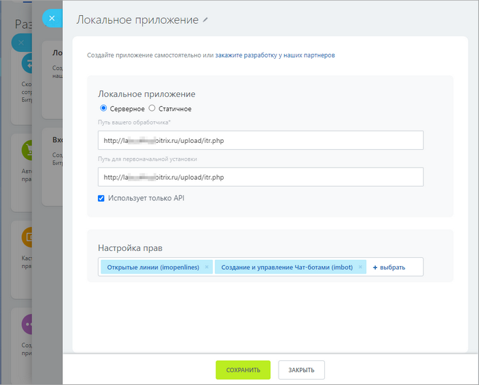
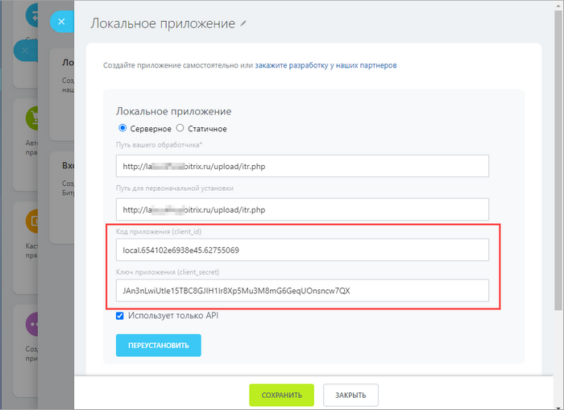

# Пример создания чат-бота для Открытых линий

Процесс создания чат-бота для *Открытых линий* аналогичен [созданию обычного чат-бота](./index.md), но есть два отличия:

1. При создании чат-бота для *Открытых линий* в [imbot.register](../../api-reference/chat-bots/imbot-register.md) в параметр `TYPE` нужно передать `O`

2. Если необходимо расширить возможности уже существующего чат-бота, то следует передать новый ключ `OPENLINE => Y`, и тогда чат-бот будет работать в гибридном режиме.
   
   В гибридном режиме чат-бот должен корректно работать в групповом чате, персональном чате и чате открытых линий. Для этого нужно во всех входящих событиях ([ONIMBOTMESSAGEADD](../../api-reference/chat-bots/messages/events/on-imbot-message-add.md) и [ONIMBOTJOINCHAT](../../api-reference/chat-bots/chats/events/on-imbot-join-chat.md)) проверять параметр `CHAT_ENTITY_TYPE` — для *Открытых линий* он должен быть `CHAT_ENTITY_TYPE => LINES`.

Во всем остальном это привычный и уже знакомый [чат-бот](./index.md).

Для более тесной интеграции с *Открытыми линиями* необходимо иметь права доступа на scope [`imopenlines`](../../api-reference/scopes/permissions.md).

С данным правом будут доступны команды:

- [imopenlines.network.join](../../api-reference/imopenlines/openlines/imopenlines-network-join.md) — подключение открытой линии вашей компании к порталу *Битрикс24*, после чего сотрудники смогут вам писать
- [imopenlines.bot.session.operator](../../api-reference/imopenlines/openlines/chat-bots/imopenlines-bot-session-operator.md) — переключение разговора на свободного оператора
- [imopenlines.bot.session.transfer](../../api-reference/imopenlines/openlines/chat-bots/imopenlines-bot-session-transfer.md) — переключение разговора на конкретного оператора
- [imopenlines.bot.session.finish](../../api-reference/imopenlines/openlines/chat-bots/imopenlines-bot-session-finish.md) — завершение текущей сессии



Использование сертификата HTTPS для чат-ботов не обязательно, но крайне рекомендуется для защиты конфиденциальных данных клиента. Приложение должно быть в кодировке `UTF-8`.



## Скачать пример чат-бота для Открытых линий

В качестве примера чат-бота для открытых линий мы подготовили чат-бот «ITR Bot». Получить его можно следующими способами:

- [скачать](https://github.com/bitrix24com/bots) c сервиса GitHub, файл `itr.php`
- найти и скопировать в продукте *«Битрикс24 в коробке»* в папке `\Bitrix\ImBot\Bot\OpenlinesMenuExample`

Данный чат-бот выступает в качестве первой линии поддержки: сначала все сообщения будут поступать к нему, а только потом — сотрудникам в очередь. Время, через которое сообщения будут переадресованы с чат-бота на сотрудников, задается в настройках открытой линии. 

Также в чат-бот добавлен класс для построения многоуровневого меню в чатах.

## Запуск на своем портале

Вы можете [взять код примера чат-бота](#скачать-пример-чат-бота-для-открытых-линий) выше, выложить на своем сервере и запустить чат-бота на своем портале в качестве локального приложения, не публикуя его через *Маркет*:

- В левом меню в разделе **Приложения** (1) перейдите в подраздел **Разработчикам** (2) и выберите пункт **Другое** (3):


- Используйте сценарий **Локальное приложение** (4):


- Выберите тип приложения **Серверное** и настройте его параметры:
  -  Смените название бота 
  -  Включите опцию `Использует только API` и задайте приложению права доступа на:
     - `Создание и управление Чат-ботами` — без этих прав приложение не сможет зарегистрировать чат-бота
     - `Открытые линии` — без этих прав приложение не сможет работать с открытыми линиями
  - Поскольку скрипт написан таким образом, что является обработчиком всех событий, то в полях `Путь вашего обработчика` и `Путь для первоначальной установки` ссылки будут вести на один и тот же URL



- После сохранения настроек появятся дополнительные поля: `Код приложения (client_id)` и `Ключ приложения (client_secret)`



- Скопируйте данные из этих полей и вставьте в файл `itr.php`


- В настройках бота нажмите `Переустановить`. Теперь бот готов к работе.

Этот бот не публикует сообщения о том, что его пригласили на портал. После установки он будет доступен в настройках открытых линий. Выберите его ответственным и укажите время, через которое разговор будет переведен от чат-бота в очередь к сотрудникам:




Клиент может переключиться на оператора раньше, отправив сообщение `0` или выбрав пункт меню `0. Wait operator answer`. 

При любом чат-боте нажатие `0` перенаправит пользователя на оператора, дополнительная обработка не требуется. 



Ниже показан диалог: сначала отвечает «ITR Bot», клиент кликает в меню по пунктам, далее очередь переходит на оператора, так как клиент выбрал пункт меню **0. Wait operator answer**:


Настроить собственное меню в «ITR Bot» можно в методе `itrRun`:

```php
/**
* Run ITR menu
*
* @param $portalId
* @param $dialogId
* @param $userId
* @param string $message
* @return bool
*/
function itrRun($portalId, $dialogId, $userId, $message = '')
{
    if ($userId <= 0)
        return false;

    $menu0 = new ItrMenu(0);
    $menu0->setText('Main menu (#0)');
    $menu0->addItem(1, 'Text', ItrItem::sendText('Text message (for #USER_NAME#)'));
    $menu0->addItem(2, 'Text without menu', ItrItem::sendText('Text message without menu', true));
    $menu0->addItem(3, 'Open menu #1', ItrItem::openMenu(1));
    $menu0->addItem(0, 'Wait operator answer', ItrItem::sendText('Wait operator answer', true));

    $menu1 = new ItrMenu(1);
    $menu1->setText('Second menu (#1)');
    $menu1->addItem(2, 'Transfer to queue', ItrItem::transferToQueue('Transfer to queue'));
    $menu1->addItem(3, 'Transfer to user', ItrItem::transferToUser(1, false, 'Transfer to user #1'));
    $menu1->addItem(4, 'Transfer to bot', ItrItem::transferToBot('marta', true, 'Transfer to bot Marta', 'Marta not found :('));
    $menu1->addItem(5, 'Finish session', ItrItem::finishSession('Finish session'));
    $menu1->addItem(6, 'Exec function', ItrItem::execFunction(function($context){
        $result = restCommand('imbot.message.add', Array(
            "DIALOG_ID" => $_REQUEST['data']['PARAMS']['DIALOG_ID'],
            "MESSAGE" => 'Function executed (action)',
        ), $_REQUEST["auth"]);
        writeToLog($result, 'Exec function');
    }, 'Function executed (text)'));
    $menu1->addItem(9, 'Back to main menu', ItrItem::openMenu(0));

    $itr = new Itr($portalId, $dialogId, 0, $userId);
    $itr->addMenu($menu0);
    $itr->addMenu($menu1);
    $itr->run(prepareText($message));

    return true;
}
```


