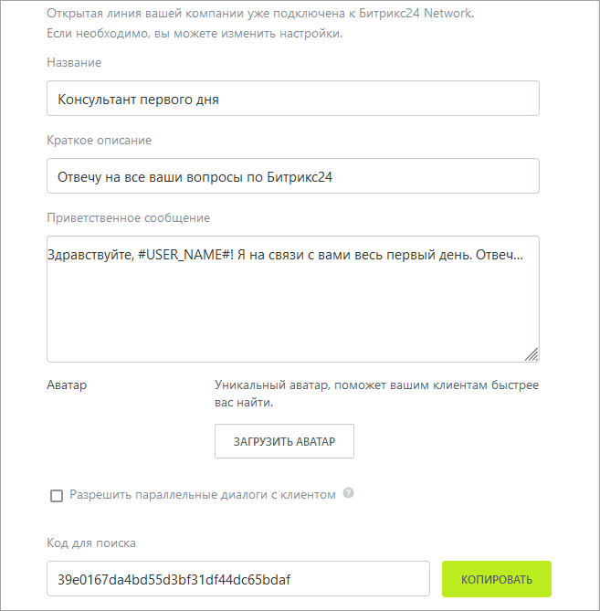
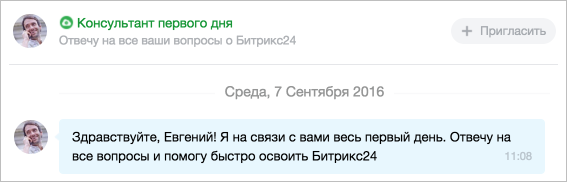

# Пример создания канала поддержки

Благодаря модулю **Открытые линии** можно организовать техническую поддержку по любому приложению *Битрикс24*, в том числе и по чат-ботам.

Для этого выполните следующие действия:

- Перейдите в раздел **Контакт-центр** и подключите канал коммуникации `Битрикс24.Network`:


- После этого станет доступна форма настроек подключения к `Битрикс24.Network`:



  - Обязательно заполните поля `Название` и `Краткое описание`, а также установите `Аватар` — это поможет клиентам легче вас найти

  - Как только пользователь перейдет в вашу Открытую линию *Битрикс24.Network*, он автоматически получит приветственное сообщение:
         
  

- Создайте новую открытую линию технической поддержки по вашему продукту или выберите действующую:


С помощью метода [imopenlines.network.join](../../api-reference/imopenlines/openlines/imopenlines-network-join.md) можно автоматически подключать вашу открытую линию к порталу пользователей:

```php
$result = restCommand(
    'imopenlines.network.join',
    Array(
        'CODE' => 'a588e1a88baaf301b9d0b0b33b1eefc2b' // код для поиска со страницы коннекторов
    ),
    $_REQUEST[
        "auth"
    ]
);
```

После установки Открытой линии вы можете написать клиенту приветственное сообщение с помощью метода [imopenlines.network.message.add](../../api-reference/imopenlines/openlines/imopenlines-network-message-add.md):

```php
Спасибо за установку, будем рады помочь, если будут вопросы — пишите в этот чат. Хорошего дня! :)
```



`restCommand` — это метод отправки данных в *Битрикс24*, данный метод есть в [ЭхоБоте](https://github.com/bitrix24com/bots) и представлен здесь в качестве примера. Вы можете использовать свою функцию или javascript-метод [BX24.callMethod](../../first-steps/how-to-use-examples.md), а также [bitrix24-php-sdk](https://github.com/mesilov/bitrix24-php-sdk). Еще можно открыть такой канал поддержки через javascript-метод [BX24.im.openMessenger](../../sdk/bx24-js-sdk/additional-functions/bx24-im-open-messenger.md).

