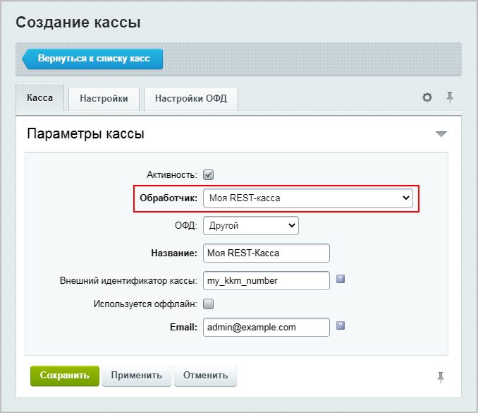
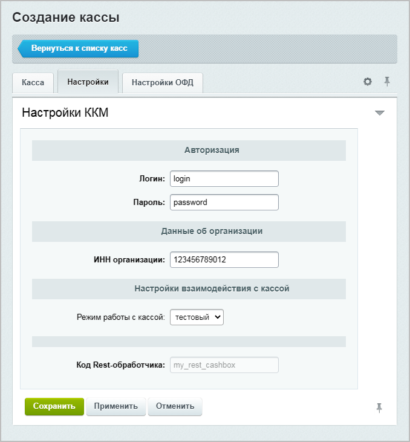

# Реализовать простую кассу на REST API

## Добавление обработчика кассы



Пример добавления обработчика кассы с возможностью настройки данных для авторизации, информации о компании и режиме работы кассы.



- JS

    ```js
    BX24.callMethod(
        "sale.cashbox.handler.add",
        {
            "CODE": "my_rest_cashbox",
            "NAME": "Моя REST-касса",
            "SORT": 100,
            "SETTINGS":
            {
                "PRINT_URL": "http://example.com/rest_print.php",
                "CHECK_URL": "http://example.com/rest_check.php",
                "CONFIG":
                {
                    "AUTH": {
                        "LABEL": "Авторизация",
                        "ITEMS": {
                            "LOGIN": {
                                "TYPE": "STRING",
                                "REQUIRED": "Y",
                                "LABEL": "Логин"
                            },
                            "PASSWORD": {
                                "TYPE": "STRING",
                                "REQUIRED": "Y",
                                "LABEL": "Пароль"
                            },
                        }
                    },
                    "COMPANY": {
                        "LABEL": "Данные об организации",
                        "ITEMS": {
                            "INN": {
                                "TYPE": "STRING",
                                "REQUIRED": "Y",
                                "LABEL": "ИНН организации"
                            }
                        }
                    },
                    "INTERACTION": {
                        "LABEL": "Настройки взаимодействия с кассой",
                        "ITEMS": {
                            "MODE": {
                                "TYPE": "ENUM",
                                "LABEL": "Режим работы с кассой",
                                "OPTIONS": {
                                    "ACTIVE": "боевой",
                                    "TEST": "тестовый"
                                }
                            }
                        }
                    }
                }
            }
        },
        function(result)
        {
            if(result.error())
                console.error(result.error());
            else
                console.dir(result.data());
        }
    );
    ```

- PHP

    ```php
    require_once('crest.php');

    $result = CRest::call('sale.cashbox.handler.add', [
        'CODE' => 'my_rest_cashbox',
        'NAME' => 'Моя REST-касса',
        'SORT' => 100,
        'SETTINGS' => [
            'PRINT_URL' => 'http://example.com/rest_print.php',
            'CHECK_URL' => 'http://example.com/rest_check.php',
            'CONFIG' => [
                'AUTH' => [
                    'LABEL' => 'Авторизация',
                    'ITEMS' => [
                        'LOGIN' => [
                            'TYPE' => 'STRING',
                            'REQUIRED' => 'Y',
                            'LABEL' => 'Логин'
                        ],
                        'PASSWORD' => [
                            'TYPE' => 'STRING',
                            'REQUIRED' => 'Y',
                            'LABEL' => 'Пароль'
                        ],
                    ]
                ],
                'COMPANY' => [
                    'LABEL' => 'Данные об организации',
                    'ITEMS' => [
                        'INN' => [
                            'TYPE' => 'STRING',
                            'REQUIRED' => 'Y',
                            'LABEL' => 'ИНН организации'
                        ]
                    ]
                ],
                'INTERACTION' => [
                    'LABEL' => 'Настройки взаимодействия с кассой',
                    'ITEMS' => [
                        'MODE' => [
                            'TYPE' => 'ENUM',
                            'LABEL' => 'Режим работы с кассой',
                            'OPTIONS' => [
                                'ACTIVE' => 'боевой',
                                'TEST' => 'тестовый'
                            ]
                        ]
                    ]
                ]
            ]
        ]
    ]);

    echo '<PRE>';
    print_r($result);
    echo '</PRE>';
    ```



Добавленную кассу можно настроить либо через настройки магазина или Центр продаж, либо вызовом метода [sale.cashbox.add](../../api-reference/sale/cashbox/sale-cashbox-add.md). Примеры:

- Вкладка **Касса**:



- Вкладка **Настройки**:



## Пример добавления кассы





- JS

    ```js
    BX24.callMethod(
        "sale.cashbox.add",
        {
            "NAME": 'Rest-касса',
            "REST_CODE": 'my_rest_cashbox',
            "EMAIL": "user@example.com",
            "NUMBER_KKM": "123",
            "ACTIVE": "Y",
            "OFD": "bx_ofdruofd",
            "OFD_SETTINGS":
            {
                "OFD_MODE":
                {
                    "IS_TEST": "N"
                }
            },
            "SETTINGS":
            {
                "AUTH":
                {
                    "LOGIN": "user123",
                    "PASSWORD": "top_secret!"
                },
                "COMPANY":
                {
                    "INN": "1234567890"
                },

                "INTERACTION":
                {
                    "MODE": "ACTIVE"
                }
            }
        },
        function(result)
        {
            if(result.error())
                console.error(result.error());
            else
                console.dir(result.data());
        }
    );
    ```

- PHP

    ```php
    require_once('crest.php');

    $result = CRest::call(
        'sale.cashbox.add',
        [
            'FIELDS' => [
                'NAME' => 'Rest-касса',
                'REST_CODE' => 'my_rest_cashbox',
                'EMAIL' => 'user@example.com',
                'NUMBER_KKM' => '123',
                'ACTIVE' => 'Y',
                'OFD' => 'bx_ofdruofd',
                'OFD_SETTINGS' => [
                    'OFD_MODE' => [
                        'IS_TEST' => 'N'
                    ]
                ],
                'SETTINGS' => [
                    'AUTH' => [
                        'LOGIN' => 'user123',
                        'PASSWORD' => 'top_secret!'
                    ],
                    'COMPANY' => [
                        'INN' => '1234567890'
                    ],
                    'INTERACTION' => [
                        'MODE' => 'ACTIVE'
                    ]
                ]
            ]
        ]
    );

    echo '<PRE>';
    print_r($result);
    echo '</PRE>';
    ```



## Страница PRINT_URL

Страница `PRINT_URL` — адрес, на который отправляются данные для печати чека.

Структуру POST-параметров, отправляемых на адрес `PRINT_URL`, смотрите в описании метода [sale.cashbox.handler.add](../../api-reference/sale/cashbox/sale-cashbox-handler-add.md#print_url).

По адресу `PRINT_URL` происходит обработка входных данных, формирование документа и возвращение результата печати. Ответом в случае ошибки служит JSON-массив вида:

```json
{
"ERRORS": [
    "Сообщение об ошибке",
    "Сообщение об ошибке",
    ...
]
}
```

При успешной печати массив имеет вид:

```json
{
    "UUID": "00112233-4455-6677-8899-aabbccddeeff"
}
```

## Страница CHECK_URL

Страница `CHECK_URL` — адрес, по которому происходит проверка успешности печати чека.

Запрос по адресу `CHECK_URL` производится либо по обращению менеджера, либо автоматически спустя некоторое время после успешной печати чека.

Структуру POST-параметров, отправляемых на адрес `CHECK_URL`, смотрите в описании метода [sale.cashbox.handler.add](../../api-reference/sale/cashbox/sale-cashbox-handler-add.md#check_url).

Запрос по адресу CHECK_URL должен возвращать данные о чеке, данные об ошибке при печати чека, либо статус «в ожидании печати».

Формат данных при ошибке печати чека:

```json
{ 
    "STATUS": "ERROR", 
    "ERROR": "Сообщение об ошибке" 
}
```

Формат данных, если чек еще не напечетан:

```json
{ 
    "STATUS": "WAIT"
}
```

Формат данных при успешной отправке чека:

```json
{
    "STATUS": "DONE",
    "UUID": "00112233-4455-6677-8899-aabbccddeeff",
    "REG_NUMBER_KKT": "000111222333",
    "FISCAL_DOC_ATTR": "33445500",
    "FISCAL_DOC_NUMBER": 123,
    "FISCAL_RECEIPT_NUMBER": 10,
    "FN_NUMBER": "0011223344556677",
    "SHIFT_NUMBER": 12,
    "PRINT_END_TIME": 1609452000
}
```

Состав полей аналогичен параметрам метода [sale.cashbox.check.apply](../../api-reference/sale/cashbox/sale-cashbox-check-apply.md).

Данные, возвращаемые `CHECK_URL`, сохраняются на портале и используются для генерации ссылки на чек.

Помимо автоматических запросов с портала на `CHECK_URL` приложение может передавать данные о чеке в любое время с помощью вызова метода [sale.cashbox.check.apply](../../api-reference/sale/cashbox/sale-cashbox-check-apply.md).



- JS

    ```js
    BX24.callMethod(
        "sale.cashbox.check.apply",
        {
            'UUID':'00112233-4455-6677-8899-aabbccddeeff',
            'PRINT_END_TIME':'1609459200',
            'REG_NUMBER_KKT':'000111222333',
            'FISCAL_DOC_ATTR':'33445500',
            'FISCAL_DOC_NUMBER':'123',
            'FISCAL_RECEIPT_NUMBER':'10',
            'FN_NUMBER':'0011223344556677',
            'SHIFT_NUMBER':'12'
        },
        function(result)
        {
            if(result.error())
                console.error(result.error());
            else
                console.dir(result.data());
        }
    );
    ```

- PHP

    ```php
    require_once('crest.php');

    $result = CRest::call(
        'sale.cashbox.check.apply',
        [
            'FIELDS' => [
                'UUID' => '00112233-4455-6677-8899-aabbccddeeff',
                'PRINT_END_TIME' => '1609459200',
                'REG_NUMBER_KKT' => '000111222333',
                'FISCAL_DOC_ATTR' => '33445500',
                'FISCAL_DOC_NUMBER' => '123',
                'FISCAL_RECEIPT_NUMBER' => '10',
                'FN_NUMBER' => '0011223344556677',
                'SHIFT_NUMBER' => '12'
            ]
        ]
    );

    echo '<PRE>';
    print_r($result);
    echo '</PRE>';
    ```


