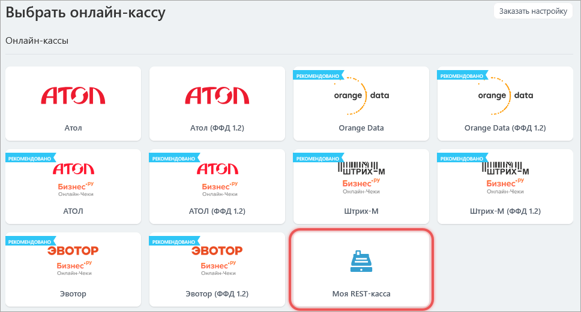
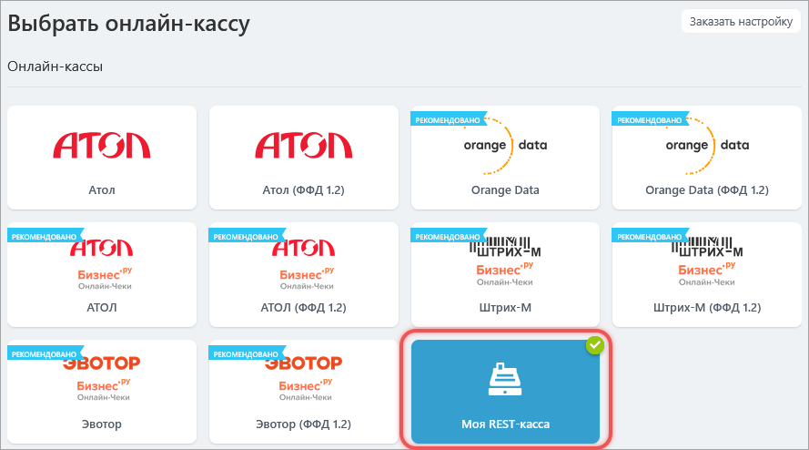

# Как подключить кассу к Битрикс24

> Scope: [`sale`](../../api-reference/scopes/permissions.md), [`cashbox`](../../api-reference/scopes/permissions.md)
>
> Кто может выполнять методы: администратор

В Битрикс24 можно подключить внешнюю кассу и автоматически печатать чеки. Когда клиент оплатит заказ, портал отправит данные чека на заданный URL. Внешний сервис сформирует и зарегистрирует фискальный чек.

Чтобы подключить кассу, последовательно выполним методы:

1. [sale.cashbox.handler.add](../../api-reference/sale/cashbox/sale-cashbox-handler-add.md) — добавим обработчик кассы,

2. [sale.cashbox.add](../../api-reference/sale/cashbox/sale-cashbox-add.md) — создадим кассу и привяжем к обработчику.

## 1\. Добавим обработчик кассы

Зарегистрируем обработчик с помощью [sale.cashbox.handler.add](../../api-reference/sale/cashbox/sale-cashbox-handler-add.md). В метод передадим настройки обработчика и адреса, на которые портал отправляет запросы для печати и проверки статуса чека.

- `CODE` — уникальный код обработчика. Укажем `my_rest_cashbox`.

- `NAME` — название обработчика, например, `Моя REST-касса`.

- `SORT` — число, которое определяет положение обработчика в списке.

- `SETTINGS` — объект c настройками обработчика.

    - `PRINT_URL` — адрес, на который портал отправляет данные для печати чека. Укажем `http://example.ru/rest_print.php`.

    - `CHECK_URL` — адрес, по которому происходит проверка статуса чека. Передадим `http://example.ru/rest_check.php`.

    - `CONFIG` — поля, которые нужно создать для обработчика. Администратор заполняет эти поля при настройке кассы. Создадим три блока: `AUTH` — авторизация по логину и паролю, `COMPANY` — данные об организации, `INTERACTION` — режим работы кассы.





- JS

   ```js
   BX24.callMethod(
       "sale.cashbox.handler.add",
       {
           "CODE": "my_rest_cashbox",
           "NAME": "Моя REST-касса",
           "SORT": 100,
           "SETTINGS":
           {
               "PRINT_URL": "http://example.ru/rest_print.php",
               "CHECK_URL": "http://example.ru/rest_check.php",
               "CONFIG":
               {
                   "AUTH": {
                       "LABEL": "Авторизация",
                       "ITEMS": {
                           "LOGIN": {
                               "TYPE": "STRING",
                               "REQUIRED": "Y",
                               "LABEL": "Логин"
                           },
                           "PASSWORD": {
                               "TYPE": "STRING",
                               "REQUIRED": "Y",
                               "LABEL": "Пароль"
                           },
                       }
                   },
                   "COMPANY": {
                       "LABEL": "Данные об организации",
                       "ITEMS": {
                           "INN": {
                               "TYPE": "STRING",
                               "REQUIRED": "Y",
                               "LABEL": "ИНН организации"
                           }
                       }
                   },
                   "INTERACTION": {
                       "LABEL": "Настройки взаимодействия с кассой",
                       "ITEMS": {
                           "MODE": {
                               "TYPE": "ENUM",
                               "LABEL": "Режим работы с кассой",
                               "OPTIONS": {
                                   "ACTIVE": "боевой",
                                   "TEST": "тестовый"
                               }
                           }
                       }
                   }
               }
           }
       },
       function(result)
       {
           if(result.error())
               console.error(result.error());
           else
               console.dir(result.data());
       }
   );
   ```

- PHP

   ```php
   require_once('crest.php');
   
   $result = CRest::call('sale.cashbox.handler.add', [
       'CODE' => 'my_rest_cashbox',
       'NAME' => 'Моя REST-касса',
       'SORT' => 100,
       'SETTINGS' => [
           'PRINT_URL' => 'http://example.ru/rest_print.php',
           'CHECK_URL' => 'http://example.ru/rest_check.php',
           'CONFIG' => [
               'AUTH' => [
                   'LABEL' => 'Авторизация',
                   'ITEMS' => [
                       'LOGIN' => [
                           'TYPE' => 'STRING',
                           'REQUIRED' => 'Y',
                           'LABEL' => 'Логин'
                       ],
                       'PASSWORD' => [
                           'TYPE' => 'STRING',
                           'REQUIRED' => 'Y',
                           'LABEL' => 'Пароль'
                       ],
                   ]
               ],
               'COMPANY' => [
                   'LABEL' => 'Данные об организации',
                   'ITEMS' => [
                       'INN' => [
                           'TYPE' => 'STRING',
                           'REQUIRED' => 'Y',
                           'LABEL' => 'ИНН организации'
                       ]
                   ]
               ],
               'INTERACTION' => [
                   'LABEL' => 'Настройки взаимодействия с кассой',
                   'ITEMS' => [
                       'MODE' => [
                           'TYPE' => 'ENUM',
                           'LABEL' => 'Режим работы с кассой',
                           'OPTIONS' => [
                               'ACTIVE' => 'боевой',
                               'TEST' => 'тестовый'
                           ]
                       ]
                   ]
               ]
           ]
       ]
   ]);
   
   echo '<PRE>';
   print_r($result);
   echo '</PRE>';
   ```



Если обработчик успешно добавлен, метод вернет его идентификатор. Если получили ошибку `error`, изучите описание возможных ошибок в документации метода [sale.cashbox.handler.add](../../api-reference/sale/cashbox/sale-cashbox-handler-add.md).

```json
{
    "result": 1,
    "time": {
        "start":1761744611,
        "finish":1761744611.243273,
        "duration":0.24327301979064941,
        "processing":0,
        "date_start":"2025-10-29T16:30:11+03:00",
        "date_finish":"2025-10-29T16:30:11+03:00",
        "operating_reset_at":1761745211,
        "operating":0
    }
}
```

Теперь обработчик можно использовать для создания касс в интерфейсе Битрикс24. Один обработчик может обслуживать несколько касс с разными реквизитами.



## 2\. Настроим кассу

Добавим кассу с помощью [sale.cashbox.add](../../api-reference/sale/cashbox/sale-cashbox-add.md). В метод передадим настройки кассы и значения параметра `CONFIG` из предыдущего шага.

- `REST_CODE` — код обработчика. Передадим значение `my_rest_cashbox`, которое указали при добавлении обработчика в параметре `CODE`.

- `NAME` — название кассы. Укажем `REST касса`.

- `NUMBER_KKM` — внешний идентификатор кассы, например, `1`.

- `OFD` — код обработчика ОФД. Передадим `bx_firstofd`. Список возможных значений смотрите в документации метода [sale.cashbox.add](../../api-reference/sale/cashbox/sale-cashbox-add.md).

- `EMAIL` — адрес электронной почты для уведомлений. Укажем `owner@example.ru`.

- `USE_OFFLINE` — флаг, используется ли касса офлайн. Зададим значение `Y`.

- `ACTIVE` — активность кассы. Укажем `Y`.

- `SETTINGS` — данные для полей, которые создали в параметре `CONFIG` на предыдущем шаге. Их нужно заполнить точно так, как описали при регистрации обработчика:

    - `AUTH` — логин и пароль для авторизации,

    - `COMPANY` — ИНН организации,

    - `INTERACTION` — режим работы, например, `ACTIVE`.



- JS

   ```js
   BX24.callMethod(
       "sale.cashbox.add",
       {
           "REST_CODE": "my_rest_cashbox",
           "NAME": "REST касса",
           "NUMBER_KKM": "1",
           "OFD": "bx_firstofd",
           "EMAIL": "owner@example.ru",
           "USE_OFFLINE": "Y",
           "ACTIVE": "Y",
           "SETTINGS": {
               "AUTH": {
                   "LOGIN": "rest_login",
                   "PASSWORD": "rest_password"
               },
               "COMPANY": {
                   "INN": "1234567890"
               },
               "INTERACTION": {
                   "MODE": "ACTIVE"
               }
           }
       },
       function(result)
       {
           if(result.error())
           console.error(result.error());
           else
           console.dir(result.data());
       }
   );
   ```

- PHP

   ```php
   require_once('crest.php');
   
   $result = CRest::call(
       'sale.cashbox.add',
       [
           'REST_CODE' => 'my_rest_cashbox',
           'NAME' => 'REST касса',
           'NUMBER_KKM' => '1',
           'OFD' => 'bx_firstofd',
           'EMAIL' => 'owner@example.ru',
           'USE_OFFLINE' => 'Y',
           'ACTIVE' => 'Y',
           'SETTINGS' => [
               'AUTH' => [
                   'LOGIN' => 'rest_login',
                   'PASSWORD' => 'rest_password'
               ],
               'COMPANY' => [
                   'INN' => '1234567890'
               ],
               'INTERACTION' => [
                   'MODE' => 'ACTIVE'
               ]
           ]
       ]
   );
   
   echo '<PRE>';
   print_r($result);
   echo '</PRE>';
   ```



Если касса успешно добавлена, метод вернет ее идентификатор. Если получили ошибку `error`, изучите описание возможных ошибок в документации метода [sale.cashbox.add](../../api-reference/sale/cashbox/sale-cashbox-add.md).

```json
{
    "result": 1,
    "time": {
        "start":1761771262,
        "finish":1761771262.111383,
        "duration":0.11138296127319336,
        "processing":0,
        "date_start":"2025-10-29T16:54:22+03:00",
        "date_finish":"2025-10-29T16:54:22+03:00",
        "operating_reset_at":1761771862,
        "operating":0
    }
}
```

В Центре продаж можно проверить, что касса подключена к Битрикс24.



## Печать чеков

Касса использует два адреса. На `PRINT_URL` портал отправляет данные для печати. На `CHECK_URL` Битрикс24 уточняет, напечатан ли чек и есть ли ошибки.

### Страница PRINT_URL

Страница `PRINT_URL` — адрес, на который портал отправляет данные для печати чека. Структуру запроса смотрите в разделе [Страница PRINT_URL](../../api-reference/sale/cashbox/sale-cashbox-handler-add.md#print_url) метода `sale.cashbox.handler.add`.

По адресу `PRINT_URL` происходит обработка входных данных, формирование документа и возвращение результата печати.

- Если печать не удалась, массив JSON имеет вид:

   ```json
   {
       "ERRORS": [
           "Сообщение об ошибке",
           "Сообщение об ошибке",
           ...
       ]
   }
   ```

- Если чек передан в печать, массив имеет вид:

   ```json
   {
       "UUID": "00112233-4455-6677-8899-aabbccddeeff"
   }
   ```

### Страница CHECK_URL

Страница `CHECK_URL` — адрес, по которому портал проверяет, готов ли чек и есть ли ошибки.

Запрос по адресу `CHECK_URL` выполняется по обращению менеджера или запускается автоматически спустя время после успешной печати чека. Структуру запроса смотрите в разделе [Страница CHECK_URL](../../api-reference/sale/cashbox/sale-cashbox-handler-add.md#check_url) метода `sale.cashbox.handler.add`.

Запрос по адресу `CHECK_URL` возвращает данные о чеке, данные об ошибке при печати чека, либо статус «в ожидании печати».

- Формат данных при ошибке печати чека:

   ```json
   {
       "STATUS": "ERROR", 
       "ERROR": "Сообщение об ошибке" 
   }
   ```

- Формат данных, если чек не напечатан:

   ```json
   {
       "STATUS": "WAIT"
   }
   ```

- Формат данных при успешной отправке чека:

   ```json
   {
       "STATUS": "DONE",
       "UUID": "00112233-4455-6677-8899-aabbccddeeff",
       "REG_NUMBER_KKT": "000111222333",
       "FISCAL_DOC_ATTR": "33445500",
       "FISCAL_DOC_NUMBER": 123,
       "FISCAL_RECEIPT_NUMBER": 10,
       "FN_NUMBER": "0011223344556677",
       "SHIFT_NUMBER": 12,
       "PRINT_END_TIME": 1609452000
   }
   ```

Полный список полей совпадает с параметрами метода [sale.cashbox.check.apply](../../api-reference/sale/cashbox/sale-cashbox-check-apply.md).

Данные от `CHECK_URL` сохраняются на портале и используются для генерации ссылки на чек.

### Передадим результат печати вручную

Данные о чеке можно передать в любое время с помощью метода [sale.cashbox.check.apply](../../api-reference/sale/cashbox/sale-cashbox-check-apply.md).

Подготовьте поля для `sale.cashbox.check.apply`.

- `UUID` — уникальный идентификатор чека, который вернул обработчик в ответе на `PRINT_URL`.

- `PRINT_END_TIME` — время окончания печати чека.

- `REG_NUMBER_KKT` — регистрационный номер кассы.

- `FISCAL_DOC_ATTR` — фискальный признак документа, который сформировала касса.

- `FISCAL_DOC_NUMBER` — номер фискального документа.

- `FISCAL_RECEIPT_NUMBER` — номер чека внутри смены.

- `FN_NUMBER` — номер фискального накопителя.

- `SHIFT_NUMBER` — номер смены, в которую попал чек.



- JS

   ```js
   BX24.callMethod(
       "sale.cashbox.check.apply",
       {
           'UUID':'00112233-4455-6677-8899-aabbccddeeff',
           'PRINT_END_TIME':'1609459200',
           'REG_NUMBER_KKT':'000111222333',
           'FISCAL_DOC_ATTR':'33445500',
           'FISCAL_DOC_NUMBER':'123',
           'FISCAL_RECEIPT_NUMBER':'10',
           'FN_NUMBER':'0011223344556677',
           'SHIFT_NUMBER':'12'
       },
       function(result)
       {
           if(result.error())
               console.error(result.error());
           else
               console.dir(result.data());
       }
   );
   ```

- PHP

   ```php
   require_once('crest.php');
   
   $result = CRest::call(
       'sale.cashbox.check.apply',
       [
           'UUID' => '00112233-4455-6677-8899-aabbccddeeff',
           'PRINT_END_TIME' => '1609459200',
           'REG_NUMBER_KKT' => '000111222333',
           'FISCAL_DOC_ATTR' => '33445500',
           'FISCAL_DOC_NUMBER' => '123',
           'FISCAL_RECEIPT_NUMBER' => '10',
           'FN_NUMBER' => '0011223344556677',
           'SHIFT_NUMBER' => '12'
       ]
   );
   
   echo '<PRE>';
   print_r($result);
   echo '</PRE>';
   ```



Если чек успешно сохранен, метод вернет `true`. Если получили ошибку `error`, изучите описание возможных ошибок в документации метода [sale.cashbox.check.apply](../../api-reference/sale/cashbox/sale-cashbox-check-apply.md).

```json
{
    "result": true,
    "time": {
        "start": 1712165362.026851,
        "finish": 1712165362.111383,
        "duration": 0.3808310031890869,
        "processing": 0.0336611270904541,
        "date_start": "2025-10-03T11:08:55+02:00",
        "date_finish": "2025-10-03T11:08:55+02:00",
        "operating_reset_at": 1705765533,
        "operating": 3.3076241016387939
    }
}
```