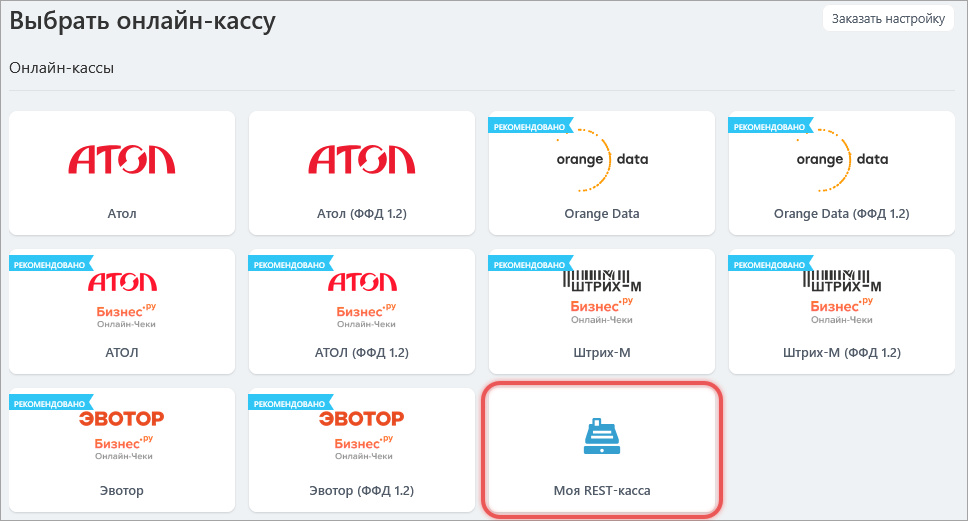
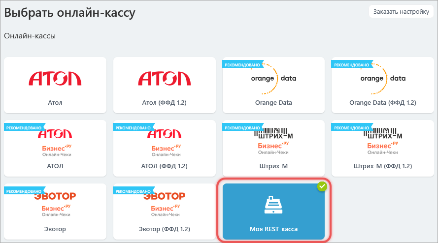

# Как подключить кассу к Битрикс24

> Scope: [`cashbox`](../../api-reference/scopes/permissions.md)
>
> Кто может выполнять методы: администратор



Выберите инструмент для разработки с AI-агентом:

- используйте [Битрикс24 Вайбкод](../../ai-tools/vibecode.md), чтобы создать приложение для Битрикс24 по описанию задачи без знания языков программирования. Агент напишет код и разместит приложение на сервере без ручной настройки хостинга
- используйте [MCP-сервер](../../ai-tools/mcp.md), чтобы разрабатывать интеграцию через REST API в своем проекте. Агент будет обращаться к официальной REST-документации



В Битрикс24 можно подключить внешнюю кассу и автоматически печатать чеки. Когда клиент оплатит заказ, Битрикс24 отправит данные чека на заданный URL. Внешний сервис сформирует и зарегистрирует фискальный чек.

В результате сценария в Центре продаж появится REST-касса, а внешний сервис сможет принимать запросы на печать чека и возвращать статус печати.

Сценарий состоит из трех шагов.

1. Добавим обработчик кассы методом [sale.cashbox.handler.add](../../api-reference/sale/cashbox/sale-cashbox-handler-add.md)
2. Создадим кассу и привяжем ее к обработчику методом [sale.cashbox.add](../../api-reference/sale/cashbox/sale-cashbox-add.md)
3. Передадим результат печати чека методом [sale.cashbox.check.apply](../../api-reference/sale/cashbox/sale-cashbox-check-apply.md), если статус нужно сохранить вручную

## Перед началом

Подготовьте значения, которые понадобятся в примерах.

- Входящий вебхук или OAuth-токен пользователя с правами администратора
- Публичный HTTPS-адрес страницы печати чека `PRINT_URL`
- Публичный HTTPS-адрес страницы проверки статуса чека `CHECK_URL`
- Уникальный код обработчика кассы, например `my_rest_cashbox`
- Данные авторизации внешней кассы, которые администратор укажет в настройках кассы

Не размещайте логин, пароль и токены доступа в публичном коде. Передавайте секреты через переменные окружения или защищенное хранилище приложения.

## 1. Добавим обработчик кассы

Зарегистрируем обработчик с помощью [sale.cashbox.handler.add](../../api-reference/sale/cashbox/sale-cashbox-handler-add.md). В метод передадим настройки обработчика и адреса, на которые портал отправляет запросы для печати и проверки статуса чека.

- `CODE` — уникальный код обработчика. Укажем `my_rest_cashbox`.

- `NAME` — название обработчика, например, `Моя REST-касса`.

- `SORT` — число, которое определяет положение обработчика в списке.

- `SETTINGS` — объект c настройками обработчика.

    - `PRINT_URL` — адрес, на который Битрикс24 отправляет данные для печати чека. Укажем `https://example.ru/rest_print.php`.

    - `CHECK_URL` — адрес, по которому происходит проверка статуса чека. Передадим `https://example.ru/rest_check.php`.

    - `CONFIG` — поля, которые нужно создать для обработчика. Администратор заполняет эти поля при настройке кассы. Создадим три блока: `AUTH` — авторизация по логину и паролю, `COMPANY` — данные об организации, `INTERACTION` — режим работы кассы.





- JS

   ```js
   import { B24Hook } from '@bitrix24/b24jssdk'

   const $b24 = B24Hook.fromWebhookUrl(process.env.B24_HOOK)
   // B24_HOOK = 'https://your-domain.bitrix24.ru/rest/USER_ID/TOKEN/'

   const response = await $b24.actions.v2.call.make({
       method: 'sale.cashbox.handler.add',
       params: {
           CODE: 'my_rest_cashbox',
           NAME: 'Моя REST-касса',
           SORT: 100,
           SETTINGS: {
               PRINT_URL: 'https://example.ru/rest_print.php',
               CHECK_URL: 'https://example.ru/rest_check.php',
               CONFIG: {
                   AUTH: {
                       LABEL: 'Авторизация',
                       ITEMS: {
                           LOGIN: {
                               TYPE: 'STRING',
                               REQUIRED: 'Y',
                               LABEL: 'Логин'
                           },
                           PASSWORD: {
                               TYPE: 'STRING',
                               REQUIRED: 'Y',
                               LABEL: 'Пароль'
                           }
                       }
                   },
                   COMPANY: {
                       LABEL: 'Данные об организации',
                       ITEMS: {
                           INN: {
                               TYPE: 'STRING',
                               REQUIRED: 'Y',
                               LABEL: 'ИНН организации'
                           }
                       }
                   },
                   INTERACTION: {
                       LABEL: 'Настройки взаимодействия с кассой',
                       ITEMS: {
                           MODE: {
                               TYPE: 'ENUM',
                               REQUIRED: 'N',
                               LABEL: 'Режим работы с кассой',
                               OPTIONS: {
                                   ACTIVE: 'боевой',
                                   TEST: 'тестовый'
                               }
                           }
                       }
                   }
               }
           }
       },
       requestId: 'cashbox-handler-add'
   })

   if (response.isSuccess) {
       console.dir(response.getData().result)
   } else {
       console.error(response.getErrorMessages().join('; '))
   }
   ```

- PHP

   ```php
   <?php
   // composer require bitrix24/b24phpsdk:"^3.0"
   require_once 'vendor/autoload.php';

   use Bitrix24\SDK\Services\ServiceBuilderFactory;
   use Symfony\Component\EventDispatcher\EventDispatcher;
   use Monolog\Logger;
   use Monolog\Handler\StreamHandler;

   $log = new Logger('b24');
   $log->pushHandler(new StreamHandler('php://stdout'));

   $sb = (new ServiceBuilderFactory(new EventDispatcher(), $log))
       ->initFromWebhook('https://your-domain.bitrix24.ru/rest/USER_ID/TOKEN/');

   $result = $sb->getSaleScope()->cashboxHandler()->add(
       'my_rest_cashbox',
       'Моя REST-касса',
       [
           'PRINT_URL' => 'https://example.ru/rest_print.php',
           'CHECK_URL' => 'https://example.ru/rest_check.php',
           'CONFIG' => [
               'AUTH' => [
                   'LABEL' => 'Авторизация',
                   'ITEMS' => [
                       'LOGIN' => [
                           'TYPE' => 'STRING',
                           'REQUIRED' => 'Y',
                           'LABEL' => 'Логин'
                       ],
                       'PASSWORD' => [
                           'TYPE' => 'STRING',
                           'REQUIRED' => 'Y',
                           'LABEL' => 'Пароль'
                       ],
                   ]
               ],
               'COMPANY' => [
                   'LABEL' => 'Данные об организации',
                   'ITEMS' => [
                       'INN' => [
                           'TYPE' => 'STRING',
                           'REQUIRED' => 'Y',
                           'LABEL' => 'ИНН организации'
                       ]
                   ]
               ],
               'INTERACTION' => [
                   'LABEL' => 'Настройки взаимодействия с кассой',
                   'ITEMS' => [
                       'MODE' => [
                           'TYPE' => 'ENUM',
                           'REQUIRED' => 'N',
                           'LABEL' => 'Режим работы с кассой',
                           'OPTIONS' => [
                               'ACTIVE' => 'боевой',
                               'TEST' => 'тестовый'
                           ]
                       ]
                   ]
               ]
           ]
       ],
       100
   );

   echo '<PRE>';
   print_r($result->getId());
   echo '</PRE>';
   ```

- Python

   ```python
   from b24pysdk import BitrixWebhook, Client
   from b24pysdk.errors import BitrixAPIError


   token = BitrixWebhook(
       domain="your-domain.bitrix24.com",
       webhook_token="user_id/webhook_key",
   )
   client = Client(token)

   try:
       response = client.sale.cashbox.handler.add(
           code="my_rest_cashbox",
           name="Моя REST-касса",
           sort=100,
           settings={
               "PRINT_URL": "https://example.ru/rest_print.php",
               "CHECK_URL": "https://example.ru/rest_check.php",
               "CONFIG": {
                   "AUTH": {
                       "LABEL": "Авторизация",
                       "ITEMS": {
                           "LOGIN": {
                               "TYPE": "STRING",
                               "REQUIRED": "Y",
                               "LABEL": "Логин",
                           },
                           "PASSWORD": {
                               "TYPE": "STRING",
                               "REQUIRED": "Y",
                               "LABEL": "Пароль",
                           },
                       },
                   },
                   "COMPANY": {
                       "LABEL": "Данные об организации",
                       "ITEMS": {
                           "INN": {
                               "TYPE": "STRING",
                               "REQUIRED": "Y",
                               "LABEL": "ИНН организации",
                           }
                       },
                   },
                   "INTERACTION": {
                       "LABEL": "Настройки взаимодействия с кассой",
                       "ITEMS": {
                           "MODE": {
                               "TYPE": "ENUM",
                               "REQUIRED": "N",
                               "LABEL": "Режим работы с кассой",
                               "OPTIONS": {
                                   "ACTIVE": "боевой",
                                   "TEST": "тестовый",
                               },
                           }
                       },
                   },
               },
           },
       ).response
       print(response.result)
   except BitrixAPIError as error:
       print(error)
   ```



Если обработчик успешно добавлен, метод вернет его идентификатор. Сохраните значение `result`: оно пригодится для поиска обработчика в списке.

```json
{
    "result": 1
}
```

Теперь обработчик можно использовать для создания касс в интерфейсе Битрикс24. Один обработчик может обслуживать несколько касс с разными реквизитами.



## 2. Настроим кассу

Добавим кассу с помощью [sale.cashbox.add](../../api-reference/sale/cashbox/sale-cashbox-add.md). В метод передадим настройки кассы и значения параметра `CONFIG` из предыдущего шага.

- `REST_CODE` — код обработчика. Передадим значение `my_rest_cashbox`, которое указали при добавлении обработчика в параметре `CODE`.

- `NAME` — название кассы. Укажем `REST касса`.

- `NUMBER_KKM` — внешний идентификатор кассы, например, `1`.

- `OFD` — код обработчика ОФД. Передадим `bx_firstofd`. Список возможных значений смотрите в документации метода [sale.cashbox.add](../../api-reference/sale/cashbox/sale-cashbox-add.md).

- `EMAIL` — адрес электронной почты для уведомлений. Укажем `owner@example.ru`.

- `USE_OFFLINE` — флаг, используется ли касса офлайн. Зададим значение `Y`.

- `ACTIVE` — активность кассы. Укажем `Y`.

- `SETTINGS` — данные для полей, которые создали в параметре `CONFIG` на предыдущем шаге. Их нужно заполнить точно так, как описали при регистрации обработчика:

    - `AUTH` — логин и пароль для авторизации,

    - `COMPANY` — ИНН организации,

    - `INTERACTION` — режим работы, например, `ACTIVE`.



- JS

   ```js
   const response = await $b24.actions.v2.call.make({
       method: 'sale.cashbox.add',
       params: {
           REST_CODE: 'my_rest_cashbox',
           NAME: 'REST касса',
           NUMBER_KKM: '1',
           OFD: 'bx_firstofd',
           EMAIL: 'owner@example.ru',
           USE_OFFLINE: 'Y',
           ACTIVE: 'Y',
           SETTINGS: {
               AUTH: {
                   LOGIN: 'rest_login',
                   PASSWORD: 'rest_password'
               },
               COMPANY: {
                   INN: '1234567890'
               },
               INTERACTION: {
                   MODE: 'ACTIVE'
               }
           }
       },
       requestId: 'cashbox-add'
   })

   if (response.isSuccess) {
       console.dir(response.getData().result)
   } else {
       console.error(response.getErrorMessages().join('; '))
   }
   ```

- PHP

   ```php
   $result = $sb->getSaleScope()->cashbox()->add([
       'REST_CODE' => 'my_rest_cashbox',
       'NAME' => 'REST касса',
       'NUMBER_KKM' => '1',
       'OFD' => 'bx_firstofd',
       'EMAIL' => 'owner@example.ru',
       'USE_OFFLINE' => 'Y',
       'ACTIVE' => 'Y',
       'SETTINGS' => [
           'AUTH' => [
               'LOGIN' => 'rest_login',
               'PASSWORD' => 'rest_password'
           ],
           'COMPANY' => [
               'INN' => '1234567890'
           ],
           'INTERACTION' => [
               'MODE' => 'ACTIVE'
           ]
       ]
   ]);

   echo '<PRE>';
   print_r($result->getId());
   echo '</PRE>';
   ```

- Python

   ```python
   try:
       response = client.sale.cashbox.add(
           rest_code="my_rest_cashbox",
           name="REST касса",
           email="owner@example.ru",
           number_kkm="1",
           ofd="bx_firstofd",
           use_offline=True,
           active=True,
           settings={
               "AUTH": {
                   "LOGIN": "rest_login",
                   "PASSWORD": "rest_password",
               },
               "COMPANY": {
                   "INN": "1234567890",
               },
               "INTERACTION": {
                   "MODE": "ACTIVE",
               },
           },
       ).response
       print(response.result)
   except BitrixAPIError as error:
       print(error)
   ```



Если касса успешно добавлена, метод вернет ее идентификатор. Сохраните значение `result`: оно понадобится для проверки кассы в списке.

```json
{
    "result": 1
}
```

В Центре продаж можно проверить, что касса подключена к Битрикс24.



## Печать чеков

Касса использует два адреса. На `PRINT_URL` портал отправляет данные для печати. На `CHECK_URL` Битрикс24 уточняет, напечатан ли чек и есть ли ошибки.

### Страница PRINT_URL

Страница `PRINT_URL` — адрес, на который Битрикс24 отправляет данные для печати чека. Структуру запроса смотрите в разделе [Страница PRINT_URL](../../api-reference/sale/cashbox/sale-cashbox-handler-add.md#print_url) метода `sale.cashbox.handler.add`.

По адресу `PRINT_URL` происходит обработка входных данных, формирование документа и возвращение результата печати.

Минимальная логика страницы `PRINT_URL`:

1. Принять данные чека от Битрикс24
2. Проверить, что в запросе есть данные для печати
3. Передать чек во внешнюю кассу
4. Вернуть `UUID`, если чек принят в печать, или массив `ERRORS`, если печать невозможна
5. Сохранить связь `UUID` с заказом или чеком во внешней системе, чтобы страница `CHECK_URL` могла вернуть статус

Пример обработчика `PRINT_URL` на Node.js:

```js
import express from 'express'
import { randomUUID } from 'crypto'

const app = express()
app.use(express.json())
app.use(express.urlencoded({ extended: true }))

const checks = new Map()

app.post('/rest_print.php', async (req, res) => {
    const payload = req.body

    if (!payload || Object.keys(payload).length === 0) {
        res.json({
            ERRORS: ['Данные чека не переданы']
        })
        return
    }

    const uuid = randomUUID()

    checks.set(uuid, {
        status: 'WAIT',
        createdAt: Date.now(),
        payload
    })

    res.json({
        UUID: uuid
    })
})
```

В рабочем сервисе храните `UUID`, статус и данные чека в базе данных, а не в памяти процесса.

- Если печать не удалась, массив JSON имеет вид:

   ```json
   {
       "ERRORS": [
           "Сообщение об ошибке",
           "Сообщение об ошибке",
           ...
       ]
   }
   ```

- Если чек передан в печать, массив имеет вид:

   ```json
   {
       "UUID": "00112233-4455-6677-8899-aabbccddeeff"
   }
   ```

### Страница CHECK_URL

Страница `CHECK_URL` — адрес, по которому портал проверяет, готов ли чек и есть ли ошибки.

Запрос по адресу `CHECK_URL` выполняется по обращению менеджера или запускается автоматически спустя время после успешной печати чека. Структуру запроса смотрите в разделе [Страница CHECK_URL](../../api-reference/sale/cashbox/sale-cashbox-handler-add.md#check_url) метода `sale.cashbox.handler.add`.

Запрос по адресу `CHECK_URL` возвращает данные о чеке, данные об ошибке при печати чека, либо статус «в ожидании печати».

Минимальная логика страницы `CHECK_URL`:

1. Принять `UUID` чека
2. Найти чек во внешней системе
3. Если чек еще печатается, вернуть `STATUS: WAIT`
4. Если печать завершилась ошибкой, вернуть `STATUS: ERROR` и текст ошибки
5. Если чек напечатан, вернуть `STATUS: DONE` и фискальные реквизиты

Пример обработчика `CHECK_URL` на Node.js:

```js
app.post('/rest_check.php', async (req, res) => {
    const uuid = req.body.UUID

    if (!uuid || !checks.has(uuid)) {
        res.json({
            STATUS: 'ERROR',
            ERROR: 'Чек с таким UUID не найден'
        })
        return
    }

    const check = checks.get(uuid)

    if (check.status === 'WAIT') {
        res.json({
            STATUS: 'WAIT'
        })
        return
    }

    if (check.status === 'ERROR') {
        res.json({
            STATUS: 'ERROR',
            ERROR: check.error
        })
        return
    }

    res.json({
        STATUS: 'DONE',
        UUID: uuid,
        REG_NUMBER_KKT: '000111222333',
        FISCAL_DOC_ATTR: '33445500',
        FISCAL_DOC_NUMBER: 123,
        FISCAL_RECEIPT_NUMBER: 10,
        FN_NUMBER: '0011223344556677',
        SHIFT_NUMBER: 12,
        PRINT_END_TIME: Math.floor(Date.now() / 1000)
    })
})
```

- Формат данных при ошибке печати чека:

   ```json
   {
       "STATUS": "ERROR", 
       "ERROR": "Сообщение об ошибке" 
   }
   ```

- Формат данных, если чек не напечатан:

   ```json
   {
       "STATUS": "WAIT"
   }
   ```

- Формат данных при успешной отправке чека:

   ```json
   {
       "STATUS": "DONE",
       "UUID": "00112233-4455-6677-8899-aabbccddeeff",
       "REG_NUMBER_KKT": "000111222333",
       "FISCAL_DOC_ATTR": "33445500",
       "FISCAL_DOC_NUMBER": 123,
       "FISCAL_RECEIPT_NUMBER": 10,
       "FN_NUMBER": "0011223344556677",
       "SHIFT_NUMBER": 12,
       "PRINT_END_TIME": 1609452000
   }
   ```

Полный список полей совпадает с параметрами метода [sale.cashbox.check.apply](../../api-reference/sale/cashbox/sale-cashbox-check-apply.md).

Данные от `CHECK_URL` сохраняются в Битрикс24 и используются для генерации ссылки на чек.

### Передадим результат печати вручную

Данные о чеке можно передать с помощью метода [sale.cashbox.check.apply](../../api-reference/sale/cashbox/sale-cashbox-check-apply.md), когда `PRINT_URL` вернул `UUID` и чек сохранен в Битрикс24.

Подготовьте поля для `sale.cashbox.check.apply`.

- `UUID` — уникальный идентификатор чека, который вернул обработчик в ответе на `PRINT_URL`.

- `PRINT_END_TIME` — время окончания печати чека.

- `REG_NUMBER_KKT` — регистрационный номер кассы.

- `FISCAL_DOC_ATTR` — фискальный признак документа, который сформировала касса.

- `FISCAL_DOC_NUMBER` — номер фискального документа.

- `FISCAL_RECEIPT_NUMBER` — номер чека внутри смены.

- `FN_NUMBER` — номер фискального накопителя.

- `SHIFT_NUMBER` — номер смены, в которую попал чек.



- JS

   ```js
   const response = await $b24.actions.v2.call.make({
       method: 'sale.cashbox.check.apply',
       params: {
           UUID: '00112233-4455-6677-8899-aabbccddeeff',
           PRINT_END_TIME: '1609459200',
           REG_NUMBER_KKT: '000111222333',
           FISCAL_DOC_ATTR: '33445500',
           FISCAL_DOC_NUMBER: '123',
           FISCAL_RECEIPT_NUMBER: '10',
           FN_NUMBER: '0011223344556677',
           SHIFT_NUMBER: '12'
       },
       requestId: 'cashbox-check-apply'
   })

   if (response.isSuccess) {
       console.dir(response.getData().result)
   } else {
       console.error(response.getErrorMessages().join('; '))
   }
   ```

- PHP

   ```php
   $result = $sb->getSaleScope()->cashbox()->checkApply([
       'UUID' => '00112233-4455-6677-8899-aabbccddeeff',
       'PRINT_END_TIME' => '1609459200',
       'REG_NUMBER_KKT' => '000111222333',
       'FISCAL_DOC_ATTR' => '33445500',
       'FISCAL_DOC_NUMBER' => '123',
       'FISCAL_RECEIPT_NUMBER' => '10',
       'FN_NUMBER' => '0011223344556677',
       'SHIFT_NUMBER' => '12'
   ]);

   echo '<PRE>';
   print_r($result->isSuccess());
   echo '</PRE>';
   ```

- Python

    ```python
    try:
        response = client.sale.cashbox.check.apply(
            uuid="00112233-4455-6677-8899-aabbccddeeff",
            print_end_time="1609459200",
            reg_number_kkt="000111222333",
            fiscal_doc_attr="33445500",
            fiscal_doc_number="123",
            fiscal_receipt_number="10",
            fn_number="0011223344556677",
            shift_number="12",
        ).response
        print(response.result)
    except BitrixAPIError as error:
        print(error)
    ```



Если чек успешно сохранен, метод вернет `true`.

```json
{
    "result": true
}
```

## Проверим результат

После настройки кассы откройте Центр продаж и проверьте, что REST-касса доступна в списке касс. После тестовой оплаты проверьте, что внешний сервис получил запрос на `PRINT_URL`, вернул `UUID`, а Битрикс24 получил статус через `CHECK_URL` или через метод `sale.cashbox.check.apply`.

Через REST проверьте обработчик и кассу методами [sale.cashbox.handler.list](../../api-reference/sale/cashbox/sale-cashbox-handler-list.md) и [sale.cashbox.list](../../api-reference/sale/cashbox/sale-cashbox-list.md).



- JS

    ```js
    const handlerResponse = await $b24.actions.v2.call.make({
        method: 'sale.cashbox.handler.list',
        params: {},
        requestId: 'cashbox-handler-list',
    })

    const cashboxResponse = await $b24.actions.v2.call.make({
        method: 'sale.cashbox.list',
        params: {
            SELECT: ['ID', 'NAME', 'ACTIVE', 'EMAIL'],
            FILTER: { '=NAME': 'REST касса' },
        },
        requestId: 'cashbox-list',
    })

    console.log(handlerResponse.getData().result)
    console.log(cashboxResponse.getData().result)
    ```

- PHP

    ```php
    $handlerResponse = $sb->core->call('sale.cashbox.handler.list', []);

    $cashboxResponse = $sb->core->call('sale.cashbox.list', [
        'SELECT' => ['ID', 'NAME', 'ACTIVE', 'EMAIL'],
        'FILTER' => ['=NAME' => 'REST касса'],
    ]);

    print_r($handlerResponse->getResponseData()->getResult());
    print_r($cashboxResponse->getResponseData()->getResult());
    ```

- Python

    ```python
    handlers = token.call_method("sale.cashbox.handler.list", {})
    cashboxes = token.call_method(
        "sale.cashbox.list",
        {
            "SELECT": ["ID", "NAME", "ACTIVE", "EMAIL"],
            "FILTER": {"=NAME": "REST касса"},
        },
    )

    print(handlers)
    print(cashboxes)
    ```



Успешное выполнение сценария подтверждают три результата:

- метод `sale.cashbox.handler.add` вернул идентификатор обработчика
- метод `sale.cashbox.add` вернул идентификатор кассы
- метод `sale.cashbox.check.apply` вернул `true`, если результат печати передавался вручную

## Ошибки и диагностика

Если метод вернул ошибку, проверьте данные запроса и состояние внешнего сервиса.

#|
|| **Код или текст ошибки** | **Причина и действие** ||
|| `ACCESS_DENIED` | Метод вызвал пользователь без прав администратора CRM на изменение настроек ||
|| `ERROR_CHECK_FAILURE` | Не передано обязательное поле или значение поля не прошло проверку. Проверьте `CODE`, `NAME`, `SETTINGS`, `REST_CODE`, `EMAIL` и `UUID` ||
|| `ERROR_HANDLER_ALREADY_EXIST` | Обработчик с таким `CODE` уже есть. Укажите другой код или используйте существующий обработчик ||
|| `ERROR_CHECK_NOT_FOUND` | Чек с указанным `UUID` не найден. Проверьте, что `UUID` совпадает со значением, которое вернула страница `PRINT_URL` ||
|| `ERROR_HANDLER_ADD`, `ERROR_CASHBOX_ADD`, `ERROR_CHECK_APPLY` | Ошибка при добавлении обработчика, создании кассы или сохранении результата печати. Подробности смотрите в `error_description` ||
|| Ошибка печати на `PRINT_URL` | Верните массив `ERRORS` и сохраните текст ошибки в логах внешнего сервиса ||
|| Статус `WAIT` на `CHECK_URL` | Чек еще не напечатан. Повторите проверку статуса после обработки чека внешней кассой ||
|#

## Что важно учитывать

- Повторный запуск примера с тем же `CODE` может вернуть ошибку, потому что код обработчика должен быть уникальным
- Адреса `PRINT_URL` и `CHECK_URL` должны быть доступны из интернета по HTTPS
- Данные из настроек кассы, например логин и пароль, храните на стороне приложения и не выводите в интерфейс без маскирования

## Продолжите изучение

- [Обработчики касс](../../api-reference/sale/cashbox/sale-cashbox-handler-list.md)
- [Кассы](../../api-reference/sale/cashbox/sale-cashbox-list.md)
- [Сохранение результата печати чека](../../api-reference/sale/cashbox/sale-cashbox-check-apply.md)
